# Critical Model Audit (v4)

Generated by `scripts/audit/critical_audit.py`. Goal: find feature noise,
redundancy, leakage and per-fold instability.

## sunflower — as-of 07_01

- rows: 286, features: 82
- mean ML MAPE: 27.98%, naive (global mean): 27.04%, naive (field mean): 28.92%
  - ⚠️ **ML does NOT beat naive global mean** for this scenario.

### Per-fold metrics

| year | n_test | n_train | n_train_years | ML MAPE | naive | field_mean | ML R² |
|---|---|---|---|---|---|---|---|
| 2017 | 15 | 189 | 7 | 20.7 | 24.4 | 22.8 | 0.09 |
| 2018 | 22 | 204 | 8 | 21.2 | 23.1 | 27.2 | -0.25 |
| 2019 | 18 | 226 | 9 | 20.0 | 17.8 | 18.4 | -0.11 |
| 2021 | 17 | 244 | 10 | 21.1 | 17.9 | 27.3 | -0.30 |
| 2022 | 3 | 261 | 11 | 71.7 | 66.2 | 67.3 | -0.15 |
| 2023 | 4 | 264 | 12 | 19.5 | 15.5 | 16.6 | -7.59 |
| 2024 | 10 | 268 | 13 | 25.5 | 25.9 | 28.0 | -2.65 |
| 2025 | 8 | 278 | 14 | 24.2 | 25.4 | 23.8 | -7.25 |

### Top features by importance

- `ndvi_last_value_asof` — 6.93
- `ndvi_max_asof` — 4.55
- `ndvi_peak_doy_asof` — 4.25
- `ndvi_anom_last_value_asof` — 4.07
- `ndvi_baseline_n_years` — 3.42
- `field_soil_Mg` — 2.94
- `field_soil_pH` — 2.83
- `ndvi_anom_max_asof` — 2.56
- `ndvi_slope_asof` — 2.56
- `ndvi_min_asof` — 2.55
- `ndvi_p75_asof` — 2.30
- `ndvi_anom_last30d_mean_asof` — 2.23
- `wx_gdd_sunflower_to_asof` — 2.20
- `wx_precip_sum_to_asof` — 2.19
- `ndvi_amplitude_asof` — 2.17

### Bottom 15 features (candidates for removal)

- `wx_hot_d30_to_asof` — 0.37
- `wx_temp_mean_to_asof` — 0.36
- `wx_jun_srad` — 0.35
- `wx_et0_sum_to_asof` — 0.33
- `wx_jun_precip` — 0.30
- `wx_srad_mean_to_asof` — 0.26
- `wx_may_hot_d30` — 0.25
- `wx_heat_run_to_asof` — 0.22
- `wx_jun_temp_max` — 0.20
- `wx_vpd_mean_to_asof` — 0.18
- `years_since_wheat` — 0.07
- `wx_may_et0` — 0.07
- `wx_hot_d35_to_asof` — 0.00
- `wx_apr_hot_d30` — 0.00
- `crop_id` — 0.00

### Redundant pairs (Spearman ≥ 0.95)

- `wx_srad_sum_to_asof` ↔ `wx_srad_mean_to_asof`: ρ = 1.000
- `wx_srad_sum_last30d` ↔ `wx_jun_srad`: ρ = 1.000
- `wx_vpd_max_last30d` ↔ `wx_jun_vpd_max`: ρ = 1.000
- `wx_temp_max_last30d` ↔ `wx_jun_temp_max`: ρ = 1.000
- `wx_et0_sum_last30d` ↔ `wx_jun_et0`: ρ = 1.000
- `wx_precip_sum_last30d` ↔ `wx_jun_precip`: ρ = 1.000
- `field_tillable_area` ↔ `field_calculated_area`: ρ = 0.999
- `wx_gdd_sunflower_to_asof` ↔ `wx_gdd_wheat_to_asof`: ρ = 0.995
- `wx_temp_max_to_asof` ↔ `wx_temp_max_last30d`: ρ = 0.990
- `wx_temp_max_to_asof` ↔ `wx_jun_temp_max`: ρ = 0.990
- `ndvi_max_asof` ↔ `ndvi_p10_max_asof`: ρ = 0.984
- `wx_vpd_max_to_asof` ↔ `wx_vpd_max_last30d`: ρ = 0.982
- `wx_vpd_max_to_asof` ↔ `wx_jun_vpd_max`: ρ = 0.982
- `wx_hot_d30_to_asof` ↔ `wx_jun_hot_d30`: ρ = 0.977
- `ndvi_max_asof` ↔ `ndvi_last_value_asof`: ρ = 0.974

### Top |corr| with target

- `target_yield_t_ha`: +1.000
- `ndvi_last_value_asof`: +0.422
- `ndvi_max_asof`: +0.383
- `ndvi_anom_last_value_asof`: +0.364
- `ndvi_p10_max_asof`: +0.356
- `ndvi_amplitude_asof`: +0.323
- `wx_precip_sum_to_asof`: +0.285
- `ndvi_peak_doy_asof`: +0.261
- `prev_crop_id`: +0.258
- `years_since_sunflower`: +0.224
...
- `wx_may_srad`: -0.078
- `wx_dry_days_to_asof`: -0.079
- `field_soil_pH`: -0.083
- `wx_apr_srad`: -0.095
- `wx_jun_temp_mean`: -0.117
- `wx_srad_sum_to_asof`: -0.118
- `wx_srad_mean_to_asof`: -0.118
- `wx_jun_et0`: -0.151
- `wx_et0_sum_last30d`: -0.151
- `years_since_wheat`: -0.252

### High-NaN features

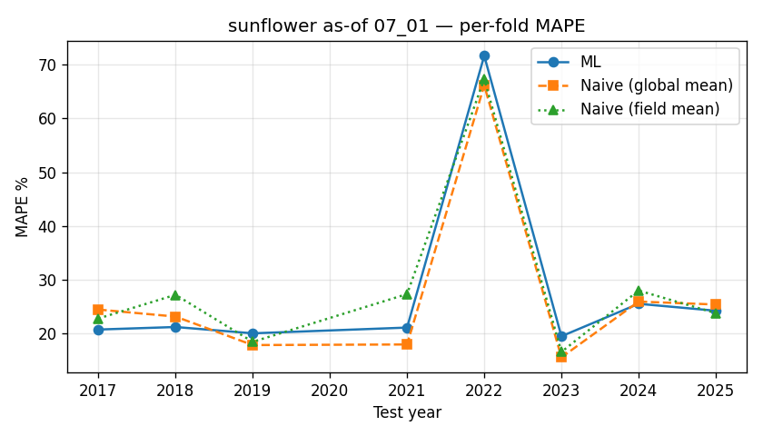

---

## sunflower — as-of 08_01

- rows: 286, features: 89
- mean ML MAPE: 24.79%, naive (global mean): 27.04%, naive (field mean): 28.92%

### Per-fold metrics

| year | n_test | n_train | n_train_years | ML MAPE | naive | field_mean | ML R² |
|---|---|---|---|---|---|---|---|
| 2017 | 15 | 189 | 7 | 17.1 | 24.4 | 22.8 | 0.29 |
| 2018 | 22 | 204 | 8 | 13.9 | 23.1 | 27.2 | 0.57 |
| 2019 | 18 | 226 | 9 | 20.4 | 17.8 | 18.4 | 0.05 |
| 2021 | 17 | 244 | 10 | 20.5 | 17.9 | 27.3 | -0.19 |
| 2022 | 3 | 261 | 11 | 65.3 | 66.2 | 67.3 | 0.03 |
| 2023 | 4 | 264 | 12 | 23.5 | 15.5 | 16.6 | -10.59 |
| 2024 | 10 | 268 | 13 | 17.0 | 25.9 | 28.0 | -0.79 |
| 2025 | 8 | 278 | 14 | 20.6 | 25.4 | 23.8 | -5.52 |

### Top features by importance

- `ndvi_p75_asof` — 10.08
- `ndvi_anom_last_value_asof` — 6.94
- `ndvi_last_value_asof` — 6.75
- `ndvi_anom_last30d_mean_asof` — 5.64
- `ndvi_mean_asof` — 5.29
- `wx_precip_sum_to_asof` — 3.21
- `ndvi_p10_max_asof` — 2.71
- `ndvi_max_asof` — 2.47
- `ndvi_anom_max_asof` — 2.14
- `ndvi_above_05_days_asof` — 2.12
- `ndvi_anom_min_asof` — 2.00
- `ndvi_peak_doy_asof` — 1.95
- `ndvi_amplitude_asof` — 1.93
- `field_soil_Mg` — 1.91
- `ndvi_integral_asof` — 1.84

### Bottom 15 features (candidates for removal)

- `wx_srad_sum_last30d` — 0.25
- `wx_apr_vpd_max` — 0.24
- `wx_temp_mean_to_asof` — 0.24
- `wx_may_vpd_max` — 0.19
- `wx_jul_vpd_max` — 0.18
- `wx_heat_run_to_asof` — 0.15
- `wx_jul_precip` — 0.15
- `wx_apr_srad` — 0.12
- `wx_may_hot_d30` — 0.11
- `years_since_wheat` — 0.08
- `wx_may_precip` — 0.06
- `wx_hot_d35_to_asof` — 0.05
- `wx_jul_temp_max` — 0.00
- `wx_apr_hot_d30` — 0.00
- `crop_id` — 0.00

### Redundant pairs (Spearman ≥ 0.95)

- `wx_srad_sum_to_asof` ↔ `wx_srad_mean_to_asof`: ρ = 1.000
- `wx_vpd_max_last30d` ↔ `wx_jul_vpd_max`: ρ = 1.000
- `wx_temp_max_last30d` ↔ `wx_jul_temp_max`: ρ = 1.000
- `field_tillable_area` ↔ `field_calculated_area`: ρ = 0.999
- `wx_gdd_sunflower_to_asof` ↔ `wx_gdd_wheat_to_asof`: ρ = 0.997
- `wx_et0_sum_last30d` ↔ `wx_jul_et0`: ρ = 0.996
- `wx_srad_sum_last30d` ↔ `wx_jul_srad`: ρ = 0.995
- `wx_precip_sum_last30d` ↔ `wx_jul_precip`: ρ = 0.995
- `ndvi_max_asof` ↔ `ndvi_p10_max_asof`: ρ = 0.993
- `wx_temp_mean_to_asof` ↔ `wx_gdd_wheat_to_asof`: ρ = 0.982
- `wx_temp_mean_to_asof` ↔ `wx_gdd_sunflower_to_asof`: ρ = 0.974

### Top |corr| with target

- `target_yield_t_ha`: +1.000
- `ndvi_p75_asof`: +0.562
- `ndvi_anom_last30d_mean_asof`: +0.535
- `ndvi_max_asof`: +0.534
- `ndvi_p10_max_asof`: +0.526
- `ndvi_last_value_asof`: +0.478
- `ndvi_anom_last_value_asof`: +0.476
- `ndvi_slope_asof`: +0.417
- `ndvi_amplitude_asof`: +0.409
- `ndvi_std_asof`: +0.383
...
- `wx_vpd_mean_to_asof`: -0.091
- `wx_apr_srad`: -0.095
- `wx_et0_sum_to_asof`: -0.098
- `wx_jun_temp_mean`: -0.117
- `wx_jul_et0`: -0.119
- `wx_et0_sum_last30d`: -0.127
- `wx_dry_days_to_asof`: -0.135
- `wx_jun_et0`: -0.151
- `wx_drought_run_to_asof`: -0.228
- `years_since_wheat`: -0.252

### High-NaN features

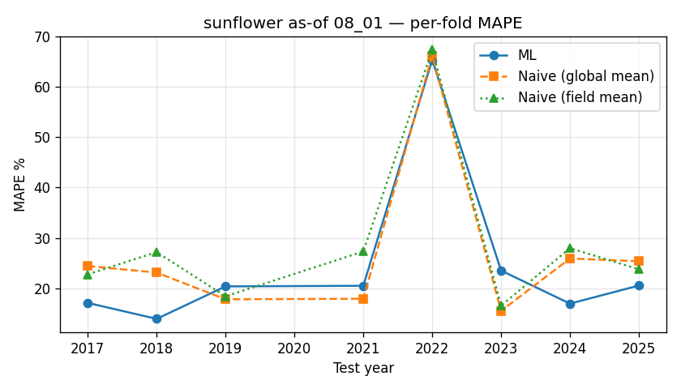

---

## sunflower — as-of 09_01

- rows: 286, features: 96
- mean ML MAPE: 25.26%, naive (global mean): 27.04%, naive (field mean): 28.92%

### Per-fold metrics

| year | n_test | n_train | n_train_years | ML MAPE | naive | field_mean | ML R² |
|---|---|---|---|---|---|---|---|
| 2017 | 15 | 189 | 7 | 17.7 | 24.4 | 22.8 | 0.43 |
| 2018 | 22 | 204 | 8 | 15.6 | 23.1 | 27.2 | 0.41 |
| 2019 | 18 | 226 | 9 | 21.5 | 17.8 | 18.4 | -0.03 |
| 2021 | 17 | 244 | 10 | 20.3 | 17.9 | 27.3 | -0.14 |
| 2022 | 3 | 261 | 11 | 69.5 | 66.2 | 67.3 | -0.07 |
| 2023 | 4 | 264 | 12 | 18.7 | 15.5 | 16.6 | -6.91 |
| 2024 | 10 | 268 | 13 | 19.5 | 25.9 | 28.0 | -1.09 |
| 2025 | 8 | 278 | 14 | 19.2 | 25.4 | 23.8 | -4.97 |

### Top features by importance

- `ndvi_p75_asof` — 9.03
- `ndvi_above_05_days_asof` — 8.91
- `ndvi_mean_asof` — 8.45
- `ndvi_anom_mean_asof` — 4.79
- `ndvi_amplitude_asof` — 3.57
- `ndvi_p10_max_asof` — 3.19
- `ndvi_anom_last30d_mean_asof` — 2.40
- `ndvi_anom_min_asof` — 2.39
- `ndvi_anom_max_asof` — 1.91
- `ndvi_slope_asof` — 1.88
- `ndvi_peak_doy_asof` — 1.75
- `ndvi_max_asof` — 1.74
- `ndvi_min_asof` — 1.70
- `ndvi_anom_last_value_asof` — 1.64
- `field_soil_pH` — 1.57

### Bottom 15 features (candidates for removal)

- `wx_may_temp_mean` — 0.15
- `wx_dry_days_to_asof` — 0.14
- `wx_jul_temp_mean` — 0.12
- `wx_apr_temp_max` — 0.11
- `wx_apr_vpd_max` — 0.11
- `wx_vpd_max_last30d` — 0.11
- `wx_apr_temp_mean` — 0.11
- `wx_srad_sum_to_asof` — 0.10
- `wx_aug_vpd_max` — 0.06
- `wx_may_hot_d30` — 0.05
- `wx_hot_d35_to_asof` — 0.03
- `wx_srad_mean_to_asof` — 0.03
- `wx_drought_run_to_asof` — 0.02
- `wx_apr_hot_d30` — 0.00
- `crop_id` — 0.00

### Redundant pairs (Spearman ≥ 0.95)

- `wx_srad_sum_to_asof` ↔ `wx_srad_mean_to_asof`: ρ = 1.000
- `field_tillable_area` ↔ `field_calculated_area`: ρ = 0.999
- `wx_vpd_max_last30d` ↔ `wx_aug_vpd_max`: ρ = 0.997
- `wx_gdd_sunflower_to_asof` ↔ `wx_gdd_wheat_to_asof`: ρ = 0.996
- `wx_precip_sum_last30d` ↔ `wx_aug_precip`: ρ = 0.993
- `ndvi_max_asof` ↔ `ndvi_p10_max_asof`: ρ = 0.991
- `wx_et0_sum_last30d` ↔ `wx_aug_et0`: ρ = 0.986
- `wx_temp_mean_to_asof` ↔ `wx_gdd_wheat_to_asof`: ρ = 0.985
- `wx_temp_mean_to_asof` ↔ `wx_gdd_sunflower_to_asof`: ρ = 0.977
- `wx_temp_max_last30d` ↔ `wx_aug_temp_max`: ρ = 0.976
- `wx_vpd_max_last30d` ↔ `wx_temp_max_last30d`: ρ = 0.967
- `wx_temp_max_last30d` ↔ `wx_aug_vpd_max`: ρ = 0.963
- `wx_vpd_mean_to_asof` ↔ `wx_vpd_days_high_to_asof`: ρ = 0.960
- `wx_precip_sum_to_asof` ↔ `wx_water_balance_to_asof`: ρ = 0.960
- `wx_srad_sum_last30d` ↔ `wx_aug_srad`: ρ = 0.960

### Top |corr| with target

- `target_yield_t_ha`: +1.000
- `ndvi_p75_asof`: +0.591
- `ndvi_anom_mean_asof`: +0.562
- `ndvi_above_05_days_asof`: +0.556
- `ndvi_max_asof`: +0.540
- `ndvi_p10_max_asof`: +0.535
- `ndvi_mean_asof`: +0.535
- `ndvi_integral_asof`: +0.460
- `ndvi_amplitude_asof`: +0.414
- `ndvi_std_asof`: +0.402
...
- `wx_drought_run_to_asof`: -0.133
- `wx_aug_hot_d30`: -0.136
- `wx_vpd_mean_to_asof`: -0.136
- `wx_vpd_days_high_to_asof`: -0.147
- `wx_precip_sum_last30d`: -0.147
- `wx_aug_precip`: -0.149
- `wx_jun_et0`: -0.151
- `wx_vpd_max_last30d`: -0.152
- `wx_aug_vpd_max`: -0.162
- `years_since_wheat`: -0.252

### High-NaN features

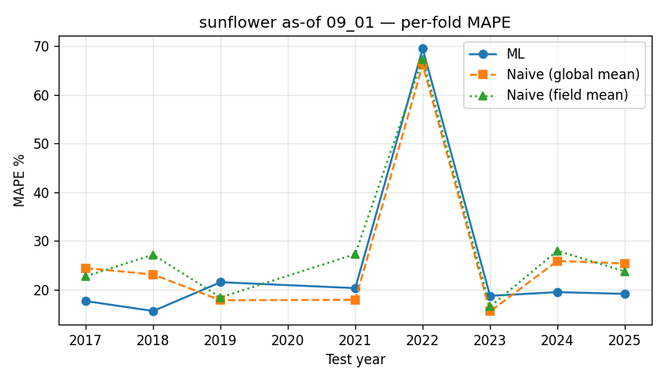

---

## wheat_spring — as-of 07_01

- rows: 67, features: 82
- mean ML MAPE: 42.40%, naive (global mean): 44.24%, naive (field mean): 56.60%

### Per-fold metrics

| year | n_test | n_train | n_train_years | ML MAPE | naive | field_mean | ML R² |
|---|---|---|---|---|---|---|---|
| 2023 | 5 | 44 | 5 | 78.4 | 82.8 | 94.2 | -2.62 |
| 2024 | 7 | 49 | 6 | 19.2 | 19.4 | 32.8 | -5.88 |
| 2025 | 11 | 56 | 7 | 29.7 | 30.6 | 42.9 | -0.01 |

### Top features by importance

- `ndvi_mean_asof` — 6.72
- `field_soil_P` — 4.87
- `ndvi_peak_doy_asof` — 4.64
- `ndvi_p25_asof` — 4.39
- `ndvi_anom_min_asof` — 3.09
- `field_id` — 2.85
- `wx_dry_days_to_asof` — 2.82
- `wx_vpd_max_to_asof` — 2.52
- `wx_drought_run_to_asof` — 2.45
- `wx_precip_sum_last30d` — 2.45
- `field_soil_N` — 2.45
- `ndvi_p75_asof` — 2.36
- `ndvi_min_asof` — 2.31
- `field_soil_OM` — 2.26
- `field_soil_pH` — 2.22

### Bottom 15 features (candidates for removal)

- `wx_apr_temp_max` — 0.38
- `ndvi_baseline_n_years` — 0.36
- `wx_srad_sum_last30d` — 0.35
- `wx_gdd_wheat_to_asof` — 0.35
- `wx_apr_vpd_max` — 0.35
- `years_since_sunflower` — 0.34
- `wx_temp_max_last30d` — 0.28
- `wx_hot_d30_to_asof` — 0.18
- `wx_srad_mean_to_asof` — 0.16
- `wx_apr_et0` — 0.12
- `wx_heat_run_to_asof` — 0.12
- `wx_jun_et0` — 0.06
- `wx_apr_hot_d30` — 0.00
- `wx_hot_d35_to_asof` — 0.00
- `crop_id` — 0.00

### Redundant pairs (Spearman ≥ 0.95)

- `wx_srad_sum_to_asof` ↔ `wx_srad_mean_to_asof`: ρ = 1.000
- `wx_precip_sum_last30d` ↔ `wx_jun_precip`: ρ = 1.000
- `wx_srad_sum_last30d` ↔ `wx_jun_srad`: ρ = 1.000
- `wx_et0_sum_last30d` ↔ `wx_jun_et0`: ρ = 1.000
- `wx_vpd_max_last30d` ↔ `wx_jun_vpd_max`: ρ = 1.000
- `wx_temp_max_last30d` ↔ `wx_jun_temp_max`: ρ = 1.000
- `field_tillable_area` ↔ `field_calculated_area`: ρ = 0.999
- `wx_gdd_sunflower_to_asof` ↔ `wx_gdd_wheat_to_asof`: ρ = 0.998
- `ndvi_max_asof` ↔ `ndvi_p10_max_asof`: ρ = 0.992
- `wx_temp_mean_to_asof` ↔ `wx_gdd_wheat_to_asof`: ρ = 0.978
- `wx_precip_sum_to_asof` ↔ `wx_water_balance_to_asof`: ρ = 0.976
- `ndvi_max_asof` ↔ `ndvi_last_value_asof`: ρ = 0.974
- `wx_temp_mean_to_asof` ↔ `wx_gdd_sunflower_to_asof`: ρ = 0.973
- `wx_apr_temp_max` ↔ `wx_apr_vpd_max`: ρ = 0.969
- `wx_hot_d30_to_asof` ↔ `wx_jun_hot_d30`: ρ = 0.967

### Top |corr| with target

- `target_yield_t_ha`: +1.000
- `ndvi_mean_asof`: +0.392
- `wx_precip_sum_last30d`: +0.367
- `wx_jun_precip`: +0.367
- `ndvi_p75_asof`: +0.363
- `ndvi_last_value_asof`: +0.346
- `wx_precip_sum_to_asof`: +0.344
- `ndvi_p10_max_asof`: +0.314
- `wx_water_balance_to_asof`: +0.304
- `ndvi_max_asof`: +0.304
...
- `wx_jun_et0`: -0.160
- `wx_vpd_days_high_to_asof`: -0.169
- `wx_srad_mean_to_asof`: -0.176
- `wx_srad_sum_to_asof`: -0.176
- `wx_may_srad`: -0.247
- `wx_drought_run_to_asof`: -0.277
- `wx_jun_vpd_max`: -0.286
- `wx_vpd_max_last30d`: -0.286
- `wx_vpd_max_to_asof`: -0.301
- `wx_dry_days_to_asof`: -0.385

### High-NaN features

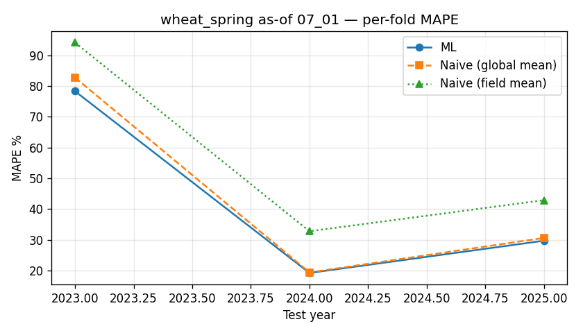

---

## wheat_spring — as-of 08_01

- rows: 67, features: 89
- mean ML MAPE: 43.21%, naive (global mean): 44.24%, naive (field mean): 56.60%

### Per-fold metrics

| year | n_test | n_train | n_train_years | ML MAPE | naive | field_mean | ML R² |
|---|---|---|---|---|---|---|---|
| 2023 | 5 | 44 | 5 | 79.8 | 82.8 | 94.2 | -2.78 |
| 2024 | 7 | 49 | 6 | 19.3 | 19.4 | 32.8 | -6.03 |
| 2025 | 11 | 56 | 7 | 30.5 | 30.6 | 42.9 | -0.04 |

### Top features by importance

- `ndvi_p25_asof` — 10.78
- `field_soil_P` — 6.00
- `ndvi_mean_asof` — 4.27
- `ndvi_integral_asof` — 3.88
- `ndvi_anom_min_asof` — 3.87
- `wx_jun_vpd_max` — 2.90
- `ndvi_anom_max_asof` — 2.60
- `wx_jun_precip` — 2.55
- `ndvi_p75_asof` — 2.53
- `rotation_pair` — 2.38
- `ndvi_above_05_days_asof` — 2.18
- `wx_srad_mean_to_asof` — 2.09
- `wx_apr_et0` — 2.07
- `wx_apr_temp_mean` — 1.77
- `field_soil_pH` — 1.70

### Bottom 15 features (candidates for removal)

- `wx_precip_sum_to_asof` — 0.26
- `wx_jul_et0` — 0.25
- `wx_jul_srad` — 0.22
- `field_calculated_area` — 0.20
- `wx_apr_precip` — 0.18
- `ndvi_baseline_n_years` — 0.18
- `wx_temp_max_last30d` — 0.17
- `wx_hot_d30_to_asof` — 0.16
- `ndvi_slope_asof` — 0.13
- `wx_temp_max_to_asof` — 0.10
- `wx_jul_temp_max` — 0.09
- `wx_jun_hot_d30` — 0.05
- `wx_hot_d35_to_asof` — 0.01
- `wx_apr_hot_d30` — 0.00
- `crop_id` — 0.00

### Redundant pairs (Spearman ≥ 0.95)

- `wx_srad_sum_to_asof` ↔ `wx_srad_mean_to_asof`: ρ = 1.000
- `wx_vpd_max_last30d` ↔ `wx_jul_vpd_max`: ρ = 1.000
- `wx_temp_max_last30d` ↔ `wx_jul_temp_max`: ρ = 1.000
- `field_tillable_area` ↔ `field_calculated_area`: ρ = 0.999
- `ndvi_max_asof` ↔ `ndvi_p10_max_asof`: ρ = 0.995
- `wx_gdd_sunflower_to_asof` ↔ `wx_gdd_wheat_to_asof`: ρ = 0.986
- `wx_precip_sum_to_asof` ↔ `wx_water_balance_to_asof`: ρ = 0.975
- `wx_et0_sum_last30d` ↔ `wx_jul_et0`: ρ = 0.974
- `wx_vpd_mean_to_asof` ↔ `wx_vpd_days_high_to_asof`: ρ = 0.973
- `wx_vpd_max_to_asof` ↔ `wx_vpd_max_last30d`: ρ = 0.972
- `wx_vpd_max_to_asof` ↔ `wx_jul_vpd_max`: ρ = 0.972
- `wx_apr_temp_max` ↔ `wx_apr_vpd_max`: ρ = 0.969
- `wx_temp_mean_to_asof` ↔ `wx_gdd_sunflower_to_asof`: ρ = 0.967
- `wx_temp_mean_to_asof` ↔ `wx_gdd_wheat_to_asof`: ρ = 0.962
- `wx_temp_max_to_asof` ↔ `wx_temp_max_last30d`: ρ = 0.956

### Top |corr| with target

- `target_yield_t_ha`: +1.000
- `ndvi_mean_asof`: +0.380
- `wx_jun_precip`: +0.367
- `wx_precip_sum_to_asof`: +0.335
- `ndvi_p75_asof`: +0.329
- `wx_water_balance_to_asof`: +0.284
- `ndvi_p10_max_asof`: +0.274
- `wx_jul_precip`: +0.272
- `ndvi_integral_asof`: +0.255
- `ndvi_max_asof`: +0.254
...
- `wx_may_srad`: -0.247
- `wx_drought_run_to_asof`: -0.265
- `wx_heat_run_to_asof`: -0.265
- `wx_vpd_days_high_to_asof`: -0.275
- `wx_jun_vpd_max`: -0.286
- `wx_jul_temp_max`: -0.295
- `wx_temp_max_last30d`: -0.295
- `wx_jul_hot_d30`: -0.322
- `wx_hot_d35_to_asof`: -0.354
- `wx_dry_days_to_asof`: -0.391

### High-NaN features

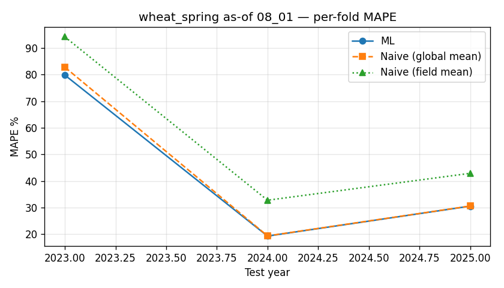

---

## wheat_spring — as-of 09_01

- rows: 67, features: 96
- mean ML MAPE: 44.19%, naive (global mean): 44.24%, naive (field mean): 56.60%

### Per-fold metrics

| year | n_test | n_train | n_train_years | ML MAPE | naive | field_mean | ML R² |
|---|---|---|---|---|---|---|---|
| 2023 | 5 | 44 | 5 | 80.8 | 82.8 | 94.2 | -2.87 |
| 2024 | 7 | 49 | 6 | 19.0 | 19.4 | 32.8 | -5.84 |
| 2025 | 11 | 56 | 7 | 32.7 | 30.6 | 42.9 | -0.20 |

### Top features by importance

- `ndvi_anom_last_value_asof` — 10.97
- `ndvi_p25_asof` — 6.41
- `ndvi_mean_asof` — 4.97
- `ndvi_slope_asof` — 3.21
- `field_soil_P` — 2.83
- `wx_drought_run_to_asof` — 2.63
- `ndvi_anom_mean_asof` — 2.59
- `rotation_pair` — 2.41
- `ndvi_min_asof` — 2.37
- `ndvi_last_value_asof` — 2.23
- `prev_crop_id` — 2.11
- `wx_may_srad` — 2.06
- `field_id` — 2.05
- `wx_may_precip` — 2.01
- `wx_vpd_days_high_to_asof` — 1.88

### Bottom 15 features (candidates for removal)

- `years_since_wheat` — 0.14
- `wx_heat_run_to_asof` — 0.14
- `wx_hot_d35_to_asof` — 0.13
- `wx_precip_sum_last30d` — 0.12
- `wx_vpd_max_last30d` — 0.10
- `wx_may_temp_mean` — 0.09
- `wx_srad_sum_last30d` — 0.08
- `wx_apr_srad` — 0.07
- `wx_dry_days_to_asof` — 0.06
- `wx_aug_precip` — 0.04
- `ndvi_baseline_n_years` — 0.02
- `wx_jun_srad` — 0.01
- `wx_may_hot_d30` — 0.01
- `wx_apr_hot_d30` — 0.00
- `crop_id` — 0.00

### Redundant pairs (Spearman ≥ 0.95)

- `wx_srad_sum_to_asof` ↔ `wx_srad_mean_to_asof`: ρ = 1.000
- `wx_vpd_max_last30d` ↔ `wx_aug_vpd_max`: ρ = 1.000
- `wx_temp_max_last30d` ↔ `wx_aug_temp_max`: ρ = 1.000
- `field_tillable_area` ↔ `field_calculated_area`: ρ = 0.999
- `ndvi_max_asof` ↔ `ndvi_p10_max_asof`: ρ = 0.993
- `wx_et0_sum_last30d` ↔ `wx_aug_et0`: ρ = 0.993
- `wx_gdd_sunflower_to_asof` ↔ `wx_gdd_wheat_to_asof`: ρ = 0.992
- `wx_srad_sum_last30d` ↔ `wx_aug_srad`: ρ = 0.989
- `wx_apr_temp_max` ↔ `wx_apr_vpd_max`: ρ = 0.969
- `wx_temp_mean_to_asof` ↔ `wx_gdd_wheat_to_asof`: ρ = 0.963
- `wx_vpd_mean_to_asof` ↔ `wx_vpd_days_high_to_asof`: ρ = 0.960
- `wx_jun_temp_max` ↔ `wx_jun_hot_d30`: ρ = 0.952

### Top |corr| with target

- `target_yield_t_ha`: +1.000
- `wx_jun_precip`: +0.367
- `wx_precip_sum_to_asof`: +0.347
- `ndvi_p75_asof`: +0.345
- `ndvi_mean_asof`: +0.319
- `wx_water_balance_to_asof`: +0.293
- `ndvi_p10_max_asof`: +0.278
- `wx_jul_precip`: +0.272
- `ndvi_max_asof`: +0.256
- `ndvi_amplitude_asof`: +0.241
...
- `ndvi_last_value_asof`: -0.260
- `wx_vpd_mean_to_asof`: -0.261
- `wx_dry_days_to_asof`: -0.272
- `wx_jun_vpd_max`: -0.286
- `wx_jul_temp_max`: -0.295
- `wx_vpd_days_high_to_asof`: -0.317
- `wx_jul_hot_d30`: -0.322
- `ndvi_anom_last_value_asof`: -0.340
- `wx_drought_run_to_asof`: -0.344
- `wx_hot_d35_to_asof`: -0.354

### High-NaN features

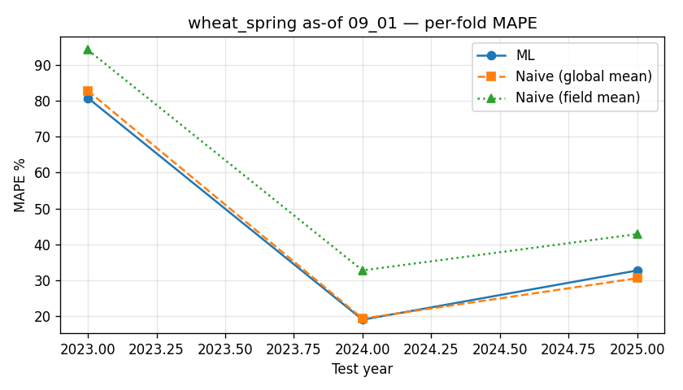

---

## wheat_winter — as-of 07_01

- rows: 39, features: 82
- mean ML MAPE: 38.97%, naive (global mean): 48.09%, naive (field mean): 52.26%

### Per-fold metrics

| year | n_test | n_train | n_train_years | ML MAPE | naive | field_mean | ML R² |
|---|---|---|---|---|---|---|---|
| 2024 | 6 | 33 | 6 | 39.0 | 48.1 | 52.3 | -25.54 |

### Top features by importance

- `ndvi_p75_asof` — 6.22
- `wx_srad_mean_to_asof` — 5.22
- `wx_apr_temp_max` — 4.29
- `prev_crop_id` — 4.24
- `rotation_pair` — 3.63
- `field_soil_pH` — 3.42
- `ndvi_p25_asof` — 3.25
- `ndvi_max_asof` — 2.83
- `ndvi_integral_asof` — 2.80
- `wx_apr_precip` — 2.74
- `wx_apr_vpd_max` — 2.52
- `wx_hot_d30_to_asof` — 2.30
- `wx_may_precip` — 2.19
- `field_soil_Mg` — 2.09
- `wx_jun_temp_mean` — 2.00

### Bottom 15 features (candidates for removal)

- `wx_drought_run_to_asof` — 0.34
- `wx_gdd_sunflower_to_asof` — 0.33
- `wx_temp_max_to_asof` — 0.31
- `wx_gdd_wheat_to_asof` — 0.29
- `wx_et0_sum_last30d` — 0.28
- `years_since_sunflower` — 0.23
- `wx_srad_sum_last30d` — 0.16
- `wx_vpd_days_high_to_asof` — 0.15
- `wx_temp_max_last30d` — 0.10
- `wx_temp_mean_to_asof` — 0.09
- `wx_hot_d35_to_asof` — 0.05
- `wx_jun_et0` — 0.02
- `crop_id` — 0.00
- `wx_apr_hot_d30` — 0.00
- `field_id` — 0.00

### Redundant pairs (Spearman ≥ 0.95)

- `field_tillable_area` ↔ `field_calculated_area`: ρ = 1.000
- `wx_temp_max_to_asof` ↔ `wx_temp_max_last30d`: ρ = 1.000
- `wx_temp_max_to_asof` ↔ `wx_jun_temp_max`: ρ = 1.000
- `wx_srad_sum_to_asof` ↔ `wx_srad_mean_to_asof`: ρ = 1.000
- `wx_srad_sum_last30d` ↔ `wx_jun_srad`: ρ = 1.000
- `wx_et0_sum_last30d` ↔ `wx_jun_et0`: ρ = 1.000
- `wx_vpd_max_last30d` ↔ `wx_jun_vpd_max`: ρ = 1.000
- `wx_temp_max_last30d` ↔ `wx_jun_temp_max`: ρ = 1.000
- `wx_precip_sum_last30d` ↔ `wx_jun_precip`: ρ = 1.000
- `ndvi_max_asof` ↔ `ndvi_p10_max_asof`: ρ = 0.999
- `wx_vpd_max_to_asof` ↔ `wx_vpd_max_last30d`: ρ = 0.988
- `wx_vpd_max_to_asof` ↔ `wx_jun_vpd_max`: ρ = 0.988
- `wx_gdd_sunflower_to_asof` ↔ `wx_gdd_wheat_to_asof`: ρ = 0.987
- `wx_vpd_mean_to_asof` ↔ `wx_vpd_days_high_to_asof`: ρ = 0.981
- `ndvi_max_asof` ↔ `ndvi_p75_asof`: ρ = 0.974

### Top |corr| with target

- `target_yield_t_ha`: +1.000
- `ndvi_anom_max_asof`: +0.706
- `ndvi_p75_asof`: +0.703
- `ndvi_mean_asof`: +0.679
- `ndvi_anom_mean_asof`: +0.674
- `ndvi_p10_max_asof`: +0.659
- `ndvi_max_asof`: +0.653
- `wx_water_balance_to_asof`: +0.634
- `ndvi_anom_last30d_mean_asof`: +0.632
- `ndvi_p25_asof`: +0.626
...
- `wx_hot_d30_to_asof`: -0.497
- `wx_dry_days_to_asof`: -0.511
- `wx_jun_temp_mean`: -0.512
- `wx_vpd_days_high_to_asof`: -0.582
- `wx_vpd_mean_to_asof`: -0.627
- `wx_et0_sum_to_asof`: -0.695
- `wx_et0_sum_last30d`: -0.695
- `wx_jun_et0`: -0.695
- `wx_srad_mean_to_asof`: -0.705
- `wx_srad_sum_to_asof`: -0.705

### High-NaN features

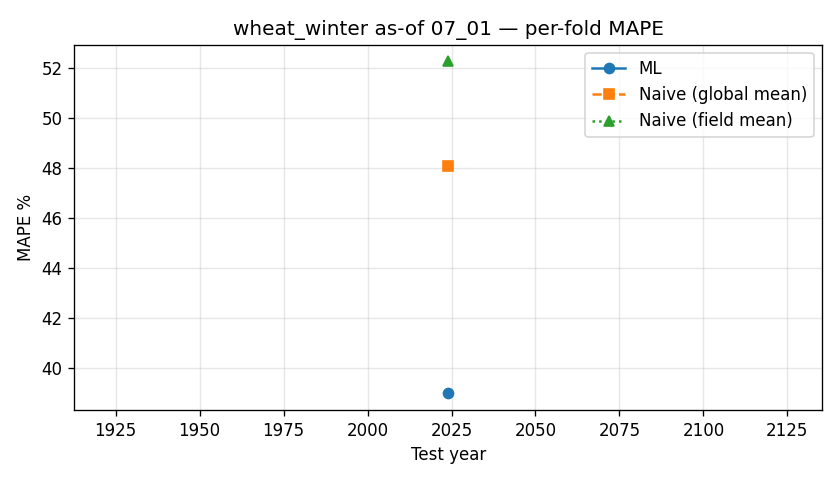

---

## wheat_winter — as-of 08_01

- rows: 39, features: 89
- mean ML MAPE: 37.51%, naive (global mean): 48.09%, naive (field mean): 52.26%

### Per-fold metrics

| year | n_test | n_train | n_train_years | ML MAPE | naive | field_mean | ML R² |
|---|---|---|---|---|---|---|---|
| 2024 | 6 | 33 | 6 | 37.5 | 48.1 | 52.3 | -23.59 |

### Top features by importance

- `wx_vpd_mean_to_asof` — 5.50
- `ndvi_mean_asof` — 4.79
- `prev_crop_id` — 3.83
- `rotation_pair` — 3.50
- `wx_water_balance_to_asof` — 3.40
- `ndvi_integral_asof` — 3.12
- `wx_jun_precip` — 3.09
- `wx_apr_temp_max` — 3.01
- `wx_apr_vpd_max` — 2.92
- `field_soil_Mg` — 2.87
- `wx_apr_temp_mean` — 2.82
- `ndvi_max_asof` — 2.59
- `field_soil_pH` — 2.48
- `wx_jun_temp_mean` — 2.32
- `wx_precip_sum_to_asof` — 2.31

### Bottom 15 features (candidates for removal)

- `ndvi_p25_asof` — 0.17
- `wx_temp_max_last30d` — 0.14
- `wx_jul_precip` — 0.12
- `ndvi_std_asof` — 0.11
- `wx_may_precip` — 0.09
- `wx_srad_sum_to_asof` — 0.06
- `wx_may_temp_max` — 0.04
- `wx_jul_et0` — 0.03
- `wx_heat_run_to_asof` — 0.03
- `wx_temp_max_to_asof` — 0.02
- `wx_jul_hot_d30` — 0.00
- `wx_hot_d35_to_asof` — 0.00
- `crop_id` — 0.00
- `wx_apr_hot_d30` — 0.00
- `field_id` — 0.00

### Redundant pairs (Spearman ≥ 0.95)

- `field_tillable_area` ↔ `field_calculated_area`: ρ = 1.000
- `wx_srad_sum_to_asof` ↔ `wx_srad_mean_to_asof`: ρ = 1.000
- `wx_vpd_max_last30d` ↔ `wx_jul_vpd_max`: ρ = 1.000
- `wx_temp_max_last30d` ↔ `wx_jul_temp_max`: ρ = 1.000
- `wx_gdd_sunflower_to_asof` ↔ `wx_gdd_wheat_to_asof`: ρ = 0.999
- `ndvi_max_asof` ↔ `ndvi_p10_max_asof`: ρ = 0.998
- `wx_et0_sum_last30d` ↔ `wx_jul_et0`: ρ = 0.995
- `wx_precip_sum_last30d` ↔ `wx_jul_precip`: ρ = 0.991
- `ndvi_p75_asof` ↔ `ndvi_p10_max_asof`: ρ = 0.981
- `ndvi_max_asof` ↔ `ndvi_p75_asof`: ρ = 0.977
- `wx_srad_sum_last30d` ↔ `wx_jul_srad`: ρ = 0.967
- `wx_srad_sum_last30d` ↔ `wx_et0_sum_last30d`: ρ = 0.965
- `wx_jul_srad` ↔ `wx_jul_et0`: ρ = 0.963
- `wx_vpd_max_to_asof` ↔ `wx_vpd_max_last30d`: ρ = 0.959
- `wx_vpd_max_to_asof` ↔ `wx_jul_vpd_max`: ρ = 0.959

### Top |corr| with target

- `target_yield_t_ha`: +1.000
- `ndvi_anom_max_asof`: +0.706
- `ndvi_mean_asof`: +0.693
- `ndvi_anom_mean_asof`: +0.682
- `ndvi_p75_asof`: +0.673
- `wx_water_balance_to_asof`: +0.632
- `ndvi_p10_max_asof`: +0.624
- `wx_jun_precip`: +0.618
- `ndvi_max_asof`: +0.612
- `ndvi_above_05_days_asof`: +0.572
...
- `wx_jul_et0`: -0.691
- `wx_et0_sum_last30d`: -0.693
- `wx_jun_et0`: -0.695
- `wx_vpd_max_last30d`: -0.704
- `wx_jul_vpd_max`: -0.704
- `wx_et0_sum_to_asof`: -0.726
- `wx_srad_mean_to_asof`: -0.736
- `wx_srad_sum_to_asof`: -0.736
- `wx_vpd_days_high_to_asof`: -0.760
- `wx_vpd_mean_to_asof`: -0.815

### High-NaN features

---

## wheat_winter — as-of 09_01

- rows: 39, features: 96
- mean ML MAPE: 44.16%, naive (global mean): 48.09%, naive (field mean): 52.26%

### Per-fold metrics

| year | n_test | n_train | n_train_years | ML MAPE | naive | field_mean | ML R² |
|---|---|---|---|---|---|---|---|
| 2024 | 6 | 33 | 6 | 44.2 | 48.1 | 52.3 | -33.48 |

### Top features by importance

- `ndvi_p75_asof` — 6.68
- `ndvi_mean_asof` — 4.37
- `wx_vpd_mean_to_asof` — 4.20
- `ndvi_max_asof` — 3.95
- `prev_crop_id` — 3.37
- `field_soil_pH` — 2.87
- `ndvi_anom_min_asof` — 2.84
- `field_soil_Mg` — 2.70
- `wx_jun_temp_mean` — 2.58
- `wx_may_et0` — 2.58
- `ndvi_anom_mean_asof` — 2.41
- `ndvi_integral_asof` — 2.31
- `wx_jul_et0` — 2.17
- `ndvi_last_value_asof` — 2.09
- `years_since_sunflower` — 1.98

### Bottom 15 features (candidates for removal)

- `ndvi_std_asof` — 0.17
- `wx_srad_sum_last30d` — 0.12
- `wx_may_temp_mean` — 0.12
- `wx_apr_et0` — 0.08
- `ndvi_peak_doy_asof` — 0.07
- `wx_drought_run_to_asof` — 0.06
- `wx_hot_d30_to_asof` — 0.03
- `wx_aug_hot_d30` — 0.03
- `wx_et0_sum_last30d` — 0.02
- `wx_jun_vpd_max` — 0.02
- `wx_jun_temp_max` — 0.02
- `wx_aug_vpd_max` — 0.01
- `crop_id` — 0.00
- `wx_apr_hot_d30` — 0.00
- `field_id` — 0.00

### Redundant pairs (Spearman ≥ 0.95)

- `field_tillable_area` ↔ `field_calculated_area`: ρ = 1.000
- `wx_srad_sum_to_asof` ↔ `wx_srad_mean_to_asof`: ρ = 1.000
- `wx_vpd_max_last30d` ↔ `wx_aug_vpd_max`: ρ = 1.000
- `wx_temp_max_last30d` ↔ `wx_aug_temp_max`: ρ = 1.000
- `wx_srad_sum_last30d` ↔ `wx_aug_srad`: ρ = 0.998
- `ndvi_max_asof` ↔ `ndvi_p10_max_asof`: ρ = 0.992
- `wx_gdd_sunflower_to_asof` ↔ `wx_gdd_wheat_to_asof`: ρ = 0.990
- `wx_et0_sum_last30d` ↔ `wx_aug_et0`: ρ = 0.983
- `wx_temp_max_last30d` ↔ `wx_aug_hot_d30`: ρ = 0.974
- `wx_aug_temp_max` ↔ `wx_aug_hot_d30`: ρ = 0.974
- `wx_jul_srad` ↔ `wx_jul_et0`: ρ = 0.963

### Top |corr| with target

- `target_yield_t_ha`: +1.000
- `ndvi_mean_asof`: +0.684
- `ndvi_p75_asof`: +0.673
- `ndvi_anom_mean_asof`: +0.645
- `wx_jun_precip`: +0.618
- `ndvi_p10_max_asof`: +0.575
- `wx_aug_temp_mean`: +0.538
- `ndvi_max_asof`: +0.534
- `ndvi_anom_max_asof`: +0.524
- `ndvi_above_05_days_asof`: +0.487
...
- `wx_jul_temp_max`: -0.592
- `wx_vpd_days_high_to_asof`: -0.617
- `wx_jul_srad`: -0.640
- `wx_et0_sum_to_asof`: -0.668
- `wx_jul_et0`: -0.691
- `wx_jun_et0`: -0.695
- `wx_jul_vpd_max`: -0.704
- `wx_srad_mean_to_asof`: -0.725
- `wx_srad_sum_to_asof`: -0.725
- `wx_vpd_mean_to_asof`: -0.779

### High-NaN features

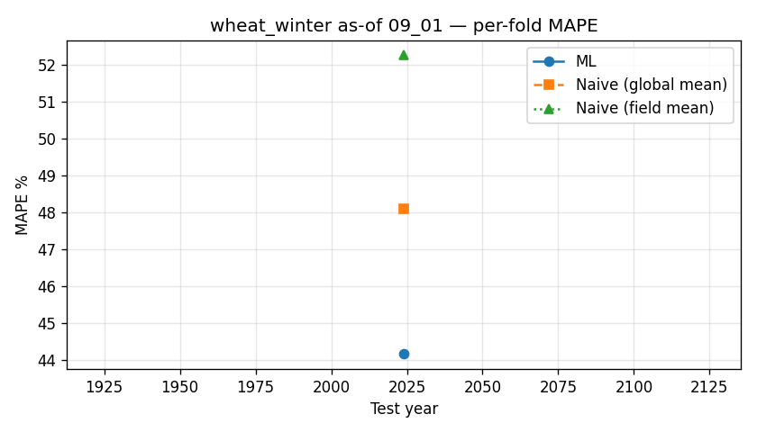

---

## wheat_combined — as-of 07_01

- rows: 106, features: 82
- mean ML MAPE: 44.94%, naive (global mean): 48.78%, naive (field mean): 58.65%

### Per-fold metrics

| year | n_test | n_train | n_train_years | ML MAPE | naive | field_mean | ML R² |
|---|---|---|---|---|---|---|---|
| 2022 | 26 | 44 | 4 | 26.6 | 27.9 | 55.3 | -0.19 |
| 2023 | 12 | 70 | 5 | 99.4 | 103.9 | 108.8 | -2.32 |
| 2024 | 13 | 82 | 6 | 23.8 | 32.8 | 39.7 | -2.18 |
| 2025 | 11 | 95 | 7 | 30.0 | 30.6 | 30.8 | -0.04 |

### Top features by importance

- `ndvi_p25_asof` — 7.40
- `rotation_pair` — 5.08
- `ndvi_p75_asof` — 3.41
- `ndvi_integral_asof` — 3.29
- `wx_may_srad` — 3.04
- `wx_jun_precip` — 2.78
- `prev_crop_id` — 2.71
- `ndvi_mean_asof` — 2.71
- `wx_precip_sum_to_asof` — 2.68
- `wx_vpd_days_high_to_asof` — 2.59
- `wx_water_balance_to_asof` — 2.36
- `ndvi_anom_min_asof` — 2.34
- `ndvi_max_asof` — 2.24
- `field_soil_N` — 2.07
- `ndvi_last_value_asof` — 2.06

### Bottom 15 features (candidates for removal)

- `years_since_sunflower` — 0.43
- `wx_temp_max_to_asof` — 0.42
- `wx_apr_vpd_max` — 0.36
- `crop_id` — 0.36
- `wx_jun_et0` — 0.33
- `wx_dry_days_to_asof` — 0.29
- `wx_temp_mean_to_asof` — 0.27
- `wx_may_vpd_max` — 0.23
- `years_since_wheat` — 0.22
- `wx_jun_temp_mean` — 0.21
- `wx_apr_temp_max` — 0.18
- `wx_et0_sum_last30d` — 0.15
- `wx_srad_sum_last30d` — 0.09
- `wx_hot_d35_to_asof` — 0.00
- `wx_apr_hot_d30` — 0.00

### Redundant pairs (Spearman ≥ 0.95)

- `wx_srad_sum_to_asof` ↔ `wx_srad_mean_to_asof`: ρ = 1.000
- `wx_srad_sum_last30d` ↔ `wx_jun_srad`: ρ = 1.000
- `wx_et0_sum_last30d` ↔ `wx_jun_et0`: ρ = 1.000
- `wx_vpd_max_last30d` ↔ `wx_jun_vpd_max`: ρ = 1.000
- `wx_temp_max_last30d` ↔ `wx_jun_temp_max`: ρ = 1.000
- `wx_precip_sum_last30d` ↔ `wx_jun_precip`: ρ = 1.000
- `field_tillable_area` ↔ `field_calculated_area`: ρ = 0.999
- `wx_gdd_sunflower_to_asof` ↔ `wx_gdd_wheat_to_asof`: ρ = 0.998
- `ndvi_max_asof` ↔ `ndvi_p10_max_asof`: ρ = 0.994
- `wx_temp_mean_to_asof` ↔ `wx_gdd_wheat_to_asof`: ρ = 0.976
- `wx_temp_max_to_asof` ↔ `wx_temp_max_last30d`: ρ = 0.971
- `wx_temp_max_to_asof` ↔ `wx_jun_temp_max`: ρ = 0.971
- `ndvi_max_asof` ↔ `ndvi_last_value_asof`: ρ = 0.968
- `wx_temp_mean_to_asof` ↔ `wx_gdd_sunflower_to_asof`: ρ = 0.966
- `ndvi_p10_max_asof` ↔ `ndvi_last_value_asof`: ρ = 0.961

### Top |corr| with target

- `target_yield_t_ha`: +1.000
- `ndvi_p75_asof`: +0.496
- `wx_precip_sum_last30d`: +0.483
- `wx_jun_precip`: +0.480
- `ndvi_p10_max_asof`: +0.474
- `ndvi_max_asof`: +0.464
- `ndvi_last_value_asof`: +0.454
- `ndvi_mean_asof`: +0.447
- `wx_precip_sum_to_asof`: +0.437
- `wx_water_balance_to_asof`: +0.431
...
- `wx_vpd_mean_to_asof`: -0.340
- `wx_vpd_days_high_to_asof`: -0.362
- `wx_jun_vpd_max`: -0.368
- `wx_vpd_max_last30d`: -0.368
- `wx_vpd_max_to_asof`: -0.384
- `wx_srad_mean_to_asof`: -0.391
- `wx_srad_sum_to_asof`: -0.391
- `wx_et0_sum_last30d`: -0.429
- `wx_jun_et0`: -0.429
- `wx_dry_days_to_asof`: -0.437

### High-NaN features

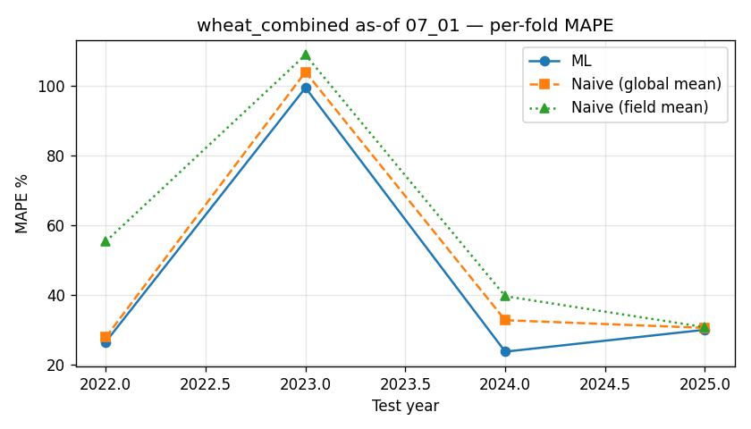

---

## wheat_combined — as-of 08_01

- rows: 106, features: 89
- mean ML MAPE: 44.07%, naive (global mean): 48.78%, naive (field mean): 58.65%

### Per-fold metrics

| year | n_test | n_train | n_train_years | ML MAPE | naive | field_mean | ML R² |
|---|---|---|---|---|---|---|---|
| 2022 | 26 | 44 | 4 | 26.9 | 27.9 | 55.3 | 0.00 |
| 2023 | 12 | 70 | 5 | 92.9 | 103.9 | 108.8 | -1.91 |
| 2024 | 13 | 82 | 6 | 23.8 | 32.8 | 39.7 | -2.13 |
| 2025 | 11 | 95 | 7 | 32.6 | 30.6 | 30.8 | -0.07 |

### Top features by importance

- `ndvi_p25_asof` — 5.44
- `rotation_pair` — 4.53
- `ndvi_anom_min_asof` — 3.90
- `prev_crop_id` — 3.50
- `ndvi_p75_asof` — 3.11
- `wx_water_balance_to_asof` — 2.62
- `field_soil_pH` — 2.61
- `wx_hot_d30_to_asof` — 2.58
- `wx_jun_hot_d30` — 2.31
- `ndvi_peak_doy_asof` — 2.20
- `wx_vpd_days_high_to_asof` — 1.98
- `wx_jun_precip` — 1.96
- `ndvi_mean_asof` — 1.95
- `ndvi_above_05_days_asof` — 1.94
- `ndvi_integral_asof` — 1.87

### Bottom 15 features (candidates for removal)

- `wx_jul_vpd_max` — 0.42
- `wx_jul_hot_d30` — 0.41
- `wx_temp_mean_to_asof` — 0.40
- `wx_heat_run_to_asof` — 0.34
- `wx_gdd_wheat_to_asof` — 0.33
- `wx_hot_d35_to_asof` — 0.27
- `wx_et0_sum_last30d` — 0.25
- `wx_may_precip` — 0.23
- `wx_srad_mean_to_asof` — 0.22
- `years_since_wheat` — 0.19
- `years_since_sunflower` — 0.14
- `wx_temp_max_to_asof` — 0.13
- `ndvi_baseline_n_years` — 0.10
- `wx_may_hot_d30` — 0.07
- `wx_apr_hot_d30` — 0.00

### Redundant pairs (Spearman ≥ 0.95)

- `wx_srad_sum_to_asof` ↔ `wx_srad_mean_to_asof`: ρ = 1.000
- `wx_vpd_max_last30d` ↔ `wx_jul_vpd_max`: ρ = 1.000
- `wx_temp_max_last30d` ↔ `wx_jul_temp_max`: ρ = 1.000
- `field_tillable_area` ↔ `field_calculated_area`: ρ = 0.999
- `ndvi_max_asof` ↔ `ndvi_p10_max_asof`: ρ = 0.997
- `wx_gdd_sunflower_to_asof` ↔ `wx_gdd_wheat_to_asof`: ρ = 0.995
- `wx_et0_sum_last30d` ↔ `wx_jul_et0`: ρ = 0.984
- `wx_precip_sum_last30d` ↔ `wx_jul_precip`: ρ = 0.973
- `wx_temp_mean_to_asof` ↔ `wx_gdd_wheat_to_asof`: ρ = 0.973
- `wx_temp_mean_to_asof` ↔ `wx_gdd_sunflower_to_asof`: ρ = 0.970
- `wx_precip_sum_to_asof` ↔ `wx_water_balance_to_asof`: ρ = 0.966
- `wx_vpd_mean_to_asof` ↔ `wx_vpd_days_high_to_asof`: ρ = 0.966
- `wx_vpd_max_to_asof` ↔ `wx_vpd_max_last30d`: ρ = 0.961
- `wx_vpd_max_to_asof` ↔ `wx_jul_vpd_max`: ρ = 0.961
- `wx_srad_sum_last30d` ↔ `wx_jul_srad`: ρ = 0.958

### Top |corr| with target

- `target_yield_t_ha`: +1.000
- `ndvi_mean_asof`: +0.503
- `ndvi_p75_asof`: +0.499
- `wx_jun_precip`: +0.480
- `wx_precip_sum_to_asof`: +0.449
- `ndvi_p10_max_asof`: +0.435
- `ndvi_anom_mean_asof`: +0.431
- `wx_water_balance_to_asof`: +0.430
- `ndvi_max_asof`: +0.426
- `ndvi_anom_max_asof`: +0.410
...
- `wx_srad_sum_to_asof`: -0.398
- `wx_vpd_max_to_asof`: -0.401
- `wx_hot_d35_to_asof`: -0.411
- `wx_jun_et0`: -0.429
- `wx_vpd_max_last30d`: -0.453
- `wx_jul_vpd_max`: -0.453
- `wx_temp_max_last30d`: -0.454
- `wx_jul_temp_max`: -0.454
- `wx_vpd_mean_to_asof`: -0.483
- `wx_vpd_days_high_to_asof`: -0.496

### High-NaN features

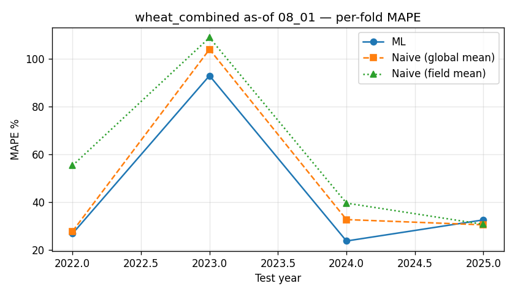

---

## wheat_combined — as-of 09_01

- rows: 106, features: 96
- mean ML MAPE: 41.32%, naive (global mean): 48.78%, naive (field mean): 58.65%

### Per-fold metrics

| year | n_test | n_train | n_train_years | ML MAPE | naive | field_mean | ML R² |
|---|---|---|---|---|---|---|---|
| 2022 | 26 | 44 | 4 | 26.9 | 27.9 | 55.3 | -0.00 |
| 2023 | 12 | 70 | 5 | 85.0 | 103.9 | 108.8 | -1.48 |
| 2024 | 13 | 82 | 6 | 22.0 | 32.8 | 39.7 | -1.75 |
| 2025 | 11 | 95 | 7 | 31.4 | 30.6 | 30.8 | 0.03 |

### Top features by importance

- `rotation_pair` — 5.41
- `ndvi_mean_asof` — 5.27
- `ndvi_p75_asof` — 4.16
- `ndvi_p25_asof` — 4.00
- `wx_jun_precip` — 3.98
- `prev_crop_id` — 3.13
- `wx_vpd_days_high_to_asof` — 2.44
- `ndvi_peak_doy_asof` — 2.34
- `ndvi_anom_min_asof` — 2.23
- `ndvi_anom_last_value_asof` — 2.20
- `field_soil_P` — 2.06
- `ndvi_anom_mean_asof` — 2.04
- `wx_hot_d30_to_asof` — 1.96
- `wx_jul_et0` — 1.75
- `wx_apr_temp_mean` — 1.70

### Bottom 15 features (candidates for removal)

- `wx_apr_temp_max` — 0.28
- `wx_drought_run_to_asof` — 0.28
- `wx_jul_srad` — 0.26
- `wx_dry_days_to_asof` — 0.24
- `wx_jun_temp_max` — 0.23
- `wx_may_hot_d30` — 0.22
- `wx_jun_hot_d30` — 0.21
- `wx_hot_d35_to_asof` — 0.15
- `wx_et0_sum_last30d` — 0.15
- `wx_may_temp_max` — 0.13
- `wx_jun_srad` — 0.08
- `wx_jul_vpd_max` — 0.06
- `wx_temp_max_last30d` — 0.01
- `wx_aug_hot_d30` — 0.00
- `wx_apr_hot_d30` — 0.00

### Redundant pairs (Spearman ≥ 0.95)

- `wx_srad_sum_to_asof` ↔ `wx_srad_mean_to_asof`: ρ = 1.000
- `wx_vpd_max_last30d` ↔ `wx_aug_vpd_max`: ρ = 1.000
- `wx_temp_max_last30d` ↔ `wx_aug_temp_max`: ρ = 1.000
- `field_tillable_area` ↔ `field_calculated_area`: ρ = 0.999
- `ndvi_max_asof` ↔ `ndvi_p10_max_asof`: ρ = 0.994
- `wx_et0_sum_last30d` ↔ `wx_aug_et0`: ρ = 0.993
- `wx_gdd_sunflower_to_asof` ↔ `wx_gdd_wheat_to_asof`: ρ = 0.992
- `wx_srad_sum_last30d` ↔ `wx_aug_srad`: ρ = 0.988
- `wx_temp_mean_to_asof` ↔ `wx_gdd_wheat_to_asof`: ρ = 0.959
- `wx_apr_temp_max` ↔ `wx_apr_vpd_max`: ρ = 0.952
- `ndvi_p75_asof` ↔ `ndvi_p10_max_asof`: ρ = 0.950

### Top |corr| with target

- `target_yield_t_ha`: +1.000
- `ndvi_p75_asof`: +0.527
- `wx_jun_precip`: +0.480
- `ndvi_mean_asof`: +0.477
- `ndvi_p10_max_asof`: +0.429
- `wx_water_balance_to_asof`: +0.413
- `wx_precip_sum_to_asof`: +0.404
- `ndvi_max_asof`: +0.401
- `ndvi_anom_mean_asof`: +0.385
- `wx_jul_precip`: +0.333
...
- `wx_jun_vpd_max`: -0.368
- `wx_et0_sum_to_asof`: -0.374
- `wx_jul_et0`: -0.388
- `wx_jul_hot_d30`: -0.390
- `wx_hot_d35_to_asof`: -0.411
- `wx_jun_et0`: -0.429
- `wx_jul_vpd_max`: -0.453
- `wx_jul_temp_max`: -0.454
- `wx_vpd_days_high_to_asof`: -0.470
- `wx_vpd_mean_to_asof`: -0.478

### High-NaN features

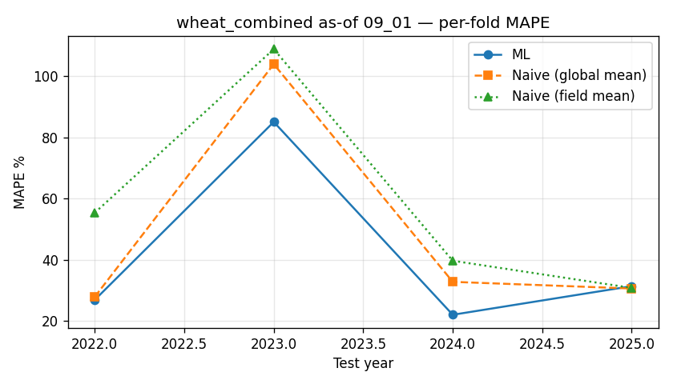

---

## all_crops — as-of 07_01

- rows: 441, features: 82
- mean ML MAPE: 34.26%, naive (global mean): 35.74%, naive (field mean): 38.12%

### Per-fold metrics

| year | n_test | n_train | n_train_years | ML MAPE | naive | field_mean | ML R² |
|---|---|---|---|---|---|---|---|
| 2017 | 30 | 189 | 7 | 35.8 | 39.8 | 41.5 | 0.12 |
| 2018 | 27 | 219 | 8 | 34.9 | 35.2 | 39.3 | -0.21 |
| 2019 | 30 | 246 | 9 | 33.8 | 34.9 | 40.3 | -0.17 |
| 2020 | 29 | 276 | 10 | 42.2 | 43.6 | 46.7 | -0.66 |
| 2021 | 30 | 305 | 11 | 25.0 | 23.4 | 26.8 | -0.17 |
| 2022 | 30 | 335 | 12 | 31.3 | 32.5 | 34.8 | -0.18 |
| 2023 | 26 | 365 | 13 | 45.3 | 44.1 | 45.3 | -0.14 |
| 2024 | 24 | 391 | 14 | 27.5 | 34.1 | 34.6 | -1.29 |
| 2025 | 26 | 415 | 15 | 32.5 | 34.0 | 33.9 | -0.04 |

### Top features by importance

- `crop_id` — 6.31
- `ndvi_baseline_n_years` — 5.65
- `ndvi_p75_asof` — 4.95
- `ndvi_anom_last_value_asof` — 4.12
- `ndvi_last_value_asof` — 3.92
- `ndvi_std_asof` — 3.33
- `prev_crop_id` — 3.09
- `ndvi_p25_asof` — 3.02
- `ndvi_slope_asof` — 2.88
- `wx_precip_sum_to_asof` — 2.57
- `wx_may_temp_mean` — 2.30
- `wx_precip_sum_last30d` — 2.22
- `ndvi_anom_min_asof` — 2.20
- `ndvi_anom_max_asof` — 2.05
- `ndvi_mean_asof` — 1.92

### Bottom 15 features (candidates for removal)

- `wx_jun_temp_max` — 0.42
- `wx_temp_max_to_asof` — 0.38
- `wx_jun_srad` — 0.35
- `wx_may_temp_max` — 0.34
- `wx_may_srad` — 0.33
- `wx_jun_hot_d30` — 0.31
- `wx_srad_sum_to_asof` — 0.30
- `wx_srad_sum_last30d` — 0.22
- `wx_heat_run_to_asof` — 0.22
- `wx_may_vpd_max` — 0.18
- `wx_vpd_mean_to_asof` — 0.13
- `wx_srad_mean_to_asof` — 0.12
- `wx_may_hot_d30` — 0.07
- `wx_hot_d35_to_asof` — 0.00
- `wx_apr_hot_d30` — 0.00

### Redundant pairs (Spearman ≥ 0.95)

- `wx_srad_sum_to_asof` ↔ `wx_srad_mean_to_asof`: ρ = 1.000
- `wx_srad_sum_last30d` ↔ `wx_jun_srad`: ρ = 1.000
- `wx_vpd_max_last30d` ↔ `wx_jun_vpd_max`: ρ = 1.000
- `wx_temp_max_last30d` ↔ `wx_jun_temp_max`: ρ = 1.000
- `wx_et0_sum_last30d` ↔ `wx_jun_et0`: ρ = 1.000
- `wx_precip_sum_last30d` ↔ `wx_jun_precip`: ρ = 1.000
- `field_tillable_area` ↔ `field_calculated_area`: ρ = 0.999
- `wx_gdd_sunflower_to_asof` ↔ `wx_gdd_wheat_to_asof`: ρ = 0.997
- `ndvi_max_asof` ↔ `ndvi_p10_max_asof`: ρ = 0.989
- `wx_temp_max_to_asof` ↔ `wx_temp_max_last30d`: ρ = 0.983
- `wx_temp_max_to_asof` ↔ `wx_jun_temp_max`: ρ = 0.983
- `wx_hot_d30_to_asof` ↔ `wx_jun_hot_d30`: ρ = 0.976
- `wx_temp_mean_to_asof` ↔ `wx_gdd_wheat_to_asof`: ρ = 0.975
- `ndvi_max_asof` ↔ `ndvi_last_value_asof`: ρ = 0.974
- `wx_temp_mean_to_asof` ↔ `wx_gdd_sunflower_to_asof`: ρ = 0.963

### Top |corr| with target

- `target_yield_t_ha`: +1.000
- `ndvi_last_value_asof`: +0.393
- `ndvi_anom_last_value_asof`: +0.376
- `ndvi_max_asof`: +0.372
- `ndvi_p10_max_asof`: +0.362
- `ndvi_amplitude_asof`: +0.346
- `ndvi_p75_asof`: +0.293
- `wx_jun_precip`: +0.293
- `wx_precip_sum_last30d`: +0.293
- `ndvi_baseline_n_years`: +0.287
...
- `wx_vpd_max_last30d`: -0.039
- `wx_srad_mean_to_asof`: -0.060
- `wx_srad_sum_to_asof`: -0.060
- `wx_hot_d35_to_asof`: -0.070
- `wx_may_srad`: -0.073
- `field_soil_pH`: -0.084
- `wx_jun_temp_mean`: -0.146
- `wx_et0_sum_last30d`: -0.162
- `wx_jun_et0`: -0.162
- `years_since_wheat`: -0.225

### High-NaN features

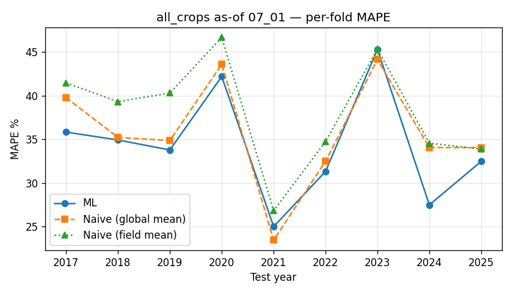

---

## all_crops — as-of 08_01

- rows: 441, features: 89
- mean ML MAPE: 34.07%, naive (global mean): 35.74%, naive (field mean): 38.12%

### Per-fold metrics

| year | n_test | n_train | n_train_years | ML MAPE | naive | field_mean | ML R² |
|---|---|---|---|---|---|---|---|
| 2017 | 30 | 189 | 7 | 37.2 | 39.8 | 41.5 | 0.04 |
| 2018 | 27 | 219 | 8 | 29.4 | 35.2 | 39.3 | 0.11 |
| 2019 | 30 | 246 | 9 | 32.4 | 34.9 | 40.3 | -0.10 |
| 2020 | 29 | 276 | 10 | 41.7 | 43.6 | 46.7 | -0.65 |
| 2021 | 30 | 305 | 11 | 24.3 | 23.4 | 26.8 | -0.33 |
| 2022 | 30 | 335 | 12 | 33.2 | 32.5 | 34.8 | 0.01 |
| 2023 | 26 | 365 | 13 | 48.8 | 44.1 | 45.3 | -0.27 |
| 2024 | 24 | 391 | 14 | 26.4 | 34.1 | 34.6 | -1.23 |
| 2025 | 26 | 415 | 15 | 33.2 | 34.0 | 33.9 | -0.01 |

### Top features by importance

- `crop_id` — 5.49
- `ndvi_anom_last30d_mean_asof` — 4.17
- `ndvi_baseline_n_years` — 4.05
- `ndvi_p75_asof` — 3.79
- `ndvi_anom_mean_asof` — 3.46
- `prev_crop_id` — 3.22
- `ndvi_mean_asof` — 2.81
- `ndvi_integral_asof` — 2.79
- `wx_jun_precip` — 2.72
- `ndvi_last_value_asof` — 2.72
- `ndvi_above_05_days_asof` — 2.67
- `ndvi_p10_max_asof` — 2.65
- `ndvi_max_asof` — 2.51
- `ndvi_peak_doy_asof` — 2.13
- `ndvi_amplitude_asof` — 1.93

### Bottom 15 features (candidates for removal)

- `wx_may_temp_max` — 0.28
- `wx_gdd_wheat_to_asof` — 0.26
- `wx_jul_et0` — 0.23
- `wx_hot_d30_to_asof` — 0.19
- `wx_temp_max_last30d` — 0.18
- `wx_et0_sum_last30d` — 0.16
- `wx_may_hot_d30` — 0.16
- `wx_vpd_max_to_asof` — 0.16
- `wx_jun_srad` — 0.15
- `wx_jul_hot_d30` — 0.14
- `wx_precip_sum_last30d` — 0.11
- `wx_hot_d35_to_asof` — 0.09
- `wx_dry_days_to_asof` — 0.03
- `wx_temp_mean_to_asof` — 0.03
- `wx_apr_hot_d30` — 0.00

### Redundant pairs (Spearman ≥ 0.95)

- `wx_srad_sum_to_asof` ↔ `wx_srad_mean_to_asof`: ρ = 1.000
- `wx_vpd_max_last30d` ↔ `wx_jul_vpd_max`: ρ = 1.000
- `wx_temp_max_last30d` ↔ `wx_jul_temp_max`: ρ = 1.000
- `field_tillable_area` ↔ `field_calculated_area`: ρ = 0.999
- `wx_gdd_sunflower_to_asof` ↔ `wx_gdd_wheat_to_asof`: ρ = 0.998
- `wx_et0_sum_last30d` ↔ `wx_jul_et0`: ρ = 0.996
- `wx_precip_sum_last30d` ↔ `wx_jul_precip`: ρ = 0.995
- `ndvi_max_asof` ↔ `ndvi_p10_max_asof`: ρ = 0.993
- `wx_srad_sum_last30d` ↔ `wx_jul_srad`: ρ = 0.986
- `wx_temp_mean_to_asof` ↔ `wx_gdd_wheat_to_asof`: ρ = 0.980
- `wx_temp_mean_to_asof` ↔ `wx_gdd_sunflower_to_asof`: ρ = 0.972
- `wx_vpd_mean_to_asof` ↔ `wx_vpd_days_high_to_asof`: ρ = 0.964

### Top |corr| with target

- `target_yield_t_ha`: +1.000
- `ndvi_p75_asof`: +0.433
- `ndvi_max_asof`: +0.390
- `ndvi_p10_max_asof`: +0.389
- `ndvi_anom_mean_asof`: +0.371
- `ndvi_mean_asof`: +0.355
- `ndvi_anom_last30d_mean_asof`: +0.330
- `ndvi_amplitude_asof`: +0.325
- `ndvi_above_05_days_asof`: +0.307
- `wx_jun_precip`: +0.293
...
- `wx_vpd_mean_to_asof`: -0.053
- `wx_hot_d35_to_asof`: -0.067
- `wx_may_srad`: -0.073
- `field_soil_pH`: -0.084
- `ndvi_peak_doy_asof`: -0.104
- `wx_jul_hot_d30`: -0.115
- `wx_jun_temp_mean`: -0.146
- `wx_jun_et0`: -0.162
- `wx_drought_run_to_asof`: -0.170
- `years_since_wheat`: -0.225

### High-NaN features

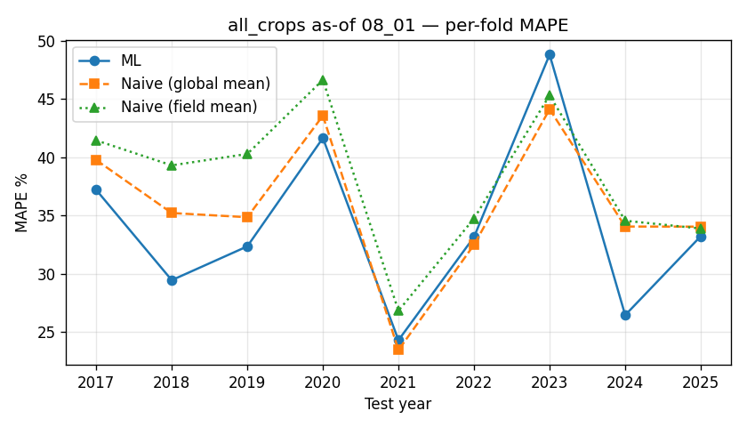

---

## all_crops — as-of 09_01

- rows: 441, features: 96
- mean ML MAPE: 34.46%, naive (global mean): 35.74%, naive (field mean): 38.12%

### Per-fold metrics

| year | n_test | n_train | n_train_years | ML MAPE | naive | field_mean | ML R² |
|---|---|---|---|---|---|---|---|
| 2017 | 30 | 189 | 7 | 41.8 | 39.8 | 41.5 | -0.06 |
| 2018 | 27 | 219 | 8 | 30.3 | 35.2 | 39.3 | 0.18 |
| 2019 | 30 | 246 | 9 | 34.0 | 34.9 | 40.3 | -0.08 |
| 2020 | 29 | 276 | 10 | 41.9 | 43.6 | 46.7 | -0.57 |
| 2021 | 30 | 305 | 11 | 25.0 | 23.4 | 26.8 | -0.18 |
| 2022 | 30 | 335 | 12 | 32.0 | 32.5 | 34.8 | -0.07 |
| 2023 | 26 | 365 | 13 | 41.2 | 44.1 | 45.3 | 0.11 |
| 2024 | 24 | 391 | 14 | 29.0 | 34.1 | 34.6 | -1.42 |
| 2025 | 26 | 415 | 15 | 35.0 | 34.0 | 33.9 | -0.06 |

### Top features by importance

- `crop_id` — 7.75
- `ndvi_p75_asof` — 5.61
- `ndvi_mean_asof` — 3.90
- `ndvi_baseline_n_years` — 3.77
- `ndvi_p10_max_asof` — 3.12
- `ndvi_peak_doy_asof` — 2.97
- `ndvi_anom_min_asof` — 2.88
- `ndvi_last_value_asof` — 2.82
- `prev_crop_id` — 2.60
- `ndvi_anom_mean_asof` — 2.59
- `ndvi_slope_asof` — 2.51
- `wx_may_temp_mean` — 2.48
- `ndvi_max_asof` — 2.04
- `wx_vpd_max_last30d` — 1.97
- `ndvi_above_05_days_asof` — 1.91

### Bottom 15 features (candidates for removal)

- `years_since_sunflower` — 0.22
- `wx_jun_vpd_max` — 0.21
- `wx_aug_et0` — 0.20
- `wx_aug_vpd_max` — 0.20
- `wx_srad_sum_to_asof` — 0.20
- `wx_aug_temp_max` — 0.13
- `wx_jun_srad` — 0.12
- `wx_srad_sum_last30d` — 0.08
- `wx_precip_sum_last30d` — 0.07
- `wx_gdd_sunflower_to_asof` — 0.06
- `wx_jul_hot_d30` — 0.05
- `wx_aug_hot_d30` — 0.04
- `wx_aug_srad` — 0.04
- `wx_hot_d35_to_asof` — 0.00
- `wx_apr_hot_d30` — 0.00

### Redundant pairs (Spearman ≥ 0.95)

- `wx_srad_sum_to_asof` ↔ `wx_srad_mean_to_asof`: ρ = 1.000
- `field_tillable_area` ↔ `field_calculated_area`: ρ = 0.999
- `wx_vpd_max_last30d` ↔ `wx_aug_vpd_max`: ρ = 0.998
- `wx_gdd_sunflower_to_asof` ↔ `wx_gdd_wheat_to_asof`: ρ = 0.996
- `ndvi_max_asof` ↔ `ndvi_p10_max_asof`: ρ = 0.993
- `wx_et0_sum_last30d` ↔ `wx_aug_et0`: ρ = 0.991
- `wx_temp_max_last30d` ↔ `wx_aug_temp_max`: ρ = 0.990
- `wx_temp_mean_to_asof` ↔ `wx_gdd_wheat_to_asof`: ρ = 0.982
- `wx_precip_sum_last30d` ↔ `wx_aug_precip`: ρ = 0.980
- `wx_temp_mean_to_asof` ↔ `wx_gdd_sunflower_to_asof`: ρ = 0.971
- `wx_srad_sum_last30d` ↔ `wx_aug_srad`: ρ = 0.970
- `wx_vpd_mean_to_asof` ↔ `wx_vpd_days_high_to_asof`: ρ = 0.966
- `wx_vpd_max_last30d` ↔ `wx_temp_max_last30d`: ρ = 0.965
- `wx_aug_temp_max` ↔ `wx_aug_vpd_max`: ρ = 0.962
- `wx_temp_max_last30d` ↔ `wx_aug_vpd_max`: ρ = 0.962

### Top |corr| with target

- `target_yield_t_ha`: +1.000
- `ndvi_p75_asof`: +0.426
- `ndvi_max_asof`: +0.392
- `ndvi_p10_max_asof`: +0.389
- `ndvi_anom_mean_asof`: +0.362
- `ndvi_mean_asof`: +0.338
- `ndvi_amplitude_asof`: +0.324
- `ndvi_integral_asof`: +0.296
- `wx_jun_precip`: +0.293
- `year`: +0.287
...
- `ndvi_peak_doy_asof`: -0.117
- `wx_aug_hot_d30`: -0.126
- `wx_jun_temp_mean`: -0.146
- `wx_temp_max_last30d`: -0.150
- `wx_aug_temp_max`: -0.153
- `wx_jun_et0`: -0.162
- `wx_vpd_max_last30d`: -0.184
- `wx_aug_vpd_max`: -0.187
- `wx_drought_run_to_asof`: -0.215
- `years_since_wheat`: -0.225

### High-NaN features

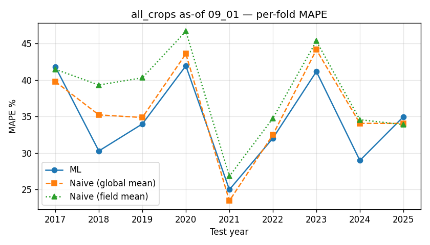

---

