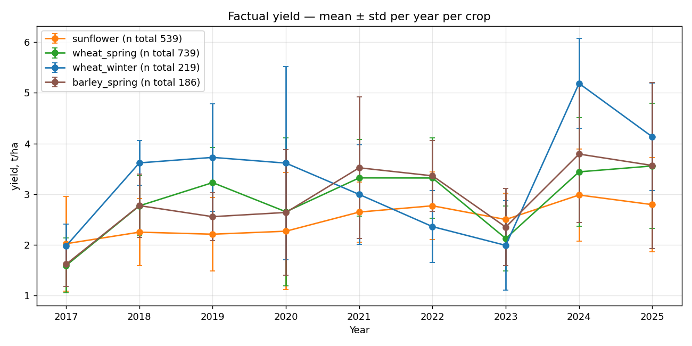
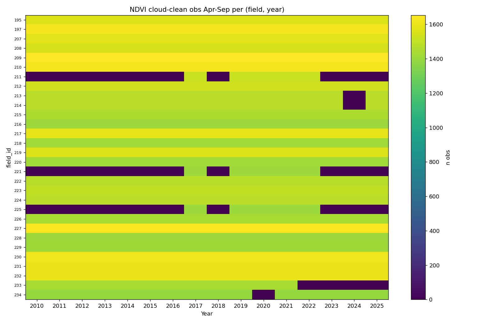

# Deep Data Audit

Generated by `scripts/audit/deep_data_audit.py`.
Purpose: find what's unused, what's broken, what could leak.


## 1. Raw file inventory

```
                               file  size_kb   rows  cols
    productivity_estimate_peers.csv   100689  47591    18
                ndvi_timeseries.csv    29524 757853    10
                openmeteo_daily.csv    16431 175320    17
                     yield_maps.csv     5620    104    34
                  plant_threats.csv     4108   7673    18
 field_scout_reports_aggregated.csv     3216   2654    27
             history_items_full.csv     2340  19172    32
productivity_estimate_histories.csv     2009   4774     6
                     operations.csv     1728   1827    73
              soil_test_samples.csv      407   1977    33
          weather_history_items.csv      337   8297     8
                     soil_tests.csv      319   1235   182
              productivity_data.csv      243   3070     7
                  growth_stages.csv      182   1181    11
                         fields.csv      112     30    32
 additional_yields_from_history.csv      100   1903     7
      weather_season_aggregates.csv       67    509    16
         productivity_estimates.csv       42    440     8
            growth_stage_groups.csv       20    184     8
                          crops.csv       14     68    17
                          seeds.csv       10     53    27
                fertilizers_npk.csv        5     55    22
               weather_stations.csv        5     53     7
                      soilgrids.csv        4     28    27
                  growth_scales.csv        3     28    10
       field_to_station_mapping.csv        0     30     3
```

## 2. Unused / under-used raw sources

```
yield_maps.csv columns: ['id', 'field_id', 'additional_info', 'external_id', 'description', 'field_work_result_id', 'property_name', 'calculated_average', 'units', 'created_at', 'updated_at', 'external_average', 'grid_map.geotransform.top_left_x', 'grid_map.geotransform.top_left_y', 'grid_map.geotransform.step_x', 'grid_map.geotransform.step_y', 'grid_map.geotransform.size_x', 'grid_map.geotransform.size_y', 'grid_map.data_values', 'totals.result.area.units', 'totals.result.area.value', 'totals.result.total.units', 'totals.result.total.value', 'totals.result.average.units', 'totals.result.average.value', 'totals.result.fuel_volume.units', 'totals.result.fuel_volume.value', 'totals.result.time_effective.units', 'totals.result.time_effective.value', 'totals.result.time_ineffective.units']

field_scout_reports_aggregated.csv columns: ['id', 'field_id', 'user_id', 'report_time', 'season', 'growth_scale', 'growth_stage', 'additional_info', 'growth_stage_id', 'threats', 'measurements', 'image1', 'image2', 'image3', 'ears_count', 'plants_count', 'ground_cover', 'created_by_user_at', 'updated_by_user_at', 'external_id', 'scouting_task_id', 'scout_report_template_id', 'created_at', 'updated_at', 'risk_yield_decreasing', 'notify_management', 'field_condition']

plant_threats.csv columns: ['id', 'name', 'custom_name', 'standard_name', 'code', 'threat_type', 'image1', 'image2', 'image3', 'external_id', 'additional_info', 'description', 'visible', 'range', 'latin_name', 'economic_threshold_damage', 'created_at', 'updated_at']

growth_stages.csv columns: ['id', 'growth_scale_id', 'growth_stage_group_id', 'code', 'name', 'localized_name', 'external_id', 'additional_info', 'description', 'created_at', 'updated_at']

productivity_estimate_peers.csv size: 98.3 MB (NOT loaded fully)

soil_tests.csv columns: ['id', 'field_id', 'made_at', 'name', 'soil_mineral_type', 'soil_organic_type', 'probe_depth', 'description', 'laboratory_name', 'attached_file', 'created_at', 'updated_at', 'external_id', 'pesticides', 'soil_pH.value', 'soil_pH.description', 'soil_pH.standard_research_method', 'soil_pH.units', 'soil_organic_matter.value', 'soil_organic_matter.description', 'soil_organic_matter.standard_research_method', 'soil_organic_matter.units', 'soil_N_NO3.value', 'soil_N_NO3.description', 'soil_N_NO3.standard_research_method', 'soil_N_NO3.units', 'soil_P.value', 'soil_P.description', 'soil_P.standard_research_method', 'soil_P.units']

soil_test_samples.csv columns: ['id', 'soil_test_id', 'coordinates', 'created_at', 'updated_at', 'soil_K', 'soil_P', 'soil_S', 'soil_Cu', 'soil_Fe', 'soil_Mg', 'soil_Mn', 'soil_Mo', 'soil_Zn', 'soil_pH', 'soil_N_NO3', 'soil_organic_matter', 'soil_research_method_K', 'soil_research_method_P', 'soil_research_method_S', 'soil_research_method_pH', 'soil_research_method_N_NO3', 'soil_research_method_organic_matter', 'soil_B', 'soil_N', 'soil_research_method_B', 'soil_research_method_N', 'soil_research_method_Cu', 'soil_research_method_Fe', 'soil_research_method_Mg']
```

## 3. Target audit — factual yield distribution
Per-(crop, year) target stats (top 30 rows):

```
       standard_name  year  n  mean  std  min  max
        avena_spring  2018  4  3.04 0.39 2.60 3.54
       barley_spring  2017  3  1.62 0.44 1.16 2.03
       barley_spring  2018  4  2.78 0.62 2.10 3.60
       barley_spring  2019  2  2.56 0.47 2.23 2.89
       barley_spring  2020 10  2.64 1.24 1.38 5.99
       barley_spring  2021 20  3.52 1.40 1.32 5.86
       barley_spring  2022 10  3.36 0.70 1.76 4.18
       barley_spring  2023 46  2.35 0.76 1.09 4.50
       barley_spring  2024 45  3.79 1.35 0.86 5.98
       barley_spring  2025 46  3.57 1.63 1.53 6.15
           buckwheat  2018  8  2.31 0.50 1.30 2.70
           buckwheat  2019  4  2.27 0.29 1.92 2.57
           buckwheat  2023  1  0.77  NaN 0.77 0.77
           buckwheat  2024  3  1.47 0.88 0.66 2.41
              lentil  2023  9  1.32 0.06 1.26 1.38
              lentil  2024 20  1.13 0.47 0.36 1.97
              lentil  2025  6  1.37 0.37 0.98 1.91
               maize  2017  1  5.43  NaN 5.43 5.43
               maize  2018  5  3.32 0.50 2.64 4.06
               maize  2019  3  5.30 2.95 3.40 8.70
               maize  2020  5  7.31 1.98 5.12 9.65
               maize  2021  1  8.83  NaN 8.83 8.83
            medicago  2025  1  1.00  NaN 1.00 1.00
oil_seed_raps_spring  2017 13  1.56 1.14 0.46 4.29
oil_seed_raps_spring  2018  1  0.81  NaN 0.81 0.81
oil_seed_raps_spring  2019  9  0.99 0.42 0.52 1.76
oil_seed_raps_spring  2020  3  1.95 2.10 0.70 4.38
oil_seed_raps_spring  2024  3  2.03 0.40 1.67 2.46
oil_seed_raps_spring  2025  9  2.09 0.50 1.25 2.76
oil_seed_raps_winter  2017  4  1.90 0.69 0.90 2.39
```



Outlier rows (|z| > 2.5 vs same-(crop,year) median): 24

```
 field_id  year                 crop   y_t_ha  median     z                    source
      346  2020        barley_spring 5.990000    2.35  2.94   productivity_normalized
      222  2023        barley_spring 4.500500    2.33  2.85 physical_harvested_weight
      423  2017 oil_seed_raps_spring 4.290000    1.06  2.83   productivity_normalized
      403  2018 oil_seed_raps_winter 2.232000    1.28  2.63   productivity_normalized
      346  2023                  pea 3.323784    1.11  3.94   productivity_normalized
      280  2018            sunflower 0.643000    2.43 -2.70   productivity_normalized
      389  2020            sunflower 5.000000    2.06  2.55   productivity_normalized
      438  2021            sunflower 4.436875    2.64  3.03   productivity_normalized
      214  2022            sunflower 1.002222    2.86 -2.80 physical_harvested_weight
      375  2023            sunflower 4.080000    2.54  2.95   productivity_normalized
      782  2025            sunflower 0.529412    3.02 -2.68   productivity_normalized
      407  2019         wheat_spring 1.418000    3.38 -2.83   productivity_normalized
      335  2020         wheat_spring 6.590000    2.46  2.83   productivity_normalized
      213  2021         wheat_spring 1.315571    3.38 -2.73 physical_harvested_weight
      257  2021         wheat_spring 5.508889    3.38  2.82   productivity_normalized
      261  2021         wheat_spring 5.387429    3.38  2.65   productivity_normalized
      295  2023         wheat_spring 4.579000    2.00  4.01   productivity_normalized
      832  2023         wheat_spring 4.200000    2.00  3.42   productivity_normalized
      671  2024         wheat_spring 0.312500    3.59 -3.07   productivity_normalized
      738  2024         wheat_spring 6.303509    3.59  2.53   productivity_normalized
      782  2024         wheat_spring 0.796842    3.59 -2.61   productivity_normalized
      234  2021         wheat_winter 5.389143    2.87  2.56 physical_harvested_weight
      235  2021         wheat_winter 7.105000    2.87  4.31   productivity_normalized
      254  2023         wheat_winter 5.264189    1.97  3.75   productivity_normalized
```

## 4. NDVI audit — coverage per (field, year)
Total NDVI observations: 757853
Year range: 2010..2025
Distinct fields: 30
After cloud filter (≤30%): 757853 (100.0%)

Apr-Sep observations per (field, year):

```
count     440.0
mean     1517.1
std        83.7
min      1391.0
25%      1439.0
50%      1498.0
75%      1606.0
max      1654.0
```



NDVI Jun-Aug stats per crop (cloud-clean):

```
                       mean    std    min    max   count
standard_name                                           
barley_spring         0.559  0.137  0.188  0.822   14110
maize                 0.539  0.129  0.225  0.817    2558
oil_seed_raps_spring  0.569  0.137  0.188  0.822   13257
oil_seed_raps_winter  0.550  0.151  0.202  0.817    3755
pea                   0.544  0.155  0.202  0.817    3753
safflower             0.599  0.106  0.289  0.775     799
soya                  0.533  0.141  0.202  0.816    3469
sunflower             0.558  0.137  0.188  0.822  252497
wheat_spring          0.562  0.135  0.188  0.822   58740
wheat_winter          0.549  0.143  0.188  0.818   34901
```

## 5. Weather audit — Open-Meteo coverage
rows: 175320, fields: 30, years: 2010..2025

Per-column NaN ratio:

```
field_id                       0.0
date                           0.0
year                           0.0
temperature_2m_mean            0.0
precipitation_sum              0.0
shortwave_radiation_sum        0.0
et0_fao_evapotranspiration     0.0
vapour_pressure_deficit_max    0.0
```

Annual aggregates (sum across all fields):

```
      precip_sum  precip_mean  srad_mean   et0_sum  vpd_max  t_max  t_min
year                                                                     
2010     21511.4         1.96      13.78  23035.28     4.67   26.0  -37.9
2011     16985.3         1.55      14.13  25227.38     3.83   25.6  -38.0
2012     21823.5         1.99      13.79  24962.33     4.17   26.2  -42.2
2013     25064.6         2.29      12.92  22468.25     2.98   22.7  -23.2
2014     25615.5         2.34      13.25  23671.69     4.38   26.9  -32.0
2015     27170.5         2.48      13.31  23848.17     4.11   25.0  -34.9
2016     29283.8         2.67      13.27  22572.22     2.97   23.6  -35.9
2017     14681.9         1.34      13.72  25593.14     4.31   27.2  -25.0
2018     22816.7         2.08      12.70  23564.62     4.04   26.0  -35.3
2019     22651.1         2.07      13.47  24511.54     4.13   27.1  -31.4
2020     21088.3         1.92      13.45  26015.68     4.29   26.5  -31.6
2021     21178.8         1.93      13.42  24788.66     3.84   26.2  -36.0
2022     19757.5         1.80      14.01  26709.21     5.03   27.1  -34.8
2023     26375.9         2.41      13.60  25618.97     5.25   29.6  -36.6
2024     29104.2         2.65      13.17  23429.38     3.82   26.1  -35.6
2025     25978.7         2.37      13.74  24719.61     3.93   27.9  -28.4
```

## 6. Sowing date audit
Sowing/harvest date coverage by crop:

```
                         n  sow_present_pct  harvest_present_pct
standard_name                                                   
avena_spring            23              0.0                  0.0
barley_spring          398             42.5                 42.0
buckwheat               21             38.1                 19.0
fallow                 141              2.1                  0.0
lentil                 133             26.3                 26.3
linum                   92              0.0                  0.0
maize                   18             27.8                 16.7
medicago                 5             20.0                 20.0
oil_seed_raps_spring   221              6.3                  5.9
oil_seed_raps_winter    35              0.0                  0.0
pea                    208             47.1                 45.7
potatoes                 1              0.0                  0.0
rye_winter               9            100.0                 66.7
safflower                1              0.0                  0.0
sainfoin                15             26.7                  0.0
soya                    82             15.9                 13.4
sudan_grass              4            100.0                  0.0
sugar_beet               2              0.0                  0.0
sunflower             4390              8.5                  8.0
sweet_clover             1            100.0                  0.0
wheat_spring          1550             42.2                 40.9
wheat_winter           280             52.9                 48.6
```

Sowing-month distribution per crop:

```
sow_month             4.0  5.0  6.0  1.0  8.0  9.0
standard_name                                     
barley_spring          22  143    4    0    0    0
buckwheat               0    5    3    0    0    0
fallow                  0    3    0    0    0    0
lentil                  0   35    0    0    0    0
maize                   0    5    0    0    0    0
medicago                0    0    1    0    0    0
oil_seed_raps_spring    0   14    0    0    0    0
pea                    19   78    0    1    0    0
rye_winter              0    0    0    0    2    7
sainfoin                0    4    0    0    0    0
soya                    0   11    2    0    0    0
sudan_grass             1    3    0    0    0    0
sunflower              26  349    0    0    0    0
sweet_clover            0    1    0    0    0    0
wheat_spring            2  581   55    0    7    9
wheat_winter            0    2    0    0   51   95
```

Sow-year offset (sow_year - record_year) per crop:

```
sow_year_offset       -1.0   0.0   2.0
standard_name                         
barley_spring            0   169     0
buckwheat                0     8     0
fallow                   0     3     0
lentil                   0    35     0
maize                    0     5     0
medicago                 0     1     0
oil_seed_raps_spring     1    13     0
pea                      0    97     1
rye_winter               9     0     0
sainfoin                 0     4     0
soya                     0    13     0
sudan_grass              0     4     0
sunflower                0   375     0
sweet_clover             0     1     0
wheat_spring            21   633     0
wheat_winter           146     2     0
```

Spring crops with fall sowing (suspect): 16

```
 field_id  year standard_name sowing_date
      367  2022  wheat_spring  2021-08-27
      388  2022  wheat_spring  2021-09-02
      347  2022  wheat_spring  2021-09-10
      390  2022  wheat_spring  2021-09-05
      371  2022  wheat_spring  2021-08-26
      373  2022  wheat_spring  2021-08-30
      374  2022  wheat_spring  2021-08-26
      375  2022  wheat_spring  2021-08-26
      402  2022  wheat_spring  2021-09-02
      377  2022  wheat_spring  2021-08-30
      405  2022  wheat_spring  2021-09-08
      407  2022  wheat_spring  2021-09-02
      412  2022  wheat_spring  2021-09-11
      415  2022  wheat_spring  2021-09-15
      379  2022  wheat_spring  2021-09-01
      380  2022  wheat_spring  2021-08-27
```

Winter wheat with non-fall sowing: 2

```
 field_id  year sowing_date
      251  2021  2021-05-04
      372  2021  2021-05-22
```

## 7. Rotation audit
Top rotation pairs (prev -> current):

```
           prev_crop        standard_name    n
           sunflower            sunflower 3502
           sunflower         wheat_spring  518
        wheat_spring         wheat_spring  459
        wheat_spring            sunflower  348
        wheat_spring        barley_spring  141
        wheat_winter            sunflower  133
        wheat_spring                  pea  125
           sunflower        barley_spring  105
oil_seed_raps_spring         wheat_spring   99
       barley_spring            sunflower   93
        wheat_spring               lentil   86
              fallow         wheat_spring   76
              lentil         wheat_spring   71
       barley_spring         wheat_spring   69
        wheat_spring oil_seed_raps_spring   68
                 pea         wheat_spring   65
        wheat_spring         wheat_winter   52
        wheat_spring                linum   50
           sunflower         wheat_winter   48
           sunflower oil_seed_raps_spring   37
```

Sunflower-after-sunflower events: 3502 (agronomically unusual; rotation 4-7y expected)

```
 field_id  year
      195  2001
      195  2002
      195  2003
      195  2004
      195  2005
      195  2006
      195  2007
      195  2008
      195  2009
      195  2010
      195  2011
      195  2012
      195  2013
      195  2014
      195  2015
      195  2016
      195  2017
      195  2018
      197  2001
      197  2002
```

## 8. Field consistency audit
fields.csv rows: 30, distinct id: 30

tillable_area distribution:

```
count     30.00
mean     127.95
std      118.97
min        4.00
25%       37.50
50%       86.00
75%      219.75
max      408.00
```

## 9. Cropwise estimate vs factual (per row)
Cropwise estimate vs factual on n=200 rows:

```
       estimate_t_ha_norm  fact_t_ha  err_estimate_minus_fact
count             200.000    200.000                  200.000
mean                2.719      2.696                    0.023
std                 0.884      1.089                    1.073
min                 0.953      0.578                   -4.184
25%                 2.170      1.923                   -0.405
50%                 2.655      2.708                    0.042
75%                 3.223      3.317                    0.751
max                 6.486      5.780                    3.174
```

Cropwise estimate accuracy vs factual per crop:

```
                         n   bias    mae   rmse   mape_%
standard_name                                           
barley_spring         16.0  0.122  0.847  1.054   37.986
maize                  3.0  1.660  1.946  2.255  165.212
oil_seed_raps_spring  11.0 -0.200  0.867  1.245   60.092
oil_seed_raps_winter   4.0 -0.502  0.881  1.078   43.724
pea                    4.0  0.748  0.786  0.915   51.993
soya                   4.0  0.327  0.327  0.420   25.821
sunflower             61.0  0.030  0.500  0.658   21.710
wheat_spring          57.0 -0.219  0.984  1.354   36.123
wheat_winter          39.0  0.211  0.786  1.009   36.327
```

Worst Cropwise misses (estimate vs factual):

```
 field_id  year        standard_name  estimate_t_ha_norm  fact_t_ha  err_estimate_minus_fact
      213  2020         wheat_spring              1.5964   5.780000                -4.183600
      208  2020         wheat_spring              1.3906   5.050000                -3.659400
      226  2020         wheat_spring              1.5046   5.020000                -3.515400
      227  2020         wheat_winter              2.2098   5.650000                -3.440200
      220  2020         wheat_spring              1.7675   5.130000                -3.362500
      207  2020 oil_seed_raps_spring              1.1702   4.380000                -3.209800
      228  2018                maize              6.4855   3.312000                 3.173500
      219  2020         wheat_spring              1.1434   4.250000                -3.106600
      222  2023        barley_spring              2.0631   4.500500                -2.437400
      209  2020                maize              2.8142   0.578000                 2.236200
      213  2021         wheat_spring              3.3956   1.315571                 2.080029
      207  2025         wheat_spring              3.4044   1.352268                 2.052132
      225  2019            sunflower              1.9401   3.961000                -2.020900
      231  2020 oil_seed_raps_winter              1.6897   3.620000                -1.930300
      197  2022         wheat_winter              3.2342   1.520700                 1.713500
```

## 10. Leakage candidate scan in v9 dataset
Numeric features with |Spearman vs target| > 0.6 (review for honest leakage):

```
Empty DataFrame
Columns: []
Index: []
```
