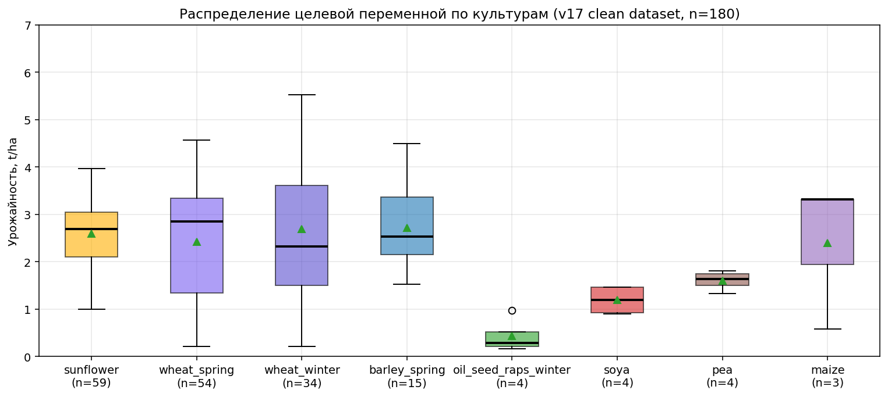
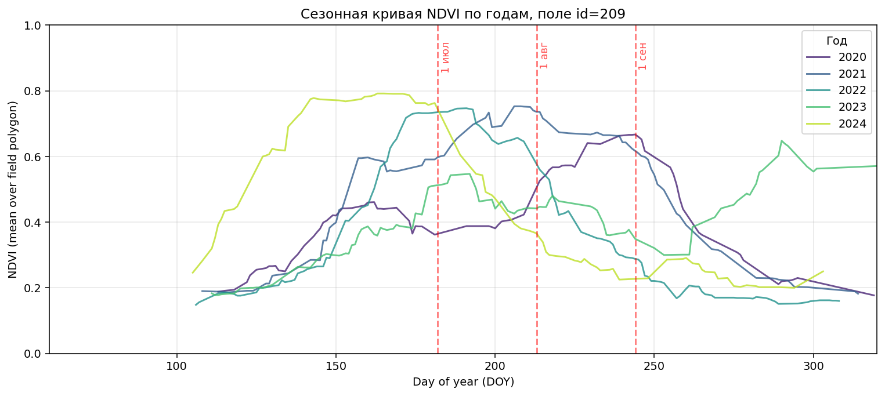
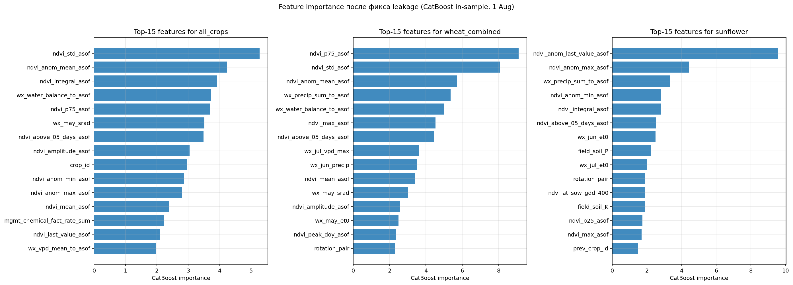
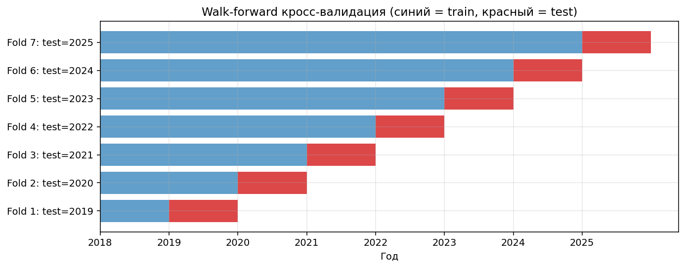
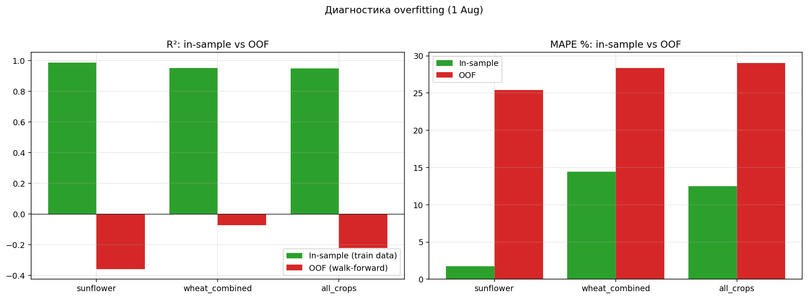
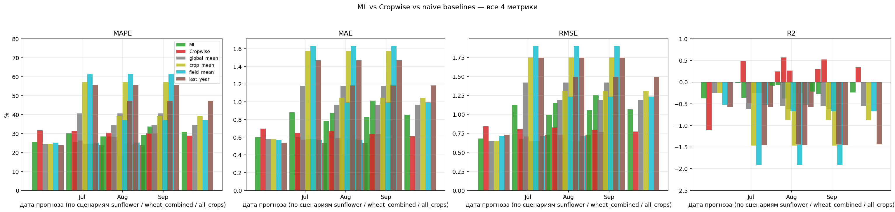
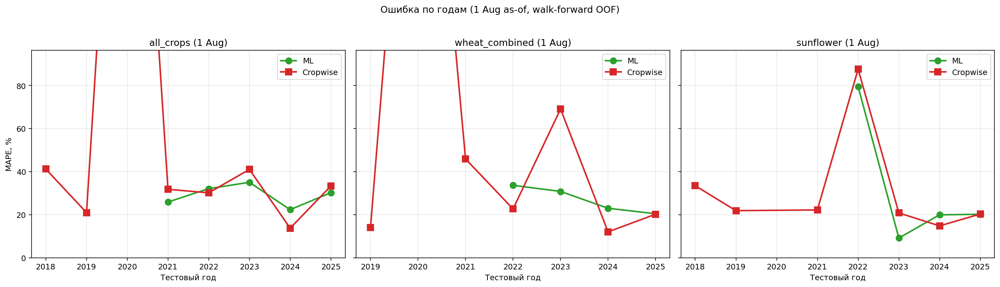

# Финальный отчёт: прогноз урожайности vs Cropwise

**Проект:** PhD — прогноз урожайности полей (ВКО, Казахстан)  
**Дата:** июнь 2026  
**Версия данных/модели:** v17 (strict target, без утечки Cropwise в фичах)

---

## Содержание

1. [Задача простыми словами](#1-задача-простыми-словами)
2. [Что на входе: все источники данных](#2-что-на-входе-все-источники-данных)
3. [Что на выходе: целевая переменная](#3-что-на-выходе-целевая-переменная)
4. [Почему даты 1 июля / 1 августа / 1 сентября](#4-почему-даты-1-июля--1-августа--1-сентября)
5. [Как собирается одна строка датасета (pipeline)](#5-как-собирается-одна-строка-датасета-pipeline)
6. [Признаки (features): что входит в модель](#6-признаки-features-что-входит-в-модель)
7. [Модель и валидация](#7-модель-и-валидация)
8. [Метрики: MAPE, MAE, RMSE, R²](#8-метрики-mape-mae-rmse-r²)
9. [История версий (v7 → v17) и найденные ошибки](#9-история-версий-v7--v17-и-найденные-ошибки)
10. [Финальные результаты (честные, после всех фиксов)](#10-финальные-результаты-честные-после-всех-фиксов)
11. [Что можно и нельзя писать в диссертации](#11-что-можно-и-нельзя-писать-в-диссертации)
12. [Куда двигаться дальше](#12-куда-двигаться-дальше)
13. [Приложения: файлы и скрипты](#13-приложения-файлы-и-скрипты)

---

## 1. Задача простыми словами

**Вход:** для каждого поля, культуры и года мы знаем только то, что было известно **до** выбранной даты (например, до 1 июля).

**Выход:** предсказать **фактическую урожайность** в конце сезона, в **тоннах на гектар (t/ha)**.

**Сравнение:** наш ML-прогноз сравнивается с **прогнозом Cropwise** на ту же дату — без использования Cropwise как входа в модель (только как внешний бенчмарк).

**Одна строка обучения** = одно поле + один год + одна культура + одна дата «as-of».

---

## 2. Что на входе: все источники данных

### 2.1. Общая картина (цифры)

| Источник | Что это | Записей | Уникальных полей | Период |
|----------|---------|--------:|-----------------:|--------|
| `history_items_full.csv` | История полей: культура, урожай, вес с комбайна | 19 172 | **633** | 2000–2030 |
| `fields.csv` | Геометрия, площадь, название | 30 | **30** | — |
| `ndvi_timeseries.csv` | Спутниковый NDVI по полигону поля | 757 853 | **30** | 2007–2025 |
| `openmeteo_daily.csv` | Погода ERA5-Land (темп., осадки, GDD…) | 175 320 | **30** | 2010–2025 |
| `operations.csv` | Операции: посев, удобрения, СЗР | 1 826 | 30 | — |
| `field_scout_reports_aggregated.csv` | Осмотры: BBCH, угрозы, состояние | 2 636 | 386 | — |
| `soil_test_samples.csv` | Анализы почвы (pH, NPK, OM…) | 1 977 | — | — |
| `productivity_data.csv` | Таблица «Поле / Год / урожайность факт ц/га» | 3 070 | по имени | 2018–2025 |
| `yield_maps.csv` | Карта урожая с комбайна (точечная) | 104 | 26 | — |
| `productivity_estimates.csv` + histories | **Прогнозы Cropwise** по датам | — | — | — |

**Главное ограничение проекта:** NDVI, погода и геометрия есть только для **30 полей**, хотя фактический урожай в истории есть у **633**. Поэтому рабочий ML-датасет — **180 строк** (30 полей × несколько лет × культуры), а не тысячи.

```
633 полей с урожаем в history_items
         │
         ▼
    30 полей с NDVI + погодой + geometry
         │
         ▼
   180 строк в v17 clean (после чистки конфликтов)
         │
         ▼
   ~127 строк с OOF-прогнозом ML (walk-forward)
```

### 2.2. Поля (`fields.csv`)

- **30 полей** с известной `tillable_area` (площадь в га).
- Имена полей на русском — по ним стыкуется `productivity_data.csv`.
- Без API-токена Cropwise **нельзя** автоматически подтянуть остальные ~603 поля.

### 2.3. Культуры

В финальном датасете **9 культур**, но по объёму данных доминируют три:

| Культура | Строк (n) | Типичный урожай, t/ha |
|----------|----------:|----------------------:|
| Подсолнечник (`sunflower`) | 59 | 1.0 – 4.0 |
| Яровая пшеница (`wheat_spring`) | 54 | 0.2 – 4.6 |
| Озимая пшеница (`wheat_winter`) | 34 | 1.5 – 5.5 |
| Яровой ячмень | 15 | 1.5 – 4.5 |
| Остальные (рапс, соя, горох, кукуруза) | ≤4 каждая | мало данных |



*Рис. 1. Распределение урожайности (t/ha) по культурам. Видно: подсолнечник и пшеница — основа; мелкие культуры (n≤4) статистически ненадёжны.*

### 2.4. NDVI (спутник)

- **NDVI** (Normalized Difference Vegetation Index) — индекс «зелени» поля, 0…1.
- Считается по полигону поля, ежедневно/по снимкам.
- Для прогноза на 1 июля в признаки попадают только наблюдения **до 1 июля** (`*_asof` в названии колонки).
- Агрономический смысл: NDVI отражает биомассу, стресс, фазу развития; пик обычно летом.



*Рис. 2. Пример NDVI по годам для поля id=209. Красные линии — даты as-of (1 июл, 1 авг, 1 сен). К июлю кривая уже несёт информацию о вегетации; к сентябрю — почти весь сезон.*

### 2.5. Погода (Open-Meteo / ERA5-Land)

- Суточные: температура, осадки, солнечная радиация, ET₀, VPD.
- Агрегаты **до as-of даты**: суммы осадков, GDD (градусо-дни), засухи, жаркие дни, водный баланс.
- Помесячные блоки (апрель–июль) — для фенологии пшеницы/подсолнечника.

### 2.6. Агрономические и управленческие данные

| Группа | Примеры признаков |
|--------|-------------------|
| Севооборот | `prev_crop_id`, `rotation_pair`, лет с последнего подсолнечника/пшеницы |
| Даты посева | `sowing_date`, дни после посева, GDD от посева |
| Осмотры (scout) | стадия BBCH, угрозы, оценка состояния поля |
| Почва (лаб.) | pH, N, P, K, органика — последний анализ **до** as-of |
| Операции (v14/v15) | нормы семян, удобрений, СЗР (без операций уборки — иначе утечка) |

### 2.7. Cropwise — только для сравнения

- Из `productivity_estimate_histories.csv` берётся **последняя оценка Cropwise с датой ≤ as-of**.
- Колонка `cropwise_asof_t_ha` **не входит в модель** (после исправления бага утечки).
- Используется только для расчёта MAPE/MAE/R² «как сделал Cropwise».

---

## 3. Что на выходе: целевая переменная

### 3.1. Что предсказываем

**`target_yield_t_ha`** — фактическая урожайность, **тонны на гектар**.

Примеры по культурам:
- подсолнечник: обычно 1.5–3.5 t/ha;
- пшеница: 2–5 t/ha;
- рекордные строки в данных: до ~5.5 t/ha (озимая пшеница).

### 3.2. Откуда берётся «правда» (v17)

Приоритет источников (если два надёжных источника расходятся **> 1 t/ha** — строка помечается конфликтом и в `clean` выкидывается):

```
1. physical_t_ha = harvested_weight / tillable_area   ← вес с комбайна / площадь
2. prod_fact_t_ha = productivity_data «факт ц/га» / 10
3. productivity_t_ha = history_items.productivity (с нормализацией ц/га → t/ha)
```

**Почему так:** вес с комбайна и площадь — самый прямой физический замер; таблица `productivity_data` — сверка по имени поля; `productivity` в history_items иногда хранит **ц/га под видом t/ha** (особенно 2020 год).

### 3.3. Какие ошибки в target мы уже исправили

| Проблема | Эффект | Версия фикса |
|----------|--------|--------------|
| В target попадали **прогнозы Cropwise**, а не факт | Модель училась предсказывать чужой прогноз | **v7** factual target |
| Ошибка **×10** (ц/га как t/ha) в 2020 | Урожай 0.5 вместо 5.0 t/ha | **v12** productivity_data |
| Расхождение productivity_data vs yield_maps > 1 t/ha | 7 «грязных» строк | **v16** conflict-clean |
| physical vs prod_fact > 1 t/ha | 3 строки (напр. поле 209, 2024) | **v17** strict |

---

## 4. Почему даты 1 июля / 1 августа / 1 сентября

### 4.1. Агрономическая логика

| Дата as-of | Фаза (типично) | Зачем прогноз |
|------------|----------------|---------------|
| **1 июля** | Вегетация, закладка урожая (пшеница колосится, подсолнечник цветёт) | Раннее планирование логистики, продаж, страхования |
| **1 августа** | Налив зерна / формирование корзинки | Уточнение прогноза, решения по уборке |
| **1 сентября** | Поздняя стадия, близко к уборке | Финальная оценка до комбайна |

Урожай физически снимают в **августе–сентябре**, но **прогнозировать раньше** — нормальная постановка: чем ближе к уборке, тем больше сигнала в NDVI/погоде и тем точнее должен быть любой метод.

### 4.2. Сравнение с Cropwise

У Cropwise в `productivity_estimate_histories` хранится **история оценок по датам**. Мы берём последнюю оценку **не позже** 1 июл / 1 авг / 1 сен — симметричное сравнение «что знали оба метода в этот день».

Проверка утечки по датам Cropwise:
- `min_offset_days = 0` → оценка **никогда не из будущего**;
- медиана «устаревания» оценки: **3–5 дней** до as-of (оценка свежая).

### 4.3. Логично ли это для ML

**Да**, при условии:
- все признаки обрезаны по as-of (`ndvi_*_asof`, `wx_*_to_asof`);
- нет признаков уборки и пост-уборочных карт;
- валидация **по годам** (walk-forward), а не случайным split.

**Нет смысла** ожидать, что прогноз 1 июля будет таким же точным, как 1 сентября — и данные это подтверждают (ошибка ML на 1 сен часто выше).

---

## 5. Как собирается одна строка датасета (pipeline)

```
history_items (поле, год, культура)
        │
        ├─► merge fields (площадь, имя)
        ├─► merge crops (standard_name)
        ├─► target v17 (physical > prod_fact > productivity)
        │
        ├─► NDVI: агрегаты только date ≤ as-of
        ├─► Weather: суммы/GDD/stress только date ≤ as-of
        ├─► Sowing: дата посева → GDD-aligned NDVI, погода от посева
        ├─► Scout / soil / operations (только события ≤ as-of)
        │
        ▼
ml_dataset_clean_v17_*_asof_07_01.csv  (159–173 колонки, 180 строк clean)
```

**As-of** означает: «притворяемся, что сегодня 1 июля 2024 года — какие признаки мы уже знаем?»

---

## 6. Признаки (features): что входит в модель

**~150 числовых + несколько категориальных** (`crop_id`, `prev_crop_id`, `field_id`, `rotation_pair`).

Группы (после исправления утечки Cropwise):

| Группа | Примеры | Зачем |
|--------|---------|-------|
| NDVI сезон | mean, max, integral, amplitude, peak_doy | Биомасса, динамика вегетации |
| NDVI anomaly | отклонение от многолетней нормы поля | Аномальный сезон |
| NDVI от посева | ndvi_at_das_30…, ndvi_at_sow_gdd_600 | Фенология |
| Погода | precip, GDD, VPD, drought_run, water_balance | Стресс, водный режим |
| Почва поля / лаб. | pH, NPK, OM | Плодородие |
| Scout | BBCH, угрозы | Полевой мониторинг |
| Management (v14/v15) | нормы удобрений, семян | Вложения (разреженно) |



*Рис. 6. Топ-признаки CatBoost (1 авг, без Cropwise в фичах). Доминируют NDVI и погода — это ожидаемо для crop yield.*

**НЕ входят в модель:** `target_yield_t_ha`, `cropwise_asof_t_ha`, `estimate_history_dict`, колонки с «сырым» target из других источников.

---

## 7. Модель и валидация

### 7.1. Модель

- **CatBoostRegressor** (градиентный бустинг по деревьям).
- Категориальные признаки: crop_id, prev_crop_id, field_id (иногда field_id отключают — меньше запоминания поля).
- Несколько наборов гиперпараметров: `default`, `shallow_l10`, `shallow_l30` (меньше глубина → меньше переобучение).

### 7.2. Walk-forward по годам



*Рис. 3. Для тестового года 2024 модель обучается только на 2018–2023. Случайный train/test split по строкам **запрещён** — будет утечка «будущего года».*

Правила:
- тестовые годы: примерно 2021–2025 (где хватает train);
- минимум **20 строк** и **3 года** в train, иначе год пропускается;
- прогнозы складываются в **OOF** (out-of-fold) — честная оценка на «невиденных» годах.

### 7.3. Переобучение — главный лимит



*Рис. 7. In-sample R² ≈ 0.95, OOF R² ≈ 0. Модель запоминает 180 строк, но не переносит знание на новый год. Это не «плохие фичи», а **мало данных**.*

---

## 8. Метрики: MAPE, MAE, RMSE, R²

| Метрика | Формула (идея) | Интерпретация | Когда смотреть |
|---------|----------------|---------------|----------------|
| **MAPE** | среднее \|ошибка\| / урожай × 100% | «Ошиблись на X%» | Сравнение культур с разным уровнем урожая; язык Cropwise |
| **MAE** | среднее \|ошибка\| в t/ha | Абсолютная ошибка в тоннах | Понятно агроному: ±0.7 t/ha |
| **RMSE** | корень из среднего квадрата ошибки | Штрафует большие промахи | Если важны редкие катастрофы |
| **R²** | доля объяснённой дисперсии | Насколько модель **ранжирует** поля лучше среднего | Мало строк → R² нестабилен |

**Почему мы не ограничиваемся R²:** при n≈50–127 и walk-forward один выброс меняет R² с 0.4 на −0.2. MAPE стабильнее для отчёта «на сколько % ошиблись».

**Почему нельзя только MAPE:** модель может иметь MAPE ≈ наивного baseline, но R² < 0 (хуже, чем предсказать среднее). Поэтому в отчёте **все четыре метрики**.

---

## 9. История версий (v7 → v17) и найденные ошибки

| Версия | Суть | Зачем |
|--------|------|-------|
| **v7** | Target = только **факт**, не прогноз Cropwise | Честная постановка |
| **v9** | As-of NDVI/погода + реальные даты посева | Реалистичный прогноз по датам |
| **v10** | Scout + soil samples | Внутренние данные хозяйства |
| **v12** | Target из `productivity_data` (ц/га÷10) | Исправление ×10 |
| **v13–v15** | Management из operations | Вложения; compact subsets |
| **v16** | Удалены 7 строк target vs yield_maps | Чувствительность к качеству target |
| **v17** | Target physical > prod_fact; 3 конфликта убраны | Строгая «правда» |
| **Фикс leakage** | `cropwise_asof_t_ha` убран из фичей | Без подглядывания в бенчмарк |

**Критический баг (найден при microscope):** колонка `cropwise_asof_t_ha` попадала в обучение → модель частично копировала Cropwise. После фикса метрики немного изменились; для `all_crops` 1 сен ML перестал «обгонять» Cropwise по MAPE.

---

## 10. Финальные результаты (честные, после всех фиксов)

Условия: **v17**, лучшая policy по сценарию/дате, walk-forward OOF, **без** Cropwise в фичах, naive baselines на **тех же строках**, что и ML.

### 10.1. MAPE, % (меньше — лучше)

| Сценарий | Дата | n | **ML** | **Cropwise** | global_mean | last_year |
|----------|------|--:|-------:|-------------:|------------:|----------:|
| all_crops | 1 Jul | 127 | **28.4** | 30.4 | 34.4 | 47.2 |
| all_crops | 1 Aug | 127 | **29.0** | 30.2 | 34.4 | 47.2 |
| all_crops | 1 Sep | 127 | 31.0 | **28.8** | 34.4 | 47.2 |
| wheat | 1 Jul | 55 | **28.1** | 31.4 | 40.6 | 55.7 |
| wheat | 1 Aug | 55 | **27.6** | 28.3 | 40.6 | 55.7 |
| wheat | 1 Sep | 55 | 33.6 | **30.3** | 40.6 | 55.7 |
| sunflower | 1 Jul | 25 | **23.7** | 31.7 | 24.5 | **23.9** |
| sunflower | 1 Aug | 25 | 25.4 | **26.3** | 24.5 | **23.9** |
| sunflower | 1 Sep | 25 | 25.9 | **18.2** | 24.5 | **23.9** |

### 10.2. R² (больше — лучше; отрицательный = хуже среднего)

| Сценарий | Дата | ML R² | Cropwise R² |
|----------|------|------:|------------:|
| all_crops | 1 Aug | 0.01 | **0.30** |
| wheat | 1 Aug | −0.09 | **0.57** |
| sunflower | 1 Aug | −0.36 | −0.49 |

### 10.3. График всех метрик



### 10.4. Ошибки по годам (1 авг)



*2020 год: аномально низкий урожай в target (после фикса единиц); ML и Cropwise оба страдают. 2024: высокий урожай пшеницы — ML недооценивает (типичный хвост).*

---

## 11. Что можно и нельзя писать в диссертации

### ✅ Можно утверждать (с оговорками)

1. Построен **воспроизводимый as-of pipeline** прогноза урожайности с контролем утечки и walk-forward валидацией.
2. Проведена **мульти-источниковая ревизия target** (комбайн, таблицы, карты урожая) с количественным эффектом на метрики (v12, v16, v17).
3. Обнаружено, что **включение прогноза платформы в признаки** искажает сравнение ML vs Cropwise — методологический вклад.
4. На **объединённом наборе культур** и **пшенице** ML по **MAPE** на 1 июл / 1 авг **не хуже** Cropwise и **лучше** простых baseline (global/crop/field mean).
5. Ограничение: **30 полей**, ~127 OOF-точек — выводы **пилотные**, не популяционные для всего ВКО.

### ❌ Нельзя утверждать

1. «ML universally beats Cropwise» — на 1 сен и по sunflower Cropwise лучше по MAPE.
2. «ML лучше ранжирует поля» — по **R²** и **MAE** Cropwise сильнее на пшенице и all_crops.
3. «Модель подсолнечника работает» — **last_year baseline ≈ ML** (разница в пределах шума, n=25).
4. Любые цифры **до** удаления `cropwise_asof_t_ha` из фичей — они завышали ML.

### Формулировка для преподавателя (один абзац)

> Мы прогнозируем фактическую урожайность (t/ha) на трёх горизонтах — 1 июля, 1 августа и 1 сентября — используя только данные, доступные до этой даты (NDVI, погода, севооборот, почва, операции). Целевую переменную выровняли по нескольким источникам с приоритетом веса с комбайна. Сравниваем walk-forward OOF прогноз CatBoost с оценкой Cropwise на ту же дату. ML даёт выигрыш по MAPE на ранних датах для пшеницы и смешанного набора, но не превосходит Cropwise по ранжированию (R²) из-за малого объёма данных (30 полей); для подсолнечника статистически значимого преимущества над простым baseline нет.

---

## 12. Куда двигаться дальше

| Приоритет | Действие | Ожидаемый эффект |
|-----------|----------|------------------|
| **1** | Расширить с **30 до 100+** полей (API / координаты / Sentinel-2) | Главный рычаг: R² и стабильность |
| **2** | Residual model: предсказывать **отклонение от crop-mean** | Лучше на малых n |
| **3** | NDRE/EVI + saturation NDVI для пшеницы | Хвосты высокого урожая |
| **4** | Ручная верификация 3 конфликтных (field 209/2024…) | Чистота target |
| **5** | Статья с фокусом на **data quality + leakage**, не на «победе над Cropwise» | Научно честно при текущем n |

---

## 13. Приложения: файлы и скрипты

### Отчёты (читать по порядку)

| Файл | Содержание |
|------|------------|
| **`reports/FINAL_REPORT_RU.md`** | Этот документ |
| `reports/MICROSCOPE_FINAL.md` | Детальный аудит + decision tree |
| `reports/MULTI_SOURCE_TARGET_AUDIT.md` | Сверка всех источников target |
| `reports/FINAL_V12_V15_V16_V17_COMPARISON.md` | Таблицы версий |
| `reports/asof_v17_strict_results.md` | Полная сетка v17 |

### Данные

| Файл | Описание |
|------|----------|
| `data_processed/ml_dataset_clean_v17_v12_clean_asof_*.csv` | Финальный датасет (180 строк) |
| `models_v2/asof_comparison/asof_results_v17_strict.csv` | Метрики обучения |

### Скрипты (воспроизведение)

```bash
# 1. Собрать v17 датасеты
python3 scripts/asof/build_v17_strict_target.py

# 2. Обучить и сравнить с Cropwise
python3 scripts/asof/train_compare_asof_v17_strict.py

# 3. Microscope-аудит + naive baselines
python3 scripts/audit/microscope_audit.py

# 4. Графики для отчёта
python3 scripts/audit/generate_final_figures.py
```

### Рисунки

Все в `reports/figures/final/`:
- `01_target_distribution.png`
- `02_ndvi_seasonal.png`
- `03_walk_forward.png`
- `04_metric_comparison.png`
- `05_per_year.png`
- `06_feature_importance.png`
- `07_overfit_gap.png`

---

*Конец отчёта. При вопросах преподавателя: раздел 11 (что можно/нельзя) + рис. 4 и 7 — самые показательные.*
