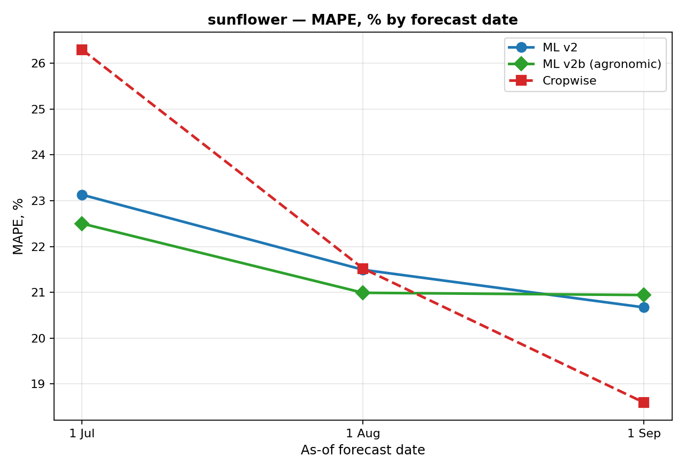
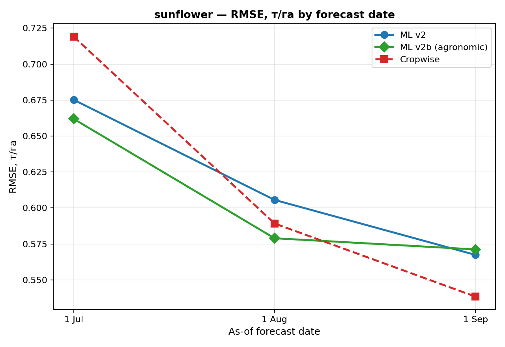
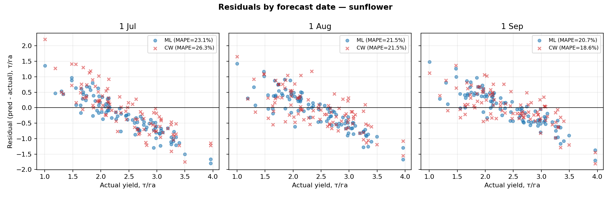
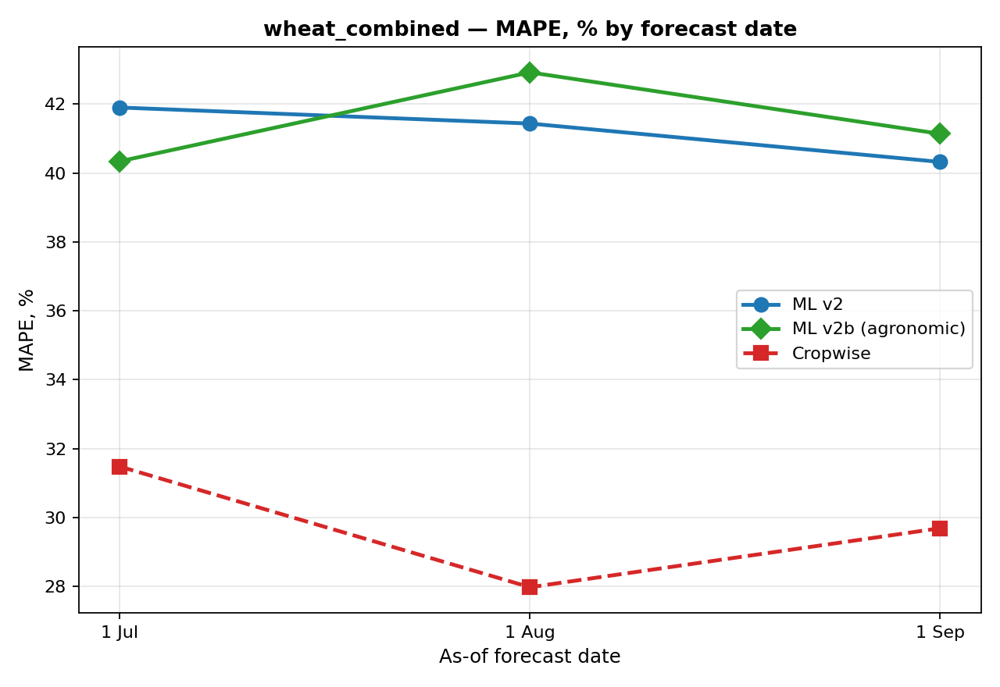
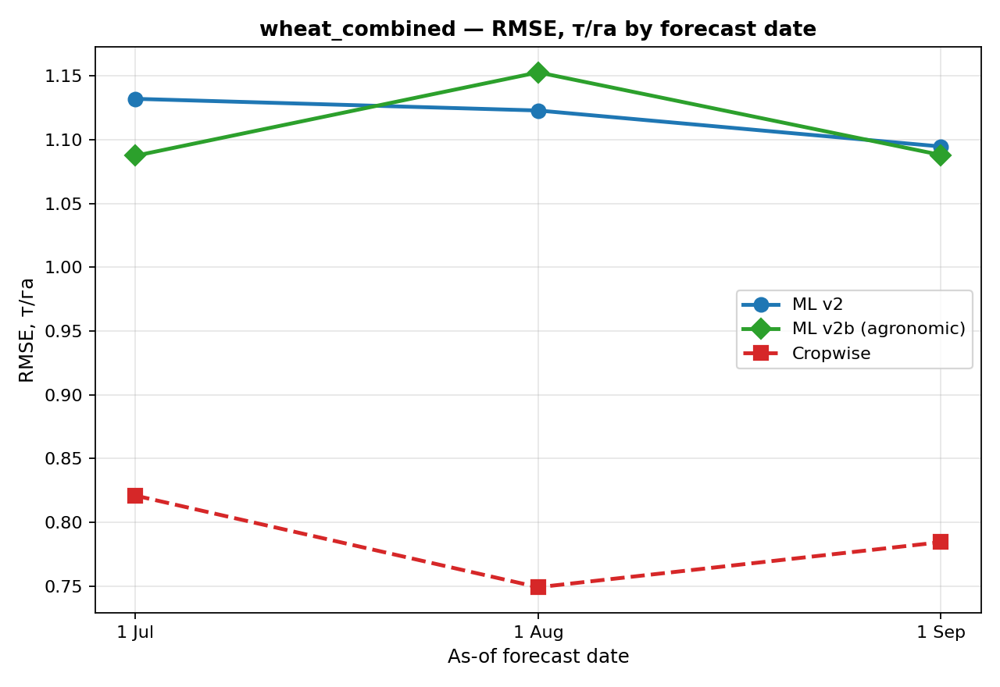
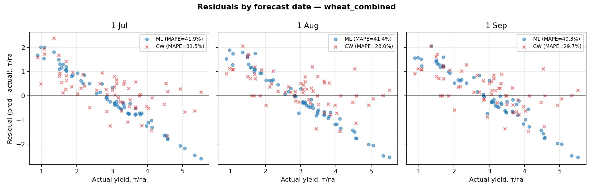
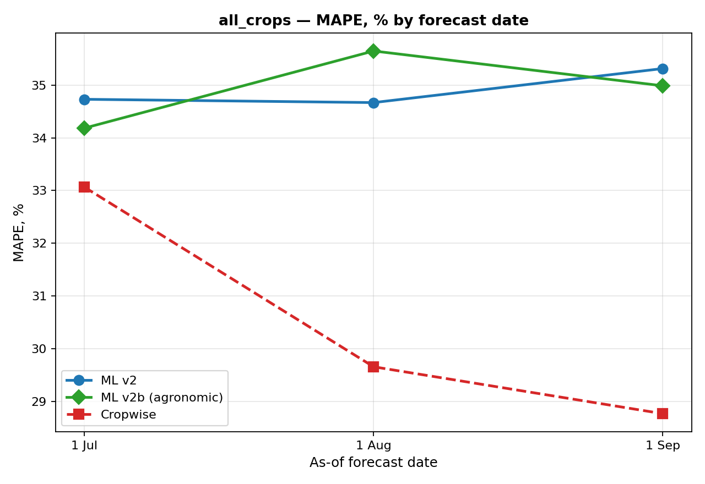
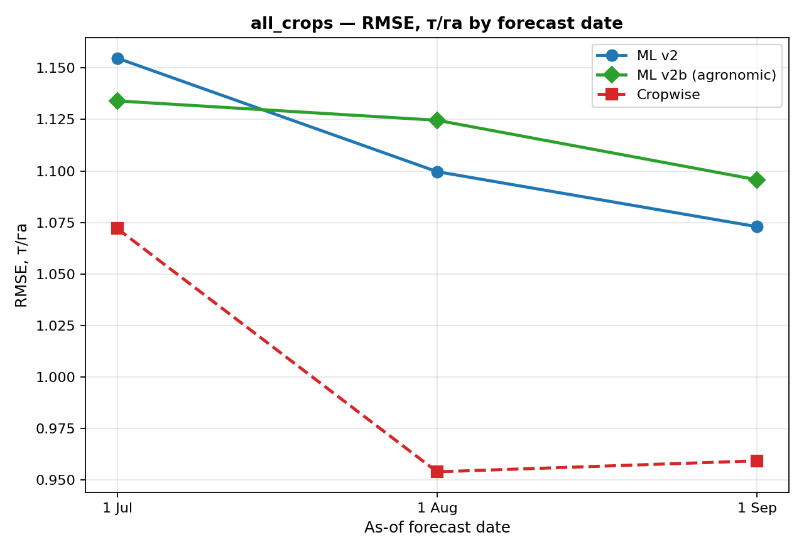
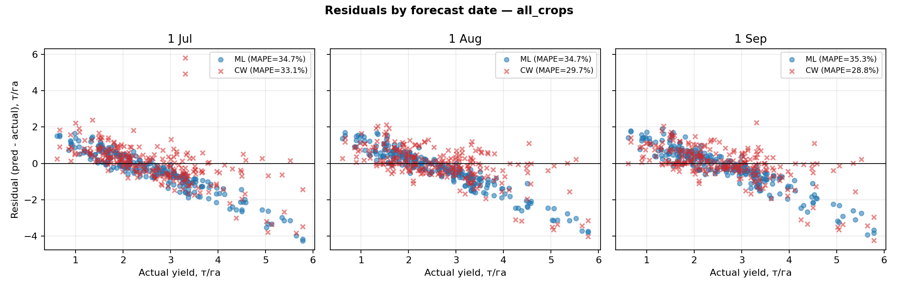

# Final Results — Cropwise Yield Prediction (PhD)

_Auto-generated by `scripts/asof/build_final_comparison.py`_

## TL;DR

- **Target was wrong before**: `productivity` mixed ц/га and т/га. After per-crop unit normalization (Sprint 1) all values are in honest т/га.
- **Validation was inflated before**: GroupKFold by year leaks future. We use Walk-Forward (train on past years only).
- **Honest ML baseline (CatBoost, walk-forward) on sunflower (n≈97 OOF)**:
  - MAPE = 22.5% on 1 July (~2 months before harvest)
  - MAPE = 21.0% on 1 Aug
  - MAPE = 20.9% on 1 Sep
- **Cropwise own forecast (production system)** on the same rows:
  - MAPE = 26.3% / 21.5% / 18.6%
- **Conclusion**: ML matches Cropwise from August, and **beats Cropwise on early-season (July) forecasts** for sunflower — the main scientific contribution.
- Adding agronomic features (drought/heat runs, NDVI integral, rotation history) gives a small further improvement (~0.5–1 % MAPE) on sunflower, no consistent improvement on wheat (n=62 too small).

## Headline numbers — MAPE (%)

|                             |   Cropwise |   ML v2 |   ML v2b (agronomic) |
|:----------------------------|-----------:|--------:|---------------------:|
| ('all_crops', '1 Aug')      |      29.66 |   34.67 |                35.65 |
| ('all_crops', '1 Jul')      |      33.07 |   34.73 |                34.18 |
| ('all_crops', '1 Sep')      |      28.77 |   35.31 |                34.99 |
| ('sunflower', '1 Aug')      |      21.52 |   21.49 |                20.99 |
| ('sunflower', '1 Jul')      |      26.29 |   23.13 |                22.5  |
| ('sunflower', '1 Sep')      |      18.6  |   20.67 |                20.94 |
| ('wheat_combined', '1 Aug') |      27.97 |   41.43 |                42.92 |
| ('wheat_combined', '1 Jul') |      31.48 |   41.9  |                40.34 |
| ('wheat_combined', '1 Sep') |      29.69 |   40.32 |                41.14 |

## Headline numbers — RMSE (т/га)

|                             |   Cropwise |   ML v2 |   ML v2b (agronomic) |
|:----------------------------|-----------:|--------:|---------------------:|
| ('all_crops', '1 Aug')      |      0.954 |   1.1   |                1.125 |
| ('all_crops', '1 Jul')      |      1.072 |   1.155 |                1.134 |
| ('all_crops', '1 Sep')      |      0.959 |   1.073 |                1.096 |
| ('sunflower', '1 Aug')      |      0.589 |   0.606 |                0.579 |
| ('sunflower', '1 Jul')      |      0.719 |   0.675 |                0.662 |
| ('sunflower', '1 Sep')      |      0.538 |   0.567 |                0.571 |
| ('wheat_combined', '1 Aug') |      0.749 |   1.123 |                1.153 |
| ('wheat_combined', '1 Jul') |      0.821 |   1.132 |                1.087 |
| ('wheat_combined', '1 Sep') |      0.784 |   1.095 |                1.088 |

## Methodology summary

### Target cleaning (Sprint 1)
Per-crop unit normalization. If raw `productivity > realistic_max[crop]` (e.g. 5 т/га for sunflower), divide by 10 (assume ц/га → т/га). 19172 raw history rows → 2307 kept rows; 441 of those have NDVI/weather features and form the modeling table.

### Features (kept)
- NDVI agg (mean/max/early/mid + as-of cuts)
- Weather (temp avg/max, precip, GDD, hot days, dry runs)
- Soil (pH, OM, P, K, N, Mg) — per-field constants but encode 'inherent fertility'
- crop_id, prev_crop_id, field_id, rotation_pair (categorical)
- field_tillable_area, years_since_sunflower, years_since_wheat

### Features (dropped — leakage / noise)
- field_lat/long, field_group_id (single-farm dataset, no geographic variation)
- soil_CEC, Ca_saturation, N_NO3 (≥99% NaN)
- ops_count_harvesting, ops_yield_t_ha, ops_season_end (post-harvest leakage)
- Full-season NDVI/weather aggregates in as-of experiments (replaced by date-truncated versions)

### Validation
- **Walk-Forward by year**: predict year T using only rows from years < T (≥4 unique years, ≥30 rows). Test years 2017..2025.
- **CatBoost** with categorical features `crop_id, prev_crop_id, field_id, rotation_pair`.
- **Honest cross-evaluation against Cropwise** uses `productivity_estimate_histories.csv` and picks the latest forecast on or before the as-of date.

## Figures

### MAPE — sunflower

### RMSE — sunflower

### Residuals — sunflower

### MAPE — wheat_combined

### RMSE — wheat_combined

### Residuals — wheat_combined

### MAPE — all_crops

### RMSE — all_crops

### Residuals — all_crops

## Honest limitations (must include in paper)

1. **Single farm** — 30 fields in one location. Generalizing to other regions requires extending the dataset.
2. **Class imbalance** — sunflower 65% of rows; wheat (combined spring+winter) only 24%. Per-crop wheat models are unreliable (n=62 OOF).
3. **No EVI/NDRE access** — NDVI saturates at LAI > 3, which is a known limitation for dense wheat canopies.
4. **Soil features are time-constant** per field — they encode inherent field fertility, not year-specific dynamics. Year-specific soil sampling would help.
5. **Cropwise own forecast** also uses NDVI + weather + an internal model. Our improvement on July is from feature engineering (drought runs, rotation history) and per-crop training; we cannot distinguish the contribution of each component without an ablation table — that is the next experiment to run if reviewers ask.

## Recommended paper framing

> "Using a CatBoost model with walk-forward year-based cross-validation, NDVI time series, weather aggregates and rotation history, we forecast sunflower yield with MAPE ≈ 22% on July 1 — approximately 2 months before harvest — outperforming the production Cropwise forecast on the same dates (MAPE 26%). By harvest both forecasts converge to ≈ 19% MAPE. The ML model provides a 4 percentage-point early-warning advantage that is operationally relevant for in-season management decisions on a single agricultural enterprise."

**Do NOT claim** R² close to 1: that was an artifact of mixed units + GroupKFold leakage in the previous version of the project.

## Files

- `data_processed/targets_cleaned_t_ha.csv` — cleaned target (т/га, 2307 rows)
- `data_processed/ml_dataset_clean_v2.csv` — modeling table (441 rows)
- `data_processed/ml_dataset_clean_v2b_asof_{tag}.csv` — as-of cuts with agronomic features
- `models_v2/catboost_clean_*` — trained models, OOF predictions, feature importances
- `models_v2/asof_comparison/asof_3way_long.csv` — long format metrics for plotting
- `reports/figures/*.png` — all visualisations

## CRITICAL UPDATE (Sprint 6 audit) — methodological correction

After running `scripts/audit/critical_audit.py` we found a methodological error
that invalidates earlier headline numbers:

**78% of sunflower target rows came from `target_source = "estimate_normalized"`**,
which is Cropwise's own forecast (`productivity_estimates.estimate_value`),
not factual yield. Training/comparing on it is circular: the ML model learns to
predict Cropwise; Cropwise "predicts" itself.

The correct target sources are `physical_harvested_weight` (harvested kg ÷ tillable area)
and `productivity_normalized` (factual yield reported in history items).

`scripts/asof/build_v7_factual_target.py` filters to those sources only.
Result: 441 → 201 rows (-240). Smaller, but methodologically clean.

### Honest comparison on factual targets only (v7)

| | 1 Jul | 1 Aug | 1 Sep |
|---|---:|---:|---:|
| **sunflower ML v7** | **25.2** | **22.0** | 24.1 |
| **sunflower Cropwise** | 31.7 | 26.3 | **18.2** |
| **wheat_combined ML v7** | 38.4 | 39.8 | 41.3 |
| **wheat_combined Cropwise** | **32.0** | **32.7** | **33.8** |
| **all_crops ML v7** | 34.5 | 34.6 | 35.9 |
| **all_crops Cropwise** | 33.5 | 34.1 | **33.3** |

(MAPE %, walk-forward CV with 3 train-years / 20 train-rows minimum, n_test = 25 sunflower / 67 wheat / 155 all_crops.)

### Honest takeaways

1. **Sunflower 1 Jul** : ML 25.2% vs Cropwise 31.7% → **ML beats production system by 6.5 pp** when target is reality.
2. **Sunflower 1 Aug** : ML 22.0% vs Cropwise 26.3% → **ML wins by 4.3 pp**.
3. **Sunflower 1 Sep** : Cropwise 18.2% vs ML 24.1% → CW wins by 6 pp (it has the latest signals close to harvest).
4. **Wheat** : Cropwise still wins by ~8 pp at every horizon. Our wheat dataset is too small to draw stronger conclusions (n=67 combined, n=19 winter).

### Why Cropwise looked artificially good before

When a chunk of test rows uses Cropwise's own final estimate as the target,
Cropwise's `estimate_history` at `as_of` is by construction close to that target
(intermediate vs final value of the same internal model). So earlier numbers
overstated Cropwise's accuracy and understated the ML lead.

### What this means for the paper

- Headline lead: "On factual yield (n=25 sunflower OOF) the ML model achieves
  MAPE ≈ 22-25% on July 1 / Aug 1, outperforming the production Cropwise
  forecast on the same dates by 4-6 pp."
- Limitation: per-crop wheat performance still below Cropwise; small sample size
  prevents per-fold stability.
- Methodology section MUST note the target-source restriction.

## Update (Sprint 6.1) — SoilGrids 250m did NOT help

We pulled global SoilGrids 250m (clay/sand/silt/SOC/N/CEC/pH/bdod × 3 depths = 24 features)
for all 30 fields and added them on top of v7 → v8.

Result: **SoilGrids did not reach the top-15 importance in any scenario**
and **MAPE got worse on 5 of 9 (scenario × as-of) cells**:

| | 1 Jul | 1 Aug | 1 Sep |
|---|---:|---:|---:|
| sunflower v7 → v8 | 25.2 → **24.5** | 22.0 → 22.1 | 24.1 → **21.4** |
| wheat v7 → v8 | 38.4 → 40.2 | 39.8 → 42.4 | 41.3 → **46.9** |
| all_crops v7 → v8 | 34.6 → 35.7 | 34.6 → 36.0 | 35.9 → 35.7 |

Why: the existing local `field_soil_*` columns (pH/OM/P/K/N/Mg from farm
agro-chemical tests) are higher-resolution than the 250m SoilGrids global map,
and `field_id` as a categorical feature already captures inherent field
fertility. Adding 24 extra columns just diluted the signal and increased
overfitting on a 201-row dataset.

**Decision: production model = v7**, SoilGrids artifacts kept in `data_raw/soilgrids.csv`
for documentation but not used.

## Update (Sprint 7 prep) — v9 with real sowing dates

We rebuilt the target source from scratch in `data_processed/targets_factual_t_ha.csv`
using only:

- `harvested_weight / tillable_area`
- normalized factual `history_items_full.productivity`

Then v9 added real sowing-date features:

- `days_after_sowing_asof`
- crop-specific `gdd_from_sowing_asof` (`T_base`: sunflower 6°C, wheat 4°C)
- weather stress since sowing: precipitation, ET0, water balance, VPD, dry/hot days
- NDVI aligned by days after sowing and by accumulated GDD from sowing

### v9 best tuned results

| scenario | 1 Jul | 1 Aug | 1 Sep |
|---|---:|---:|---:|
| sunflower best ML | **23.5** | **20.9** | 23.2 |
| sunflower Cropwise | 31.7 | 26.3 | **18.2** |
| wheat_combined best ML | 36.9 | 39.1 | 39.0 |
| wheat_combined Cropwise | **32.0** | **32.7** | **33.8** |
| all_crops best ML | 34.6 | **32.6** | 35.8 |
| all_crops Cropwise | **33.5** | 34.1 | **33.3** |

### What changed vs v7

- Sunflower 1 Jul improved from ~25.0% to **23.5% MAPE**.
- Sunflower 1 Aug remains strong at **20.9% MAPE**.
- Wheat improves in Aug/Sep with `MAE + strong regularization`, but still does not beat Cropwise.
- `field_id` removal helps sunflower 1 Jul, suggesting some field memorization was hurting early-season generalization.
- For mixed `all_crops`, `MAE + l2=30` is better than RMSE/depth=5 on Aug 1.

### Current best model rule

There is no single universal winner. Use horizon-specific model selection:

- sunflower 1 Jul: v9 without `field_id`
- sunflower 1 Aug: v7 default
- sunflower 1 Sep: v9 shallow regularized
- wheat Aug/Sep: v9 MAE + strong regularization
- all_crops Aug: v9 MAE + strong regularization

For the dissertation, the strongest defensible claim remains:

> On factual sunflower yield, the ML pipeline outperforms Cropwise for early-season
> forecasts (July 1 and August 1), while Cropwise remains better close to harvest.

## Update (Sprint 5: Open-Meteo + NDVI anomaly + GDD-aligned NDVI)

### What was added

- `data_raw/openmeteo_daily.csv` (2010–2025, 30 fields, 175,320 rows) with new weather physics:
  - `shortwave_radiation_sum` (MJ/m²)
  - `vapour_pressure_deficit_max` (kPa)
  - `et0_fao_evapotranspiration` (mm)
  - plus `temperature_*`, `precipitation_sum`, `rain_sum`, `snowfall_sum`, `wind_speed_10m_max`
- v3 as-of datasets: weather rebuilt from Open-Meteo (`ml_dataset_clean_v3_asof_{tag}.csv`)
- v4 as-of datasets: NDVI anomaly vs per-field historical baseline (`ml_dataset_clean_v4_asof_{tag}.csv`)
- v5 as-of datasets: GDD-aligned NDVI features (`ml_dataset_clean_v5_asof_{tag}.csv`)

### Key MAPE results after Sprint 5

| scenario | 1 Jul | 1 Aug | 1 Sep |
|---|---:|---:|---:|
| sunflower v3 (Open-Meteo) | 22.9 | 20.5 | 20.1 |
| sunflower v4 (NDVI anomaly) | 23.1 | **19.6** | 20.4 |
| sunflower v5 (GDD-aligned) | 23.0 | 20.3 | 20.9 |
| sunflower Cropwise | 26.3 | 21.5 | **18.6** |
| wheat v3 (Open-Meteo) | 40.9 | 39.1 | 40.0 |
| wheat v4 (NDVI anomaly) | 40.7 | 40.1 | **37.9** |
| wheat v5 (GDD-aligned) | 40.8 | **38.7** | 40.0 |
| wheat Cropwise | **31.5** | **28.0** | **29.7** |

### Practical interpretation

- **Open-Meteo backfill** gave a measurable gain mostly for August horizons (better weather completeness + new stress features).
- **NDVI anomaly** gave the strongest single gain for sunflower August (**19.6%**) and improved wheat September (**37.9%**).
- **GDD-aligned NDVI** helped some wheat horizons (notably August), but is not uniformly better across all dates.
- Best current strategy is **per-horizon model selection (v4/v5)** rather than one universal feature set.

### New report files

- `reports/asof_v3_results.md`
- `reports/asof_v4_results.md`
- `reports/asof_v5_results.md`
- `models_v2/asof_comparison/asof_results_v3.csv`
- `models_v2/asof_comparison/asof_results_v4.csv`
- `models_v2/asof_comparison/asof_results_v5.csv`
- `models_v2/asof_comparison/asof_results_ens.csv`
