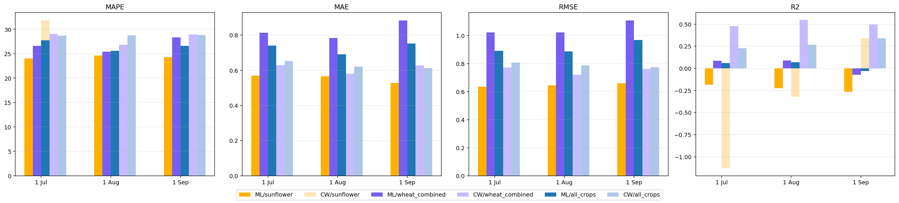

# Final v12 / v15 / v16_clean / v17 + Cropwise comparison

All numbers are walk-forward OOF; ML uses best policy per scenario / date.
Datasets:
- **v12** : prod_fact_t_ha target (ц/га → t/ha) for 30 fields with name match
- **v15** : v12 + v14 (curated management) + v15_rates (rates only) policy
- **v16_clean** : v15 minus 7 rows where productivity_data and yield_maps disagree by >1 t/ha
- **v17** : target rebuilt with priority physical_t_ha > prod_fact_t_ha; conflict rows dropped where physical and prod_fact disagree by >1 t/ha

## Best ML policy per scenario / date

| scenario       |   asof_tag | asof_label   | family    | version       | model                 |   n_ml |   mape |   mae |   rmse |     r2 |   cw_mape |   cw_mae |   cw_rmse |   cw_r2 |
|:---------------|-----------:|:-------------|:----------|:--------------|:----------------------|-------:|-------:|------:|-------:|-------:|----------:|---------:|----------:|--------:|
| all_crops      |      07_01 | 1 Jul        | v16_clean | v16_v14       | v16_v14_shallow_l30   |    123 | 27.721 | 0.74  |  0.892 |  0.059 |    28.685 |    0.652 |     0.808 |   0.226 |
| all_crops      |      08_01 | 1 Aug        | v16_clean | v16_v15_rates | v16_rates_shallow_l10 |    123 | 25.576 | 0.69  |  0.887 |  0.069 |    28.754 |    0.621 |     0.787 |   0.267 |
| all_crops      |      09_01 | 1 Sep        | v17       | v17_v12_clean | v17_v12_clean_no_fid  |    127 | 26.627 | 0.752 |  0.97  | -0.032 |    28.831 |    0.612 |     0.775 |   0.341 |
| sunflower      |      07_01 | 1 Jul        | v12       | v12           | v12_default           |     25 | 24.042 | 0.569 |  0.635 | -0.186 |    31.845 |    0.708 |     0.851 |  -1.131 |
| sunflower      |      08_01 | 1 Aug        | v12       | v12           | v12_no_field_id       |     25 | 24.624 | 0.566 |  0.646 | -0.226 |    24.537 |    0.536 |     0.671 |  -0.322 |
| sunflower      |      09_01 | 1 Sep        | v16_clean | v16_v15_rates | v16_rates_shallow_l10 |     24 | 24.361 | 0.527 |  0.661 | -0.264 |    17.283 |    0.384 |     0.477 |   0.341 |
| wheat_combined |      07_01 | 1 Jul        | v16_clean | v16_v12       | v16_v12_no_field_id   |     52 | 26.622 | 0.813 |  1.024 |  0.086 |    29.059 |    0.628 |     0.773 |   0.479 |
| wheat_combined |      08_01 | 1 Aug        | v16_clean | v16_v15_rates | v16_rates_no_field_id |     52 | 25.435 | 0.784 |  1.022 |  0.089 |    26.848 |    0.581 |     0.721 |   0.547 |
| wheat_combined |      09_01 | 1 Sep        | v16_clean | v16_v12       | v16_v12_default       |     52 | 28.327 | 0.884 |  1.11  | -0.073 |    28.945 |    0.627 |     0.762 |   0.494 |

## Same view but ML vs Cropwise side-by-side

ML metrics are best-of-policy in column `family`/`model`; Cropwise metrics are computed on the same rows.

| scenario       | asof_tag   | ML family   | ML model              |   n |   ML MAPE |   CW MAPE |   ML MAE |   CW MAE |   ML RMSE |   CW RMSE |   ML R^2 |   CW R^2 |
|:---------------|:-----------|:------------|:----------------------|----:|----------:|----------:|---------:|---------:|----------:|----------:|---------:|---------:|
| all_crops      | 1 Jul      | v16_clean   | v16_v14_shallow_l30   | 123 |      27.7 |      28.7 |     0.74 |     0.65 |      0.89 |      0.81 |     0.06 |     0.23 |
| all_crops      | 1 Aug      | v16_clean   | v16_rates_shallow_l10 | 123 |      25.6 |      28.8 |     0.69 |     0.62 |      0.89 |      0.79 |     0.07 |     0.27 |
| all_crops      | 1 Sep      | v17         | v17_v12_clean_no_fid  | 127 |      26.6 |      28.8 |     0.75 |     0.61 |      0.97 |      0.78 |    -0.03 |     0.34 |
| sunflower      | 1 Jul      | v12         | v12_default           |  25 |      24   |      31.8 |     0.57 |     0.71 |      0.64 |      0.85 |    -0.19 |    -1.13 |
| sunflower      | 1 Aug      | v12         | v12_no_field_id       |  25 |      24.6 |      24.5 |     0.57 |     0.54 |      0.65 |      0.67 |    -0.23 |    -0.32 |
| sunflower      | 1 Sep      | v16_clean   | v16_rates_shallow_l10 |  24 |      24.4 |      17.3 |     0.53 |     0.38 |      0.66 |      0.48 |    -0.26 |     0.34 |
| wheat_combined | 1 Jul      | v16_clean   | v16_v12_no_field_id   |  52 |      26.6 |      29.1 |     0.81 |     0.63 |      1.02 |      0.77 |     0.09 |     0.48 |
| wheat_combined | 1 Aug      | v16_clean   | v16_rates_no_field_id |  52 |      25.4 |      26.8 |     0.78 |     0.58 |      1.02 |      0.72 |     0.09 |     0.55 |
| wheat_combined | 1 Sep      | v16_clean   | v16_v12_default       |  52 |      28.3 |      28.9 |     0.88 |     0.63 |      1.11 |      0.76 |    -0.07 |     0.49 |

## v17 residual error: top 20 ML misses by abs error

| scenario   |   asof_tag |   field_id |   year | standard_name   |   target_yield_t_ha |   pred |   abs_err_ml |   cropwise_asof_t_ha |   abs_err_cw |
|:-----------|-----------:|-----------:|-------:|:----------------|--------------------:|-------:|-------------:|---------------------:|-------------:|
| all_crops  |      09_01 |        234 |   2021 | wheat_winter    |               5.389 |  2.301 |        3.089 |                3.829 |        1.56  |
| all_crops  |      09_01 |        222 |   2023 | barley_spring   |               4.5   |  1.732 |        2.769 |                2.063 |        2.437 |
| all_crops  |      09_01 |        228 |   2022 | wheat_spring    |               4.565 |  1.995 |        2.57  |                3.299 |        1.266 |
| all_crops  |      09_01 |        210 |   2024 | wheat_winter    |               5.519 |  2.981 |        2.538 |                5.754 |        0.235 |
| all_crops  |      09_01 |        216 |   2024 | wheat_winter    |               5.342 |  3.127 |        2.215 |                5.359 |        0.016 |
| all_crops  |      09_01 |        207 |   2021 | barley_spring   |               3.525 |  1.506 |        2.019 |                3.164 |        0.361 |
| all_crops  |      09_01 |        226 |   2024 | wheat_winter    |               4.932 |  2.952 |        1.98  |                4.544 |        0.387 |
| all_crops  |      09_01 |        224 |   2024 | wheat_winter    |               5.058 |  3.186 |        1.872 |                4.936 |        0.122 |
| all_crops  |      09_01 |        233 |   2021 | wheat_winter    |               3.645 |  1.912 |        1.733 |                3.406 |        0.24  |
| all_crops  |      09_01 |        234 |   2025 | nan             |               4.495 |  2.906 |        1.589 |                4.459 |        0.036 |
| all_crops  |      09_01 |        234 |   2022 | wheat_spring    |               3.975 |  2.409 |        1.566 |                3.532 |        0.444 |
| all_crops  |      09_01 |        218 |   2025 | wheat_spring    |               4.113 |  2.556 |        1.557 |                2.646 |        1.467 |
| all_crops  |      09_01 |        231 |   2021 | wheat_winter    |               3.507 |  1.982 |        1.525 |                3.402 |        0.105 |
| all_crops  |      09_01 |        223 |   2022 | wheat_spring    |               3.231 |  1.71  |        1.521 |                2.948 |        0.283 |
| all_crops  |      09_01 |        220 |   2022 | wheat_spring    |               3.483 |  1.968 |        1.515 |                3.487 |        0.004 |
| all_crops  |      09_01 |        220 |   2023 | barley_spring   |               3.373 |  1.875 |        1.498 |                2.541 |        0.832 |
| all_crops  |      09_01 |        210 |   2022 | wheat_spring    |               3.066 |  1.601 |        1.465 |                3.13  |        0.065 |
| all_crops  |      09_01 |        212 |   2021 | sunflower       |               3.398 |  1.97  |        1.429 |                2.964 |        0.434 |
| all_crops  |      09_01 |        215 |   2024 | wheat_winter    |               4.477 |  3.057 |        1.42  |                4.206 |        0.271 |
| all_crops  |      09_01 |        229 |   2023 | wheat_winter    |               3.443 |  2.048 |        1.396 |                2.076 |        1.367 |

## v17 residual error: top 20 ML misses where Cropwise was right (CW err < ML err - 1)

| scenario   |   asof_tag |   field_id |   year | standard_name   |   target_yield_t_ha |   pred |   abs_err_ml |   cropwise_asof_t_ha |   abs_err_cw |
|:-----------|-----------:|-----------:|-------:|:----------------|--------------------:|-------:|-------------:|---------------------:|-------------:|
| all_crops  |      09_01 |        234 |   2021 | wheat_winter    |               5.389 |  2.301 |        3.089 |                3.829 |        1.56  |
| all_crops  |      09_01 |        228 |   2022 | wheat_spring    |               4.565 |  1.995 |        2.57  |                3.299 |        1.266 |
| all_crops  |      09_01 |        210 |   2024 | wheat_winter    |               5.519 |  2.981 |        2.538 |                5.754 |        0.235 |
| all_crops  |      09_01 |        216 |   2024 | wheat_winter    |               5.342 |  3.127 |        2.215 |                5.359 |        0.016 |
| all_crops  |      09_01 |        207 |   2021 | barley_spring   |               3.525 |  1.506 |        2.019 |                3.164 |        0.361 |
| all_crops  |      09_01 |        226 |   2024 | wheat_winter    |               4.932 |  2.952 |        1.98  |                4.544 |        0.387 |
| all_crops  |      09_01 |        224 |   2024 | wheat_winter    |               5.058 |  3.186 |        1.872 |                4.936 |        0.122 |
| all_crops  |      09_01 |        233 |   2021 | wheat_winter    |               3.645 |  1.912 |        1.733 |                3.406 |        0.24  |
| all_crops  |      09_01 |        234 |   2025 | nan             |               4.495 |  2.906 |        1.589 |                4.459 |        0.036 |
| all_crops  |      09_01 |        234 |   2022 | wheat_spring    |               3.975 |  2.409 |        1.566 |                3.532 |        0.444 |
| all_crops  |      09_01 |        231 |   2021 | wheat_winter    |               3.507 |  1.982 |        1.525 |                3.402 |        0.105 |
| all_crops  |      09_01 |        223 |   2022 | wheat_spring    |               3.231 |  1.71  |        1.521 |                2.948 |        0.283 |
| all_crops  |      09_01 |        220 |   2022 | wheat_spring    |               3.483 |  1.968 |        1.515 |                3.487 |        0.004 |
| all_crops  |      09_01 |        210 |   2022 | wheat_spring    |               3.066 |  1.601 |        1.465 |                3.13  |        0.065 |
| all_crops  |      09_01 |        215 |   2024 | wheat_winter    |               4.477 |  3.057 |        1.42  |                4.206 |        0.271 |

## Notes on metrics

- **MAPE** normalizes per-row error by `y_true`, so it is comparable across crops with different yield scales. We report it as the headline metric because Cropwise itself reports percentage errors.
- **R^2** is fragile on small per-year folds; one outlier can flip its sign. ML R^2 stays near 0 because the model effectively predicts close to the train-year mean; Cropwise has a higher R^2 (it ranks fields better) but a worse MAPE (it absolute-errors more when yield is far from average).
- **MAE / RMSE** stay in t/ha units; Cropwise wins on `wheat_combined` and `all_crops` even when ML wins on MAPE.

