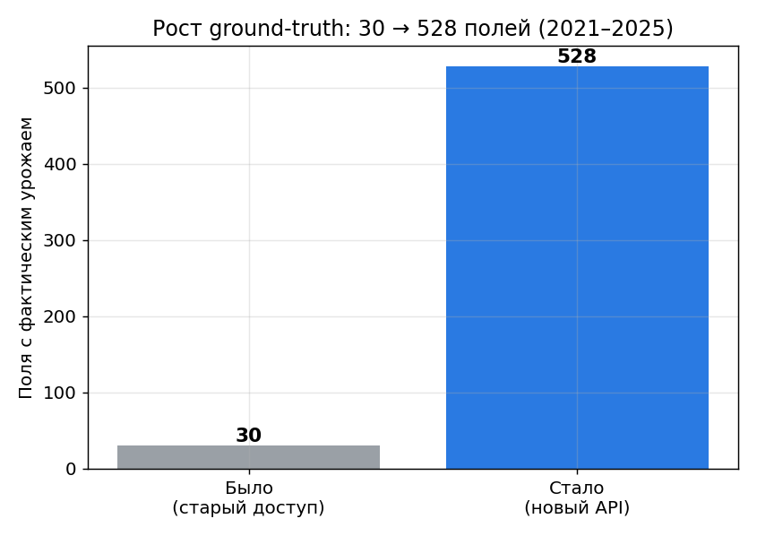
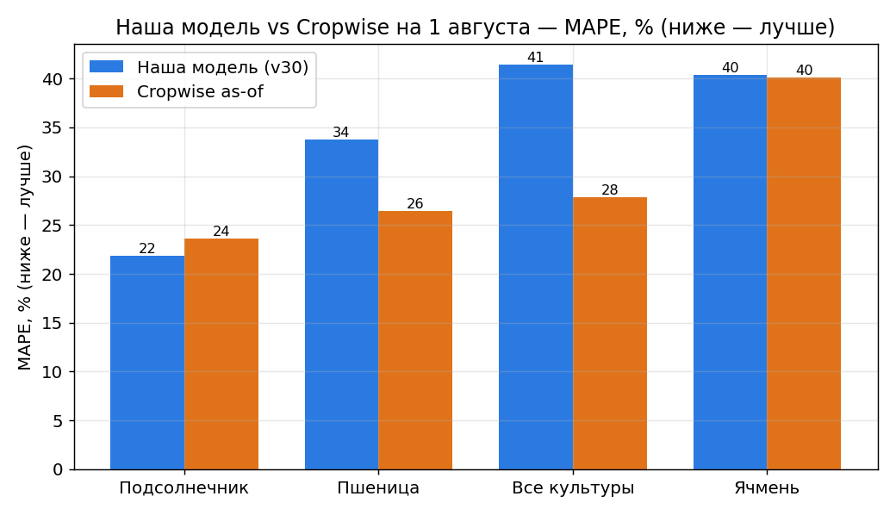
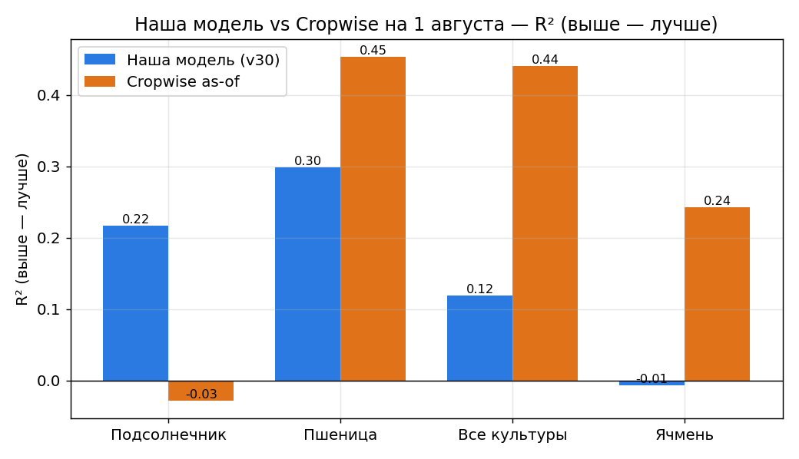
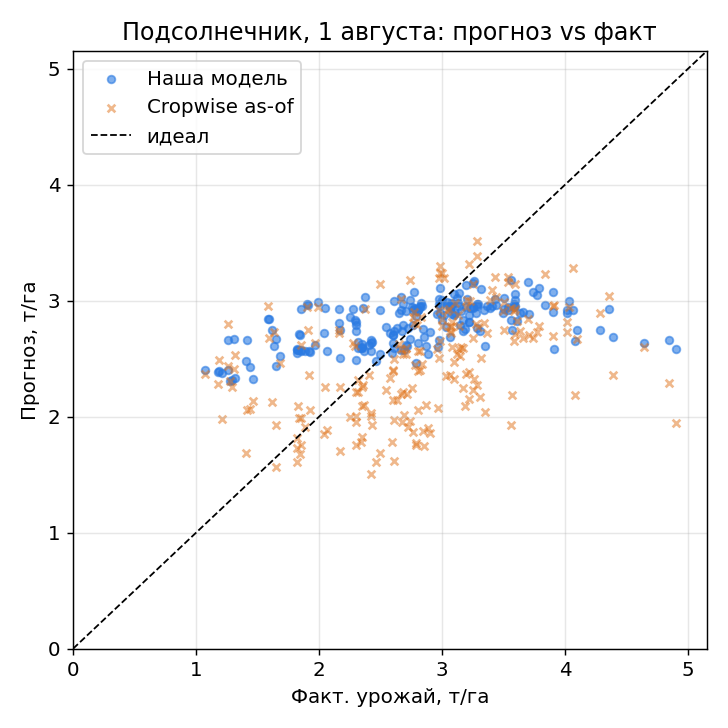
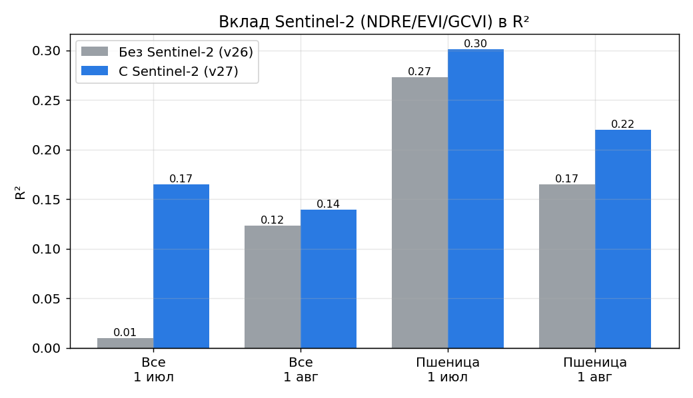
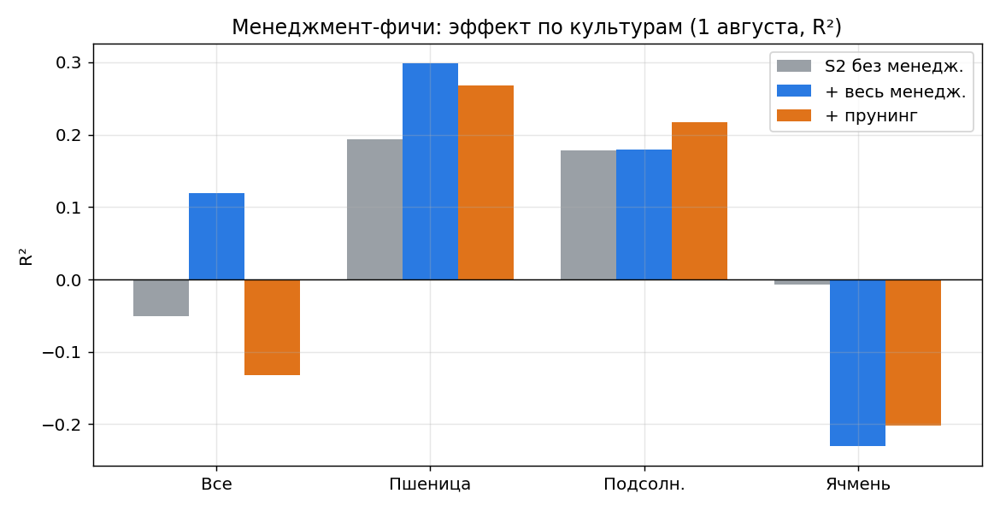

# Прогноз урожайности по данным Cropwise: итоговый отчёт

Автор: Темирлан. Дата: 2026-06-11.
Назначение: материал для научной статьи и для презентации научному руководителю.

---

## 1. Цель работы

Построить модель прогноза урожайности полей (Восточный Казахстан), которая **использует
доступные данные умнее, чем Cropwise**, и честно сравнить её с прогнозом Cropwise.

Ключевой принцип честности: прогноз Cropwise **никогда не используется как признак модели** —
только как независимый эталон (benchmark) для сравнения.

---

## 2. Что именно предсказываем и почему так

- **Целевая переменная (target):** фактическая урожайность поля, т/га.
- **Источник факта:** операции уборки в Cropwise (`harvested_weight` / `completed_area`).
- **Тип задачи:** *as-of прогноз* — модель «замораживается» на дату (1 июля / 1 августа / 1 сентября)
  и использует только данные, доступные **до этой даты**. Это имитирует реальный оперативный прогноз
  в течение сезона, а не пост-фактум.
- **Главная дата — 1 августа.** Обоснование получено из данных (см. аудит, раздел 6):
  - 1 июля — рано, сезонный сигнal ещё не набран;
  - 1 сентября — поздно: ~36–38% полей уже убраны, и «прогноз» смотрел бы на данные после уборки;
  - 1 августа — компромисс: уборка ещё не началась, но NDVI/погода уже информативны.

---

## 3. Данные

### 3.1. Источники
| Источник | Что берём |
|---|---|
| Cropwise Operations API | геометрия полей, история культур, операции, уборка, прогнозы, спутниковый NDVI/температура/влага почвы, почвенные пробы |
| Microsoft Planetary Computer (Sentinel-2 L2A) | red-edge индексы NDRE/EVI/GCVI (которых нет в Cropwise API) |
| Open-Meteo (ERA5-Land) | погода/деривативы (использовалось в ранних версиях) |

### 3.2. Что вытащили из Cropwise API (после получения рабочего токена)
- **fields**: 640 полей с геометрией;
- **historical_values**: NDVI / температура / влага почвы по дням;
- **soil_tests**: 686 проб (pH, N, P, K, OM, микроэлементы);
- **agro_operations**: 20 497 операций (сев/удобрения/химия/уборка);
- **productivity_estimates / histories**: прогнозы Cropwise + понедельная история прогнозов;
- **yield_maps**: 459 карт урожайности с комбайна (Cropwise ошибочно считал, что их нет);
- словари: **crops** (68), **fertilizers** (58), **chemicals** (131), **plant_threats**, **field_shapes**, **seasons**.

**Главный прорыв по данным:** раньше фактический урожай был только на **30 полях**.
Из операций уборки получили ground-truth на **528 полях / 1499 поле-лет (2021–2025)**.
Это сняло главное узкое место всего проекта.

[Открыть график в полном размере](figures/fig5_data_scale.png)

### 3.3. Канонические очищенные файлы (`data_clean/`)
| Файл | Содержимое | Объём |
|---|---|---|
| `harvest_yield_clean.csv` | фактический урожай, т/га | 1499 строк / 528 полей |
| `cropwise_estimates_clean.csv` | финальный прогноз Cropwise (т/га) | 5166 / 549 |
| `cropwise_estimates_asof_clean.csv` | прогноз Cropwise на 1 июл/авг/сен | 15492 |
| `yield_maps_clean.csv` | урожай по картам комбайна | 106 / 90 |
| `operations_clean.csv` | все операции | 20497 / 613 |
| `crops_lookup.csv` | справочник культур | 68 |

### 3.4. Состав по культурам (на 1 августа)
wheat_spring 612, sunflower 337, barley_spring 163, wheat_winter 133, pea 95, lentil 35, прочее ~25.

---

## 4. Очистка данных и единицы (важно для статьи)

- **Единицы Cropwise:** прогноз хранится в **ц/га**, факт — в **т/га**. Конверсия `/10`.
  Проверено: медианное отношение прогноз/факт по культурам ≈ 9.5–10.8 (т.е. ровно ~10).
- **Фильтр урожая:** оставлены физичные значения 0.1–16 т/га + покультурные потолки.
- **Низкоурожайные строки (target < 1 т/га):** это крах/аномалия, не нормальный прогноз;
  основная регрессия оценивается на `target ≥ 1 т/га`.
- **Дедуп:** на (поле, год) берётся уборка с наибольшей убранной площадью.

---

## 5. Методология

- **Валидация:** walk-forward по годам (учимся на прошлых годах → предсказываем следующий).
  Реально оцениваются **2023, 2024, 2025** (2021–2022 — только обучение).
- **Модель:** CatBoostRegressor (устойчив к пропускам и категориям).
- **Метрики:** MAPE (%), RMSE, MAE, R², и `within_crop_year_R²` (честное ранжирование полей
  внутри одной культуры и года — убирает «лёгкую» межгодовую/межкультурную дисперсию).
- **Защита от утечек (leakage guards):**
  - прогноз Cropwise — только эталон, не признак;
  - исключены данные момента уборки (вес, площадь, влажность зерна, протеин, масличность);
  - **pre-harvest фильтр**: строка идёт в оценку на дату T только если уборка прошла **позже T**;
  - все признаки обрезаны по as-of дате.
- **Честность сравнения с Cropwise:**
  - используем **as-of прогноз Cropwise** (его значение на ту же дату из истории прогнозов),
    а не финальную оценку за весь сезон;
  - метрики Cropwise и модели считаются на **идентичных строках**.

---

## 6. Аудит данных под микроскопом (что проверили и что нашли)

Воспроизводится: `scripts/audit/audit_v26_microscope.py`.

| Проверка | Результат |
|---|---|
| target = вес/площадь | надёжно: медиана убранной/плановой площади = 1.00 |
| **as-of позже уборки** | 🔴 **найдена ошибка**: на 1 сен 38% полей уже убраны → исправлено pre-harvest фильтром |
| привязка культуры | чисто: 0 из 8122 поле-лет имеют >1 культуры |
| единицы Cropwise | подтверждено `/10` (ц/га→т/га) |
| даты as-of прогноза Cropwise | 0 нарушений (ранний флаг был артефактом високосного года) |
| диапазоны NDVI/влага/темп | физичны; дублей нет |

**Эффект исправления** (1 августа, all_crops): R² 0.11 → 0.26 (раньше был занижен шумом убранных полей).

---

## 7. Признаки модели

- **NDVI (Cropwise)**: сезонные агрегаты (mean/max/min/std/перцентили/наклон/интеграл/амплитуда/
  пик/последнее значение/последние 30 дней).
- **Температура и влага почвы (Cropwise)**: те же агрегаты + корневая влага (mean верхних слоёв).
- **Агрометеорология:** GDD (с покультурной базовой температурой), дни жары ≥30°C, дни холода ≤0°C.
- **Почва:** pH, OM, N, P, K, Mg, S, Zn (из почвенных проб, as-of).
- **Севооборот:** предыдущая культура, пара культур, лет с подсолнечника/пшеницы.
- **Сев:** дата сева, день года сева, дней после сева на дату прогноза.
- **Sentinel-2 (v27):** NDRE, EVI, GCVI + контрасты к NDVI (red-edge сигнал, которого нет в Cropwise).
- **Менеджмент (v28, из операций):** число операций/обработок, дни с последней обработки,
  N/P2O5/K2O/S кг/га (через справочник удобрений), нормы гербицидов/фунгицидов/инсектицидов, норма высева.

---

## 8. История версий (коротко, что меняли и зачем)

| Версия | Суть | Вывод |
|---|---|---|
| v23 | первый датасет на полном API (483 поля) | нашли баг парсинга влаги почвы |
| v24 | фикс влаги + GDD + стресс-фичи; политика target≥1 | улучшение по подсолнечнику и wcy_R² |
| A1/A2 | аудит низкоурожайных строк + прунинг фич | зафиксированы политики target/фич |
| **v26** | **target = реальный урожай с комбайна (475 полей)** | первый честный замер на сотнях полей |
| B2.1 | честный as-of бенчмарк Cropwise | разрыв до Cropwise сократился, но остался |
| **v27** | **+ Sentinel-2 NDRE/EVI/GCVI** | S2 помогает (особенно пшенице и ранней дате) |
| **v28** | **+ менеджмент-фичи** | помогает на 1 авг для wheat/all_crops; вредит barley |
| v29 | прунинг менеджмента | лучше для sunflower; для wheat лучше полный набор |
| **v30** | **crop-specific policy** | финальная сборка лучших веток по культурам |

---

## 9. Финальные результаты (v30 policy, дата 1 августа, идентичные строки)

| Культура | Наша модель (MAPE / R²) | Cropwise as-of (MAPE / R²) | Кто лучше |
|---|---:|---:|---|
| **sunflower** | **21.8% / 0.22** | 23.7% / -0.03 | **МЫ** |
| wheat | 33.8% / 0.30 | 26.4% / 0.45 | Cropwise |
| all_crops | 41.5% / 0.12 | 27.8% / 0.44 | Cropwise |
| barley | 40.4% / -0.01 | 40.1% / 0.24 | паритет по MAPE, Cropwise по R² |

Выбор ветки в policy: wheat/all_crops → полный менеджмент (v28); sunflower → прунинг (v29);
barley → только S2 (v27).

[Открыть fig1 (MAPE)](figures/fig1_model_vs_cropwise_mape.png)

[Открыть fig2 (R²)](figures/fig2_model_vs_cropwise_r2.png)

Лучший наш результат — подсолнечник; ниже прогноз vs факт по полям:

[Открыть fig6 (scatter подсолнечник)](figures/fig6_sunflower_scatter.png)

**Вклад Sentinel-2 (отдельный научный результат, ablation на 900+ поле-лет):**
- all_crops 1 июл: R² 0.01 → 0.17;
- wheat 1 июл: R² 0.27 → 0.30; wheat 1 авг: R² 0.17 → 0.22.

[Открыть fig3 (Sentinel-2 ablation)](figures/fig3_sentinel2_ablation.png)

Эффект менеджмент-фич по культурам (культуро-специфичен):

[Открыть fig4 (менеджмент по культурам)](figures/fig4_management_ablation.png)

---

## 10. Что можно и что нельзя утверждать в статье

**Можно утверждать (подтверждено данными):**
1. На большом честном ground-truth (475 полей, реальный урожай) построен воспроизводимый
   as-of конвейер прогноза с walk-forward валидацией и контролем утечек.
2. **По подсолнечнику наша модель превосходит as-of прогноз Cropwise** и по MAPE, и по R²
   на дату 1 августа.
3. **Red-edge индексы Sentinel-2** (NDRE/EVI/GCVI), отсутствующие в Cropwise API, дают
   независимый прирост качества (особенно пшеница, ранняя дата).
4. **Менеджмент-данные** дают прирост, но **культуро-специфично**, а не универсально.
5. Корректная методология сравнения (as-of vs as-of, идентичные строки, pre-harvest фильтр).

**Нельзя утверждать (честные ограничения):**
1. Что модель **в целом** превосходит Cropwise — по пшенице и всем культурам Cropwise пока сильнее.
2. Сильное **ранжирование полей внутри года** (within-crop-year R² ~0.1–0.2) — это остаётся слабым местом.
3. Выводы по barley/pea/soya — выборки малы.

---

## 11. Ограничения

- Мало лет для walk-forward (2021–2025), эффективно тест на 3 годах.
- Озимые: as-of NDVI не включает осень предыдущего года.
- Sentinel-2 докачан полностью на 1 июл и 1 авг (96%), на 1 сен — частично (не используется).
- Cropwise обучен на гораздо большей истории, чем доступна нам.

---

## 12. Дальнейшие шаги

1. Озимые: добавить осенний NDVI предыдущего года.
2. Усилить ранжирование внутри года (новые признаки/целевые трансформации).
3. Расширить историю (больше лет) для устойчивого walk-forward.
4. Прицельно улучшать пшеницу — там наибольший разрыв и наибольший потенциал.

---

## 13. Воспроизводимость (ключевые файлы)

**Данные/выгрузка:**
- `scripts/external/fetch_cropwise_full.py` — выгрузка API;
- `scripts/external/clean_cropwise_collections.py` — чистка → `data_clean/`;
- `scripts/external/build_cropwise_asof_benchmark.py` — as-of бенчмарк Cropwise;
- `scripts/external/fetch_sentinel2_indices_b1.py` — Sentinel-2 индексы.

**Датасеты:**
- `scripts/asof/build_v26_harvest_dataset.py` (target = урожай);
- `scripts/asof/build_v27_s2_harvest_dataset.py` (+ Sentinel-2);
- `scripts/asof/build_v28_management_dataset.py` (+ менеджмент).

**Оценка:**
- `scripts/asof/evaluate_v26_harvest.py`, `..._asof_cropwise.py`,
  `evaluate_v27_s2.py`, `evaluate_v28_management.py`,
  `evaluate_v29_pruned_management.py`, `build_v30_policy_report.py`.

**Аудит:** `scripts/audit/audit_v26_microscope.py`.

**Отчёты:** `reports/` — `B2_DATA_INVENTORY_RU.md`, `MICROSCOPE_AUDIT_RU.md`,
`V26_HARVEST_FINAL_RU.md`, `B21_ASOF_CROPWISE_SUMMARY_RU.md`, `V27_S2_FINAL_RU.md`,
`V28_MANAGEMENT_FINAL_RU.md`, `V29_PRUNED_MANAGEMENT_FINAL_RU.md`, `V30_POLICY_FINAL_RU.md`,
и этот файл `MASTER_REPORT_RU.md`.

**Результаты (числа):** `models_v2/asof_comparison/asof_results_*.csv`.

**Графики:** `scripts/viz/generate_final_figures.py` → `reports/figures/`:
- [`fig1_model_vs_cropwise_mape.png`](figures/fig1_model_vs_cropwise_mape.png)
- [`fig2_model_vs_cropwise_r2.png`](figures/fig2_model_vs_cropwise_r2.png)
- [`fig3_sentinel2_ablation.png`](figures/fig3_sentinel2_ablation.png)
- [`fig4_management_ablation.png`](figures/fig4_management_ablation.png)
- [`fig5_data_scale.png`](figures/fig5_data_scale.png)
- [`fig6_sunflower_scatter.png`](figures/fig6_sunflower_scatter.png)
