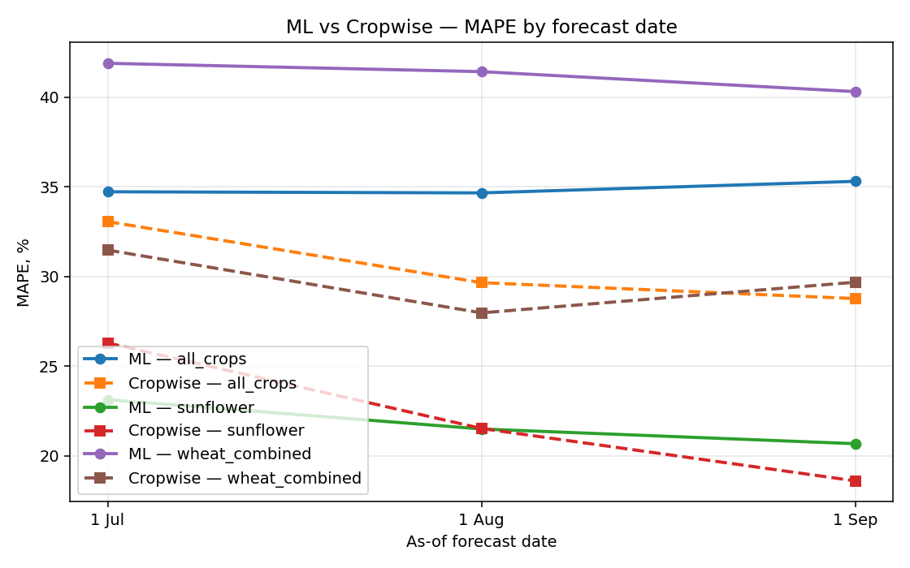
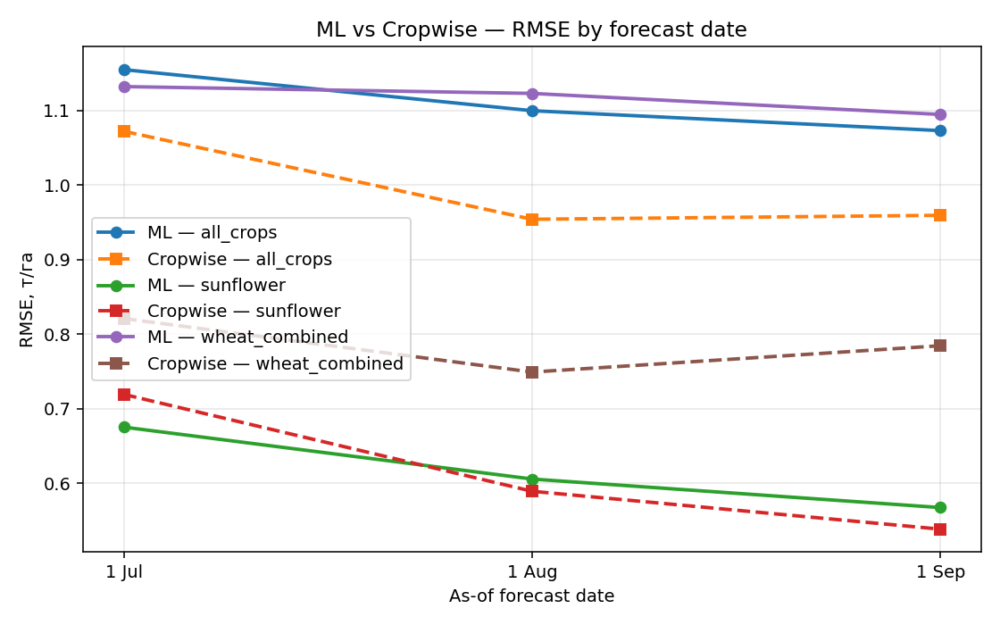

# As-of forecast results — ML vs Cropwise

_Generated by `scripts/asof/train_and_compare_asof.py`_

## Setup

- For each forecast date D in {1 July, 1 Aug, 1 Sep}:
  - rebuild NDVI/weather aggregates using only data **on or before D** of that year
  - train CatBoost (cat_features=`crop_id, prev_crop_id, field_id`) with walk-forward CV by year (test years 2017..2025)
- Cropwise own forecast extracted from `productivity_estimate_histories.csv` (latest entry on or before D)
- Compare on the **same set of (field_id, year)** rows where both forecasts exist

## Headline

| scenario       |   asof_tag | asof_label   |   n_compare |   ml_r2 |   ml_rmse |   ml_mae |   ml_mape |   cw_r2 |   cw_rmse |   cw_mae |   cw_mape |
|:---------------|-----------:|:-------------|------------:|--------:|----------:|---------:|----------:|--------:|----------:|---------:|----------:|
| sunflower      |      07_01 | 1 Jul        |          97 |  -0.138 |     0.675 |    0.556 |    23.129 |  -0.29  |     0.719 |    0.575 |    26.294 |
| sunflower      |      08_01 | 1 Aug        |          97 |   0.085 |     0.606 |    0.495 |    21.492 |   0.134 |     0.589 |    0.471 |    21.521 |
| sunflower      |      09_01 | 1 Sep        |          97 |   0.197 |     0.567 |    0.459 |    20.671 |   0.277 |     0.538 |    0.411 |    18.595 |
| wheat_combined |      07_01 | 1 Jul        |          62 |   0.02  |     1.132 |    0.941 |    41.901 |   0.485 |     0.821 |    0.636 |    31.477 |
| wheat_combined |      08_01 | 1 Aug        |          62 |   0.036 |     1.123 |    0.935 |    41.434 |   0.571 |     0.749 |    0.576 |    27.973 |
| wheat_combined |      09_01 | 1 Sep        |          62 |   0.084 |     1.095 |    0.899 |    40.32  |   0.529 |     0.784 |    0.614 |    29.685 |
| all_crops      |      07_01 | 1 Jul        |         251 |  -0.185 |     1.155 |    0.852 |    34.731 |  -0.022 |     1.072 |    0.741 |    33.066 |
| all_crops      |      08_01 | 1 Aug        |         251 |  -0.075 |     1.1   |    0.811 |    34.668 |   0.191 |     0.954 |    0.661 |    29.659 |
| all_crops      |      09_01 | 1 Sep        |         251 |  -0.024 |     1.073 |    0.789 |    35.313 |   0.182 |     0.959 |    0.651 |    28.77  |

## Plots

### MAPE curve

### RMSE curve

## Files

- `models_v2/asof_comparison/asof_results.csv` — aggregated metrics
- `models_v2/asof_comparison/per_row_predictions.csv` — every comparable (field, year) row with ML & Cropwise forecasts
