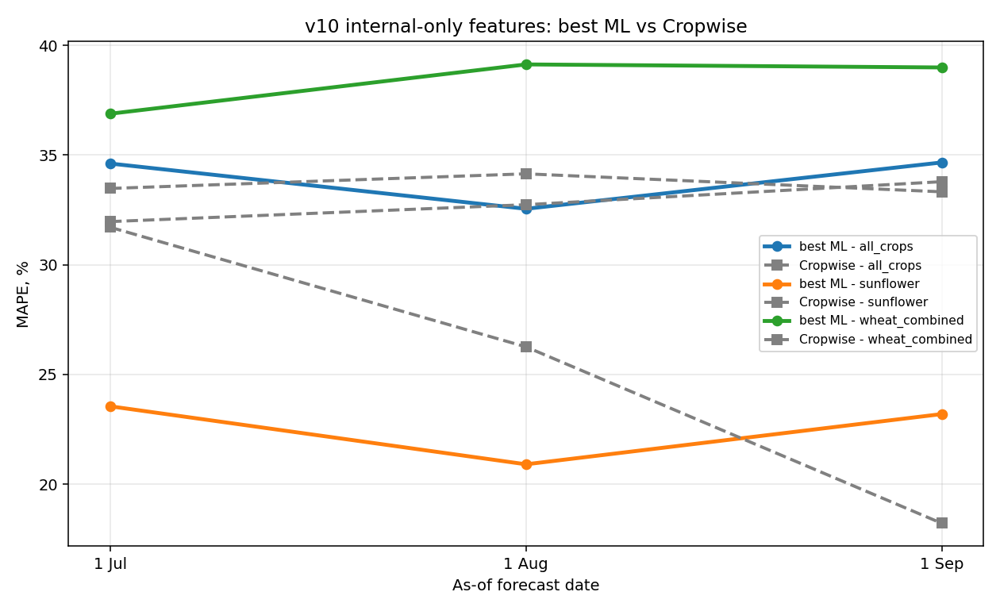

# v10 — Internal Scout + Soil Features

_Generated by `scripts/asof/train_compare_asof_v10.py`._

No API data, no Cropwise forecast feature. Added only as-of scout reports and soil samples.

## Best model per scenario/date

| scenario       |   asof_tag | model          |   n_ml |   n_cw |   mape |   rmse |   mae |     r2 |   cw_mape |   cw_rmse |   cw_mae |   cw_r2 | asof_label   |
|:---------------|-----------:|:---------------|-------:|-------:|-------:|-------:|------:|-------:|----------:|----------:|---------:|--------:|:-------------|
| all_crops      |      07_01 | v9_mae_l30     |    155 |    154 | 34.613 |  1.257 | 0.943 | -0.305 |    33.478 |     1.099 |    0.815 |  -0.005 | 1 Jul        |
| all_crops      |      08_01 | v9_mae_l30     |    155 |    154 | 32.55  |  1.177 | 0.873 | -0.144 |    34.145 |     1.136 |    0.822 |  -0.073 | 1 Aug        |
| all_crops      |      09_01 | v10_mae_l30    |    155 |    154 | 34.663 |  1.243 | 0.936 | -0.276 |    33.325 |     1.13  |    0.806 |  -0.061 | 1 Sep        |
| sunflower      |      07_01 | v9_no_field_id |     25 |     25 | 23.548 |  0.64  | 0.554 | -0.213 |    31.708 |     0.845 |    0.697 |  -1.111 | 1 Jul        |
| sunflower      |      08_01 | v7_default     |     25 |     25 | 20.904 |  0.569 | 0.475 |  0.042 |    26.257 |     0.709 |    0.573 |  -0.487 | 1 Aug        |
| sunflower      |      09_01 | v9_shallow_l10 |     25 |     25 | 23.194 |  0.629 | 0.537 | -0.171 |    18.215 |     0.499 |    0.409 |   0.264 | 1 Sep        |
| wheat_combined |      07_01 | v7_default     |     67 |     67 | 36.884 |  1.043 | 0.849 |  0.15  |    31.967 |     0.871 |    0.674 |   0.407 | 1 Jul        |
| wheat_combined |      08_01 | v9_mae_l30     |     67 |     67 | 39.132 |  1.087 | 0.883 |  0.076 |    32.738 |     0.849 |    0.676 |   0.436 | 1 Aug        |
| wheat_combined |      09_01 | v9_mae_l30     |     67 |     67 | 38.993 |  1.061 | 0.853 |  0.119 |    33.787 |     0.862 |    0.703 |   0.419 | 1 Sep        |

## Full grid

| model           |   n_ml |   n_cw |   mape |   rmse |   mae |     r2 |   cw_mape |   cw_rmse |   cw_mae |   cw_r2 | scenario       |   asof_tag | asof_label   |
|:----------------|-------:|-------:|-------:|-------:|------:|-------:|----------:|----------:|---------:|--------:|:---------------|-----------:|:-------------|
| v7_default      |     25 |     25 | 24.994 |  0.678 | 0.596 | -0.358 |    31.708 |     0.845 |    0.697 |  -1.111 | sunflower      |      07_01 | 1 Jul        |
| v9_shallow_l10  |     25 |     25 | 24.341 |  0.653 | 0.571 | -0.26  |    31.708 |     0.845 |    0.697 |  -1.111 | sunflower      |      07_01 | 1 Jul        |
| v9_mae_l30      |     25 |     25 | 26.287 |  0.746 | 0.651 | -0.647 |    31.708 |     0.845 |    0.697 |  -1.111 | sunflower      |      07_01 | 1 Jul        |
| v9_no_field_id  |     25 |     25 | 23.548 |  0.64  | 0.554 | -0.213 |    31.708 |     0.845 |    0.697 |  -1.111 | sunflower      |      07_01 | 1 Jul        |
| v10_default     |     25 |     25 | 24.562 |  0.657 | 0.576 | -0.275 |    31.708 |     0.845 |    0.697 |  -1.111 | sunflower      |      07_01 | 1 Jul        |
| v10_shallow_l10 |     25 |     25 | 25.141 |  0.678 | 0.598 | -0.361 |    31.708 |     0.845 |    0.697 |  -1.111 | sunflower      |      07_01 | 1 Jul        |
| v10_shallow_l30 |     25 |     25 | 25.513 |  0.695 | 0.613 | -0.429 |    31.708 |     0.845 |    0.697 |  -1.111 | sunflower      |      07_01 | 1 Jul        |
| v10_mae_l30     |     25 |     25 | 24.348 |  0.697 | 0.592 | -0.438 |    31.708 |     0.845 |    0.697 |  -1.111 | sunflower      |      07_01 | 1 Jul        |
| v10_no_field_id |     25 |     25 | 25.281 |  0.682 | 0.602 | -0.374 |    31.708 |     0.845 |    0.697 |  -1.111 | sunflower      |      07_01 | 1 Jul        |
| v7_default      |     25 |     25 | 20.904 |  0.569 | 0.475 |  0.042 |    26.257 |     0.709 |    0.573 |  -0.487 | sunflower      |      08_01 | 1 Aug        |
| v9_shallow_l10  |     25 |     25 | 22.71  |  0.614 | 0.523 | -0.115 |    26.257 |     0.709 |    0.573 |  -0.487 | sunflower      |      08_01 | 1 Aug        |
| v9_mae_l30      |     25 |     25 | 25.86  |  0.731 | 0.652 | -0.581 |    26.257 |     0.709 |    0.573 |  -0.487 | sunflower      |      08_01 | 1 Aug        |
| v9_no_field_id  |     25 |     25 | 24.012 |  0.658 | 0.568 | -0.278 |    26.257 |     0.709 |    0.573 |  -0.487 | sunflower      |      08_01 | 1 Aug        |
| v10_default     |     25 |     25 | 23.634 |  0.63  | 0.544 | -0.175 |    26.257 |     0.709 |    0.573 |  -0.487 | sunflower      |      08_01 | 1 Aug        |
| v10_shallow_l10 |     25 |     25 | 21.972 |  0.589 | 0.493 | -0.026 |    26.257 |     0.709 |    0.573 |  -0.487 | sunflower      |      08_01 | 1 Aug        |
| v10_shallow_l30 |     25 |     25 | 22.055 |  0.59  | 0.493 | -0.03  |    26.257 |     0.709 |    0.573 |  -0.487 | sunflower      |      08_01 | 1 Aug        |
| v10_mae_l30     |     25 |     25 | 24.811 |  0.695 | 0.62  | -0.429 |    26.257 |     0.709 |    0.573 |  -0.487 | sunflower      |      08_01 | 1 Aug        |
| v10_no_field_id |     25 |     25 | 21.716 |  0.59  | 0.487 | -0.028 |    26.257 |     0.709 |    0.573 |  -0.487 | sunflower      |      08_01 | 1 Aug        |
| v7_default      |     25 |     25 | 23.443 |  0.626 | 0.541 | -0.158 |    18.215 |     0.499 |    0.409 |   0.264 | sunflower      |      09_01 | 1 Sep        |
| v9_shallow_l10  |     25 |     25 | 23.194 |  0.629 | 0.537 | -0.171 |    18.215 |     0.499 |    0.409 |   0.264 | sunflower      |      09_01 | 1 Sep        |
| v9_mae_l30      |     25 |     25 | 24.9   |  0.67  | 0.578 | -0.328 |    18.215 |     0.499 |    0.409 |   0.264 | sunflower      |      09_01 | 1 Sep        |
| v9_no_field_id  |     25 |     25 | 24.003 |  0.648 | 0.563 | -0.241 |    18.215 |     0.499 |    0.409 |   0.264 | sunflower      |      09_01 | 1 Sep        |
| v10_default     |     25 |     25 | 24.823 |  0.659 | 0.578 | -0.286 |    18.215 |     0.499 |    0.409 |   0.264 | sunflower      |      09_01 | 1 Sep        |
| v10_shallow_l10 |     25 |     25 | 24.692 |  0.662 | 0.581 | -0.295 |    18.215 |     0.499 |    0.409 |   0.264 | sunflower      |      09_01 | 1 Sep        |
| v10_shallow_l30 |     25 |     25 | 23.906 |  0.64  | 0.559 | -0.211 |    18.215 |     0.499 |    0.409 |   0.264 | sunflower      |      09_01 | 1 Sep        |
| v10_mae_l30     |     25 |     25 | 25.601 |  0.687 | 0.602 | -0.397 |    18.215 |     0.499 |    0.409 |   0.264 | sunflower      |      09_01 | 1 Sep        |
| v10_no_field_id |     25 |     25 | 24.127 |  0.646 | 0.562 | -0.234 |    18.215 |     0.499 |    0.409 |   0.264 | sunflower      |      09_01 | 1 Sep        |
| v7_default      |     67 |     67 | 36.884 |  1.043 | 0.849 |  0.15  |    31.967 |     0.871 |    0.674 |   0.407 | wheat_combined |      07_01 | 1 Jul        |
| v9_shallow_l10  |     67 |     67 | 38.791 |  1.11  | 0.91  |  0.037 |    31.967 |     0.871 |    0.674 |   0.407 | wheat_combined |      07_01 | 1 Jul        |
| v9_mae_l30      |     67 |     67 | 37.347 |  1.131 | 0.893 | -0.001 |    31.967 |     0.871 |    0.674 |   0.407 | wheat_combined |      07_01 | 1 Jul        |
| v9_no_field_id  |     67 |     67 | 39.285 |  1.121 | 0.922 |  0.017 |    31.967 |     0.871 |    0.674 |   0.407 | wheat_combined |      07_01 | 1 Jul        |
| v10_default     |     67 |     67 | 41.027 |  1.157 | 0.949 | -0.047 |    31.967 |     0.871 |    0.674 |   0.407 | wheat_combined |      07_01 | 1 Jul        |
| v10_shallow_l10 |     67 |     67 | 39.367 |  1.148 | 0.936 | -0.031 |    31.967 |     0.871 |    0.674 |   0.407 | wheat_combined |      07_01 | 1 Jul        |
| v10_shallow_l30 |     67 |     67 | 39.77  |  1.126 | 0.923 |  0.009 |    31.967 |     0.871 |    0.674 |   0.407 | wheat_combined |      07_01 | 1 Jul        |
| v10_mae_l30     |     67 |     67 | 38.805 |  1.197 | 0.955 | -0.12  |    31.967 |     0.871 |    0.674 |   0.407 | wheat_combined |      07_01 | 1 Jul        |
| v10_no_field_id |     67 |     67 | 39.765 |  1.137 | 0.926 | -0.011 |    31.967 |     0.871 |    0.674 |   0.407 | wheat_combined |      07_01 | 1 Jul        |
| v7_default      |     67 |     67 | 42.325 |  1.16  | 0.935 | -0.052 |    32.738 |     0.849 |    0.676 |   0.436 | wheat_combined |      08_01 | 1 Aug        |
| v9_shallow_l10  |     67 |     67 | 40.644 |  1.126 | 0.909 |  0.008 |    32.738 |     0.849 |    0.676 |   0.436 | wheat_combined |      08_01 | 1 Aug        |
| v9_mae_l30      |     67 |     67 | 39.132 |  1.087 | 0.883 |  0.076 |    32.738 |     0.849 |    0.676 |   0.436 | wheat_combined |      08_01 | 1 Aug        |
| v9_no_field_id  |     67 |     67 | 41.483 |  1.134 | 0.92  | -0.005 |    32.738 |     0.849 |    0.676 |   0.436 | wheat_combined |      08_01 | 1 Aug        |
| v10_default     |     67 |     67 | 40.754 |  1.128 | 0.911 |  0.006 |    32.738 |     0.849 |    0.676 |   0.436 | wheat_combined |      08_01 | 1 Aug        |
| v10_shallow_l10 |     67 |     67 | 41.462 |  1.129 | 0.907 |  0.003 |    32.738 |     0.849 |    0.676 |   0.436 | wheat_combined |      08_01 | 1 Aug        |
| v10_shallow_l30 |     67 |     67 | 40.251 |  1.112 | 0.884 |  0.033 |    32.738 |     0.849 |    0.676 |   0.436 | wheat_combined |      08_01 | 1 Aug        |
| v10_mae_l30     |     67 |     67 | 41.736 |  1.151 | 0.933 | -0.036 |    32.738 |     0.849 |    0.676 |   0.436 | wheat_combined |      08_01 | 1 Aug        |
| v10_no_field_id |     67 |     67 | 40.044 |  1.129 | 0.898 |  0.003 |    32.738 |     0.849 |    0.676 |   0.436 | wheat_combined |      08_01 | 1 Aug        |
| v7_default      |     67 |     67 | 40.103 |  1.103 | 0.888 |  0.049 |    33.787 |     0.862 |    0.703 |   0.419 | wheat_combined |      09_01 | 1 Sep        |
| v9_shallow_l10  |     67 |     67 | 41.361 |  1.137 | 0.901 | -0.01  |    33.787 |     0.862 |    0.703 |   0.419 | wheat_combined |      09_01 | 1 Sep        |
| v9_mae_l30      |     67 |     67 | 38.993 |  1.061 | 0.853 |  0.119 |    33.787 |     0.862 |    0.703 |   0.419 | wheat_combined |      09_01 | 1 Sep        |
| v9_no_field_id  |     67 |     67 | 42.402 |  1.163 | 0.925 | -0.057 |    33.787 |     0.862 |    0.703 |   0.419 | wheat_combined |      09_01 | 1 Sep        |
| v10_default     |     67 |     67 | 42.224 |  1.157 | 0.926 | -0.046 |    33.787 |     0.862 |    0.703 |   0.419 | wheat_combined |      09_01 | 1 Sep        |
| v10_shallow_l10 |     67 |     67 | 42.082 |  1.167 | 0.924 | -0.066 |    33.787 |     0.862 |    0.703 |   0.419 | wheat_combined |      09_01 | 1 Sep        |
| v10_shallow_l30 |     67 |     67 | 43.867 |  1.202 | 0.94  | -0.131 |    33.787 |     0.862 |    0.703 |   0.419 | wheat_combined |      09_01 | 1 Sep        |
| v10_mae_l30     |     67 |     67 | 39.648 |  1.124 | 0.906 |  0.012 |    33.787 |     0.862 |    0.703 |   0.419 | wheat_combined |      09_01 | 1 Sep        |
| v10_no_field_id |     67 |     67 | 41.16  |  1.143 | 0.91  | -0.022 |    33.787 |     0.862 |    0.703 |   0.419 | wheat_combined |      09_01 | 1 Sep        |
| v7_default      |    155 |    154 | 35.352 |  1.211 | 0.91  | -0.211 |    33.478 |     1.099 |    0.815 |  -0.005 | all_crops      |      07_01 | 1 Jul        |
| v9_shallow_l10  |    155 |    154 | 39.952 |  1.287 | 0.985 | -0.368 |    33.478 |     1.099 |    0.815 |  -0.005 | all_crops      |      07_01 | 1 Jul        |
| v9_mae_l30      |    155 |    154 | 34.613 |  1.257 | 0.943 | -0.305 |    33.478 |     1.099 |    0.815 |  -0.005 | all_crops      |      07_01 | 1 Jul        |
| v9_no_field_id  |    155 |    154 | 39.253 |  1.291 | 0.986 | -0.376 |    33.478 |     1.099 |    0.815 |  -0.005 | all_crops      |      07_01 | 1 Jul        |
| v10_default     |    155 |    154 | 36.637 |  1.227 | 0.921 | -0.244 |    33.478 |     1.099 |    0.815 |  -0.005 | all_crops      |      07_01 | 1 Jul        |
| v10_shallow_l10 |    155 |    154 | 38.708 |  1.284 | 0.98  | -0.362 |    33.478 |     1.099 |    0.815 |  -0.005 | all_crops      |      07_01 | 1 Jul        |
| v10_shallow_l30 |    155 |    154 | 38.166 |  1.269 | 0.968 | -0.33  |    33.478 |     1.099 |    0.815 |  -0.005 | all_crops      |      07_01 | 1 Jul        |
| v10_mae_l30     |    155 |    154 | 36.731 |  1.27  | 0.954 | -0.333 |    33.478 |     1.099 |    0.815 |  -0.005 | all_crops      |      07_01 | 1 Jul        |
| v10_no_field_id |    155 |    154 | 38.642 |  1.256 | 0.96  | -0.302 |    33.478 |     1.099 |    0.815 |  -0.005 | all_crops      |      07_01 | 1 Jul        |
| v7_default      |    155 |    154 | 35.131 |  1.173 | 0.886 | -0.137 |    34.145 |     1.136 |    0.822 |  -0.073 | all_crops      |      08_01 | 1 Aug        |
| v9_shallow_l10  |    155 |    154 | 39.461 |  1.249 | 0.974 | -0.288 |    34.145 |     1.136 |    0.822 |  -0.073 | all_crops      |      08_01 | 1 Aug        |
| v9_mae_l30      |    155 |    154 | 32.55  |  1.177 | 0.873 | -0.144 |    34.145 |     1.136 |    0.822 |  -0.073 | all_crops      |      08_01 | 1 Aug        |
| v9_no_field_id  |    155 |    154 | 38.443 |  1.232 | 0.951 | -0.253 |    34.145 |     1.136 |    0.822 |  -0.073 | all_crops      |      08_01 | 1 Aug        |
| v10_default     |    155 |    154 | 38.34  |  1.238 | 0.951 | -0.266 |    34.145 |     1.136 |    0.822 |  -0.073 | all_crops      |      08_01 | 1 Aug        |
| v10_shallow_l10 |    155 |    154 | 36.783 |  1.225 | 0.922 | -0.239 |    34.145 |     1.136 |    0.822 |  -0.073 | all_crops      |      08_01 | 1 Aug        |
| v10_shallow_l30 |    155 |    154 | 35.257 |  1.203 | 0.889 | -0.194 |    34.145 |     1.136 |    0.822 |  -0.073 | all_crops      |      08_01 | 1 Aug        |
| v10_mae_l30     |    155 |    154 | 35.643 |  1.278 | 0.977 | -0.349 |    34.145 |     1.136 |    0.822 |  -0.073 | all_crops      |      08_01 | 1 Aug        |
| v10_no_field_id |    155 |    154 | 38.057 |  1.242 | 0.946 | -0.274 |    34.145 |     1.136 |    0.822 |  -0.073 | all_crops      |      08_01 | 1 Aug        |
| v7_default      |    155 |    154 | 35.775 |  1.209 | 0.92  | -0.208 |    33.325 |     1.13  |    0.806 |  -0.061 | all_crops      |      09_01 | 1 Sep        |
| v9_shallow_l10  |    155 |    154 | 39.672 |  1.268 | 0.99  | -0.328 |    33.325 |     1.13  |    0.806 |  -0.061 | all_crops      |      09_01 | 1 Sep        |
| v9_mae_l30      |    155 |    154 | 35.794 |  1.258 | 0.947 | -0.306 |    33.325 |     1.13  |    0.806 |  -0.061 | all_crops      |      09_01 | 1 Sep        |
| v9_no_field_id  |    155 |    154 | 39.452 |  1.264 | 0.982 | -0.319 |    33.325 |     1.13  |    0.806 |  -0.061 | all_crops      |      09_01 | 1 Sep        |
| v10_default     |    155 |    154 | 38.48  |  1.239 | 0.951 | -0.268 |    33.325 |     1.13  |    0.806 |  -0.061 | all_crops      |      09_01 | 1 Sep        |
| v10_shallow_l10 |    155 |    154 | 37.964 |  1.247 | 0.947 | -0.284 |    33.325 |     1.13  |    0.806 |  -0.061 | all_crops      |      09_01 | 1 Sep        |
| v10_shallow_l30 |    155 |    154 | 36.853 |  1.251 | 0.937 | -0.293 |    33.325 |     1.13  |    0.806 |  -0.061 | all_crops      |      09_01 | 1 Sep        |
| v10_mae_l30     |    155 |    154 | 34.663 |  1.243 | 0.936 | -0.276 |    33.325 |     1.13  |    0.806 |  -0.061 | all_crops      |      09_01 | 1 Sep        |
| v10_no_field_id |    155 |    154 | 38.971 |  1.269 | 0.974 | -0.33  |    33.325 |     1.13  |    0.806 |  -0.061 | all_crops      |      09_01 | 1 Sep        |

