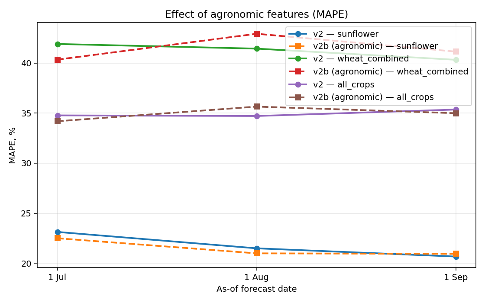
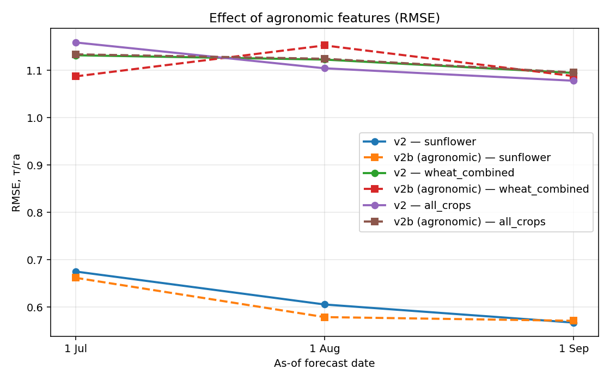

# As-of v2 vs v2b — agronomic feature impact

_Generated by `scripts/asof/train_compare_asof_v2b.py`_

## New features in v2b
- NDVI: integral, peak DOY, amplitude, days above 0.5
- Weather: longest drought run, longest heat run, monthly precip/hot for Jul/Aug
- Field history: years_since_sunflower, years_since_wheat, rotation_pair (categorical)

## Results

| scenario       |   asof_tag | asof_label   |   n_compare |   v2_r2 |   v2_rmse |   v2_mae |   v2_mape |   v2b_r2 |   v2b_rmse |   v2b_mae |   v2b_mape |
|:---------------|-----------:|:-------------|------------:|--------:|----------:|---------:|----------:|---------:|-----------:|----------:|-----------:|
| sunflower      |      07_01 | 1 Jul        |          97 |  -0.138 |     0.675 |    0.556 |    23.129 |   -0.093 |      0.662 |     0.542 |     22.5   |
| sunflower      |      08_01 | 1 Aug        |          97 |   0.085 |     0.606 |    0.495 |    21.492 |    0.164 |      0.579 |     0.479 |     20.99  |
| sunflower      |      09_01 | 1 Sep        |          97 |   0.197 |     0.567 |    0.459 |    20.671 |    0.186 |      0.571 |     0.473 |     20.941 |
| wheat_combined |      07_01 | 1 Jul        |          62 |   0.02  |     1.132 |    0.941 |    41.901 |    0.096 |      1.087 |     0.895 |     40.338 |
| wheat_combined |      08_01 | 1 Aug        |          62 |   0.036 |     1.123 |    0.935 |    41.434 |   -0.016 |      1.153 |     0.945 |     42.92  |
| wheat_combined |      09_01 | 1 Sep        |          62 |   0.084 |     1.095 |    0.899 |    40.32  |    0.095 |      1.088 |     0.881 |     41.136 |
| all_crops      |      07_01 | 1 Jul        |         252 |  -0.185 |     1.159 |    0.856 |    34.769 |   -0.135 |      1.134 |     0.833 |     34.183 |
| all_crops      |      08_01 | 1 Aug        |         252 |  -0.076 |     1.104 |    0.816 |    34.707 |   -0.116 |      1.125 |     0.83  |     35.646 |
| all_crops      |      09_01 | 1 Sep        |         252 |  -0.026 |     1.078 |    0.794 |    35.352 |   -0.059 |      1.096 |     0.797 |     34.986 |

### asof_mape_v2_vs_v2b.png

### asof_rmse_v2_vs_v2b.png

