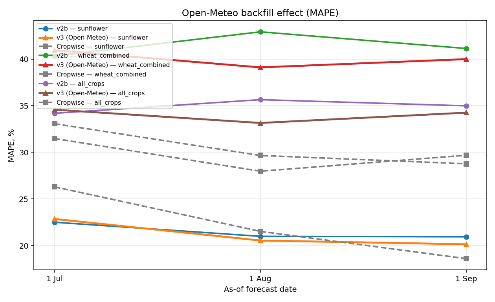
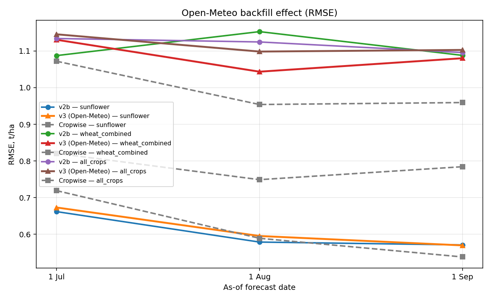

# Sprint 5.1 — Open-Meteo backfill: v2b → v3 vs Cropwise

_Generated by `scripts/asof/train_compare_asof_v3.py`_

## What changed in v3
- All `wx_*` features rebuilt from **Open-Meteo / ERA5** archive (covers 2010-2025 fully).
- New physical signals not present before:
  - `wx_srad_sum_to_asof`, monthly `wx_*_srad` — solar radiation (ceiling for photosynthesis).
  - `wx_vpd_max_to_asof`, `wx_vpd_days_high_to_asof` — atmospheric drought stress.
  - `wx_et0_sum_to_asof`, `wx_water_balance_to_asof = precip − et0` — water demand vs supply.
  - GDD with crop-specific bases: sunflower (T_base=6°C), wheat (T_base=4°C).
  - Last-30-days windows for srad/precip/et0/vpd.

## Results — ML v2b vs ML v3 vs Cropwise

`v2b_*` and `v3_*` columns: metrics on the v2b∩v3 set. `cw_*`: metrics on the v2b∩v3∩Cropwise set.

| scenario       |   asof_tag | asof_label   |   n_ml |   n_all |   v2b_r2 |   v2b_rmse |   v2b_mae |   v2b_mape |   v3_r2 |   v3_rmse |   v3_mae |   v3_mape |   v2b_a_rmse |   v2b_a_mape |   v3_a_rmse |   v3_a_mape |   cw_r2 |   cw_rmse |   cw_mae |   cw_mape |
|:---------------|-----------:|:-------------|-------:|--------:|---------:|-----------:|----------:|-----------:|--------:|----------:|---------:|----------:|-------------:|-------------:|------------:|------------:|--------:|----------:|---------:|----------:|
| sunflower      |      07_01 | 1 Jul        |     97 |      97 |   -0.093 |      0.662 |     0.542 |     22.5   |  -0.131 |     0.673 |    0.557 |    22.851 |        0.662 |       22.5   |       0.673 |      22.851 |  -0.29  |     0.719 |    0.575 |    26.294 |
| sunflower      |      08_01 | 1 Aug        |     97 |      97 |    0.164 |      0.579 |     0.479 |     20.99  |   0.115 |     0.596 |    0.489 |    20.54  |        0.579 |       20.99  |       0.596 |      20.54  |   0.134 |     0.589 |    0.471 |    21.521 |
| sunflower      |      09_01 | 1 Sep        |     97 |      97 |    0.186 |      0.571 |     0.473 |     20.941 |   0.19  |     0.57  |    0.469 |    20.139 |        0.571 |       20.941 |       0.57  |      20.139 |   0.277 |     0.538 |    0.411 |    18.595 |
| wheat_combined |      07_01 | 1 Jul        |     62 |      62 |    0.096 |      1.087 |     0.895 |     40.338 |   0.022 |     1.131 |    0.956 |    40.947 |        1.087 |       40.338 |       1.131 |      40.947 |   0.485 |     0.821 |    0.636 |    31.477 |
| wheat_combined |      08_01 | 1 Aug        |     62 |      62 |   -0.016 |      1.153 |     0.945 |     42.92  |   0.167 |     1.044 |    0.855 |    39.108 |        1.153 |       42.92  |       1.044 |      39.108 |   0.571 |     0.749 |    0.576 |    27.973 |
| wheat_combined |      09_01 | 1 Sep        |     62 |      62 |    0.095 |      1.088 |     0.881 |     41.136 |   0.108 |     1.08  |    0.879 |    39.994 |        1.088 |       41.136 |       1.08  |      39.994 |   0.529 |     0.784 |    0.614 |    29.685 |
| all_crops      |      07_01 | 1 Jul        |    252 |     251 |   -0.135 |      1.134 |     0.833 |     34.183 |  -0.158 |     1.146 |    0.861 |    34.574 |        1.129 |       34.132 |       1.139 |      34.508 |  -0.022 |     1.072 |    0.741 |    33.066 |
| all_crops      |      08_01 | 1 Aug        |    252 |     251 |   -0.116 |      1.125 |     0.83  |     35.646 |  -0.065 |     1.098 |    0.804 |    33.148 |        1.118 |       35.582 |       1.092 |      33.088 |   0.191 |     0.954 |    0.661 |    29.659 |
| all_crops      |      09_01 | 1 Sep        |    252 |     251 |   -0.059 |      1.096 |     0.797 |     34.986 |  -0.073 |     1.103 |    0.82  |    34.254 |        1.087 |       34.906 |       1.097 |      34.201 |   0.182 |     0.959 |    0.651 |    28.77  |

### asof_mape_v2b_vs_v3.png

### asof_rmse_v2b_vs_v3.png

