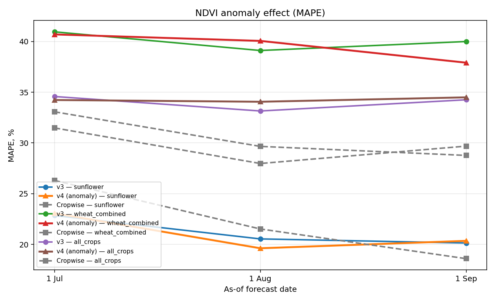
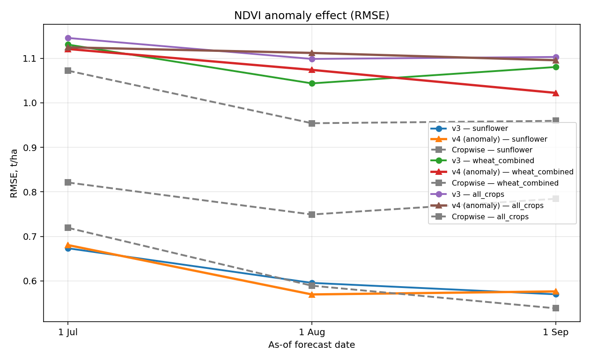

# Sprint 5.2 — NDVI anomaly: v3 → v4 vs Cropwise

_Generated by `scripts/asof/train_compare_asof_v4.py`_

## What changed in v4
Added 6 features that compare current NDVI to the **per-field historical baseline**
(mean NDVI for the same field at the same DOY ±7d, over years strictly < target year):

- `ndvi_anom_mean_asof` — average anomaly over season-to-date
- `ndvi_anom_max_asof` — best deviation above baseline
- `ndvi_anom_min_asof` — worst deviation below baseline (stress signal)
- `ndvi_anom_last_value_asof` — current state vs baseline
- `ndvi_anom_last30d_mean_asof` — recent month vs baseline (trend)
- `ndvi_baseline_n_years` — confidence in baseline (how many history years)

This breaks the limit where the model could only memorise per-field absolute NDVI levels — it now sees explicit relative-to-self deviations.

## Results

| scenario       |   asof_tag | asof_label   |   n_ml |   n_all |   v3_r2 |   v3_rmse |   v3_mae |   v3_mape |   v4_r2 |   v4_rmse |   v4_mae |   v4_mape |   v3_a_mape |   v4_a_mape |   cw_r2 |   cw_rmse |   cw_mae |   cw_mape |
|:---------------|-----------:|:-------------|-------:|--------:|--------:|----------:|---------:|----------:|--------:|----------:|---------:|----------:|------------:|------------:|--------:|----------:|---------:|----------:|
| sunflower      |      07_01 | 1 Jul        |     97 |      97 |  -0.131 |     0.673 |    0.557 |    22.851 |  -0.155 |     0.68  |    0.564 |    23.064 |      22.851 |      23.064 |  -0.29  |     0.719 |    0.575 |    26.294 |
| sunflower      |      08_01 | 1 Aug        |     97 |      97 |   0.115 |     0.596 |    0.489 |    20.54  |   0.191 |     0.57  |    0.466 |    19.62  |      20.54  |      19.62  |   0.134 |     0.589 |    0.471 |    21.521 |
| sunflower      |      09_01 | 1 Sep        |     97 |      97 |   0.19  |     0.57  |    0.469 |    20.139 |   0.171 |     0.576 |    0.474 |    20.35  |      20.139 |      20.35  |   0.277 |     0.538 |    0.411 |    18.595 |
| wheat_combined |      07_01 | 1 Jul        |     62 |      62 |   0.022 |     1.131 |    0.956 |    40.947 |   0.039 |     1.121 |    0.926 |    40.693 |      40.947 |      40.693 |   0.485 |     0.821 |    0.636 |    31.477 |
| wheat_combined |      08_01 | 1 Aug        |     62 |      62 |   0.167 |     1.044 |    0.855 |    39.108 |   0.118 |     1.074 |    0.872 |    40.054 |      39.108 |      40.054 |   0.571 |     0.749 |    0.576 |    27.973 |
| wheat_combined |      09_01 | 1 Sep        |     62 |      62 |   0.108 |     1.08  |    0.879 |    39.994 |   0.201 |     1.022 |    0.841 |    37.908 |      39.994 |      37.908 |   0.529 |     0.784 |    0.614 |    29.685 |
| all_crops      |      07_01 | 1 Jul        |    252 |     251 |  -0.158 |     1.146 |    0.861 |    34.574 |  -0.116 |     1.124 |    0.838 |    34.23  |      34.508 |      34.161 |  -0.022 |     1.072 |    0.741 |    33.066 |
| all_crops      |      08_01 | 1 Aug        |    252 |     251 |  -0.065 |     1.098 |    0.804 |    33.148 |  -0.091 |     1.112 |    0.811 |    34.056 |      33.088 |      34.019 |   0.191 |     0.954 |    0.661 |    29.659 |
| all_crops      |      09_01 | 1 Sep        |    252 |     251 |  -0.073 |     1.103 |    0.82  |    34.254 |  -0.059 |     1.095 |    0.815 |    34.492 |      34.201 |      34.432 |   0.182 |     0.959 |    0.651 |    28.77  |

### asof_mape_v3_vs_v4.png

### asof_rmse_v3_vs_v4.png

