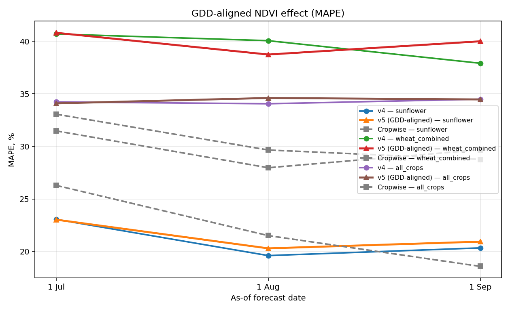
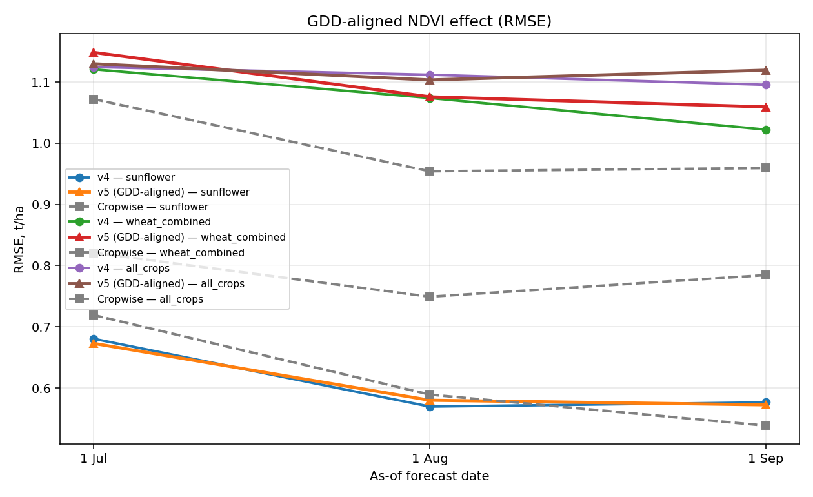

# Sprint 5.3 — GDD-aligned NDVI: v4 → v5 vs Cropwise

_Generated by `scripts/asof/train_compare_asof_v5.py`_

## What changed in v5
Added phenology-aligned features instead of (or in addition to) calendar-aligned NDVI:

- `gdd_at_asof` — accumulated GDD (base 5°C) from April 1 to as-of date
- `ndvi_at_gdd_{200..1400}` — NDVI interpolated at fixed phenological stages
- `ndvi_peak_gdd_at_asof` — at which GDD did season-to-date peak NDVI occur
- `ndvi_peak_value_at_asof` — peak NDVI value (smoothed)
- `ndvi_growth_per_100gdd` — early-season slope (emergence → peak)

Same biophysical stage = same feature column across years, regardless of calendar shift.

## Results

| scenario       |   asof_tag | asof_label   |   n_ml |   n_all |   v4_r2 |   v4_rmse |   v4_mae |   v4_mape |   v5_r2 |   v5_rmse |   v5_mae |   v5_mape |   v4_a_mape |   v5_a_mape |   cw_r2 |   cw_rmse |   cw_mae |   cw_mape |
|:---------------|-----------:|:-------------|-------:|--------:|--------:|----------:|---------:|----------:|--------:|----------:|---------:|----------:|------------:|------------:|--------:|----------:|---------:|----------:|
| sunflower      |      07_01 | 1 Jul        |     97 |      97 |  -0.155 |     0.68  |    0.564 |    23.064 |  -0.129 |     0.673 |    0.56  |    23.036 |      23.064 |      23.036 |  -0.29  |     0.719 |    0.575 |    26.294 |
| sunflower      |      08_01 | 1 Aug        |     97 |      97 |   0.191 |     0.57  |    0.466 |    19.62  |   0.161 |     0.58  |    0.476 |    20.307 |      19.62  |      20.307 |   0.134 |     0.589 |    0.471 |    21.521 |
| sunflower      |      09_01 | 1 Sep        |     97 |      97 |   0.171 |     0.576 |    0.474 |    20.35  |   0.183 |     0.572 |    0.479 |    20.947 |      20.35  |      20.947 |   0.277 |     0.538 |    0.411 |    18.595 |
| wheat_combined |      07_01 | 1 Jul        |     62 |      62 |   0.039 |     1.121 |    0.926 |    40.693 |  -0.008 |     1.148 |    0.964 |    40.805 |      40.693 |      40.805 |   0.485 |     0.821 |    0.636 |    31.477 |
| wheat_combined |      08_01 | 1 Aug        |     62 |      62 |   0.118 |     1.074 |    0.872 |    40.054 |   0.115 |     1.076 |    0.891 |    38.737 |      40.054 |      38.737 |   0.571 |     0.749 |    0.576 |    27.973 |
| wheat_combined |      09_01 | 1 Sep        |     62 |      62 |   0.201 |     1.022 |    0.841 |    37.908 |   0.142 |     1.059 |    0.877 |    39.998 |      37.908 |      39.998 |   0.529 |     0.784 |    0.614 |    29.685 |
| all_crops      |      07_01 | 1 Jul        |    252 |     251 |  -0.116 |     1.124 |    0.838 |    34.23  |  -0.126 |     1.13  |    0.845 |    34.094 |      34.161 |      34.039 |  -0.022 |     1.072 |    0.741 |    33.066 |
| all_crops      |      08_01 | 1 Aug        |    252 |     251 |  -0.091 |     1.112 |    0.811 |    34.056 |  -0.074 |     1.103 |    0.816 |    34.608 |      34.019 |      34.556 |   0.191 |     0.954 |    0.661 |    29.659 |
| all_crops      |      09_01 | 1 Sep        |    252 |     251 |  -0.059 |     1.095 |    0.815 |    34.492 |  -0.105 |     1.119 |    0.83  |    34.467 |      34.432 |      34.401 |   0.182 |     0.959 |    0.651 |    28.77  |

### asof_mape_v4_vs_v5.png

### asof_rmse_v4_vs_v5.png

