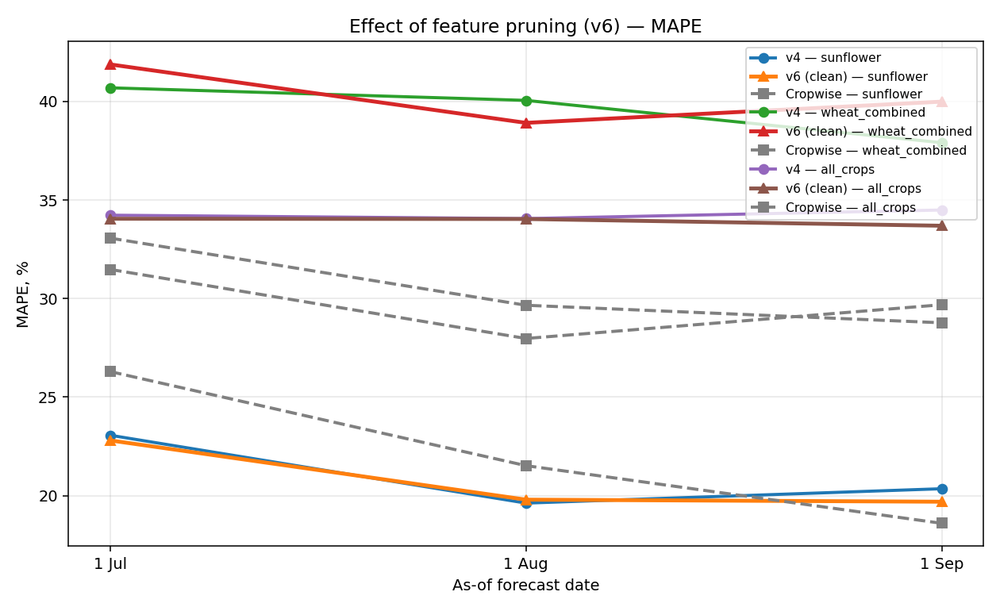

# Sprint 6 — Feature pruning v4 → v6

Removed 15 redundant or low-signal features identified in `AUDIT.md`:

- duplicates (Spearman ≥ 0.95): `field_calculated_area`, `wx_srad_mean_to_asof`,
  `wx_gdd_wheat_to_asof`, `ndvi_p10_max_asof`, all `wx_*_last30d` variants
- near-zero importance: `wx_hot_d35_to_asof`, `wx_apr_*`, `wx_may_hot_d30`

## Results

| scenario       |   asof_tag | asof_label   |   n_ml |   n_all |   v4_mape |   v6_mape |   cw_mape |   v4_r2 |   v6_r2 |   cw_r2 |   v4_rmse |   v6_rmse |   cw_rmse |
|:---------------|-----------:|:-------------|-------:|--------:|----------:|----------:|----------:|--------:|--------:|--------:|----------:|----------:|----------:|
| sunflower      |      07_01 | 1 Jul        |     97 |      97 |    23.064 |    22.801 |    26.294 |  -0.155 |  -0.117 |  -0.29  |     0.68  |     0.669 |     0.719 |
| sunflower      |      08_01 | 1 Aug        |     97 |      97 |    19.62  |    19.796 |    21.521 |   0.191 |   0.174 |   0.134 |     0.57  |     0.576 |     0.589 |
| sunflower      |      09_01 | 1 Sep        |     97 |      97 |    20.35  |    19.691 |    18.595 |   0.171 |   0.194 |   0.277 |     0.576 |     0.568 |     0.538 |
| wheat_combined |      07_01 | 1 Jul        |     62 |      62 |    40.693 |    41.879 |    31.477 |   0.039 |  -0.018 |   0.485 |     1.121 |     1.154 |     0.821 |
| wheat_combined |      08_01 | 1 Aug        |     62 |      62 |    40.054 |    38.914 |    27.973 |   0.118 |   0.136 |   0.571 |     1.074 |     1.063 |     0.749 |
| wheat_combined |      09_01 | 1 Sep        |     62 |      62 |    37.908 |    39.991 |    29.685 |   0.201 |   0.13  |   0.529 |     1.022 |     1.067 |     0.784 |
| all_crops      |      07_01 | 1 Jul        |    252 |     251 |    34.23  |    34.05  |    33.066 |  -0.116 |  -0.133 |  -0.022 |     1.124 |     1.133 |     1.072 |
| all_crops      |      08_01 | 1 Aug        |    252 |     251 |    34.056 |    34.036 |    29.659 |  -0.091 |  -0.124 |   0.191 |     1.112 |     1.129 |     0.954 |
| all_crops      |      09_01 | 1 Sep        |    252 |     251 |    34.492 |    33.694 |    28.77  |  -0.059 |  -0.038 |   0.182 |     1.095 |     1.084 |     0.959 |

