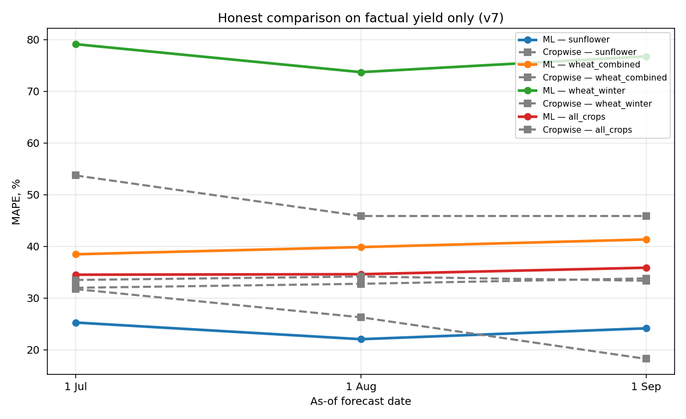

# Sprint 6+ — Honest comparison on FACTUAL targets only (v7)

`AUDIT.md` revealed that 78% of sunflower targets came from `estimate_normalized` —
which is Cropwise's own forecast, not factual yield. Training/comparing on it makes
the comparison circular (we predict their predictions; they 'predict' themselves).

v7 keeps ONLY rows where target_source ∈ {physical_harvested_weight, productivity_normalized}.
This drops 240 rows (441 → 201) but yields a methodologically clean comparison.

## Headline

| scenario       |   asof_tag | asof_label   |   n_ml |   n_all |   ml_mape |   ml_r2 |   ml_rmse |   ml_a_mape |   ml_a_rmse |   ml_a_r2 |   cw_mape |   cw_r2 |   cw_rmse |
|:---------------|-----------:|:-------------|-------:|--------:|----------:|--------:|----------:|------------:|------------:|----------:|----------:|--------:|----------:|
| sunflower      |      07_01 | 1 Jul        |     25 |      25 |    25.245 |  -0.383 |     0.684 |      25.245 |       0.684 |    -0.383 |    31.708 |  -1.111 |     0.845 |
| sunflower      |      08_01 | 1 Aug        |     25 |      25 |    22.022 |  -0.062 |     0.599 |      22.022 |       0.599 |    -0.062 |    26.257 |  -0.487 |     0.709 |
| sunflower      |      09_01 | 1 Sep        |     25 |      25 |    24.127 |  -0.227 |     0.644 |      24.127 |       0.644 |    -0.227 |    18.215 |   0.264 |     0.499 |
| wheat_combined |      07_01 | 1 Jul        |     67 |      67 |    38.447 |   0.05  |     1.102 |      38.447 |       1.102 |     0.05  |    31.967 |   0.407 |     0.871 |
| wheat_combined |      08_01 | 1 Aug        |     67 |      67 |    39.841 |   0.081 |     1.084 |      39.841 |       1.084 |     0.081 |    32.738 |   0.436 |     0.849 |
| wheat_combined |      09_01 | 1 Sep        |     67 |      67 |    41.314 |   0.013 |     1.123 |      41.314 |       1.123 |     0.013 |    33.787 |   0.419 |     0.862 |
| wheat_winter   |      07_01 | 1 Jul        |     19 |      19 |    79.093 |  -0.095 |     1.689 |      79.093 |       1.689 |    -0.095 |    53.695 |   0.627 |     0.986 |
| wheat_winter   |      08_01 | 1 Aug        |     19 |      19 |    73.683 |   0.063 |     1.563 |      73.683 |       1.563 |     0.063 |    45.851 |   0.675 |     0.92  |
| wheat_winter   |      09_01 | 1 Sep        |     19 |      19 |    76.728 |  -0.086 |     1.683 |      76.728 |       1.683 |    -0.086 |    45.851 |   0.675 |     0.92  |
| all_crops      |      07_01 | 1 Jul        |    155 |     154 |    34.558 |  -0.246 |     1.228 |      34.497 |       1.222 |    -0.242 |    33.478 |  -0.005 |     1.099 |
| all_crops      |      08_01 | 1 Aug        |    155 |     154 |    34.578 |  -0.118 |     1.163 |      34.59  |       1.161 |    -0.121 |    34.145 |  -0.073 |     1.136 |
| all_crops      |      09_01 | 1 Sep        |    155 |     154 |    35.894 |  -0.162 |     1.186 |      35.85  |       1.181 |    -0.158 |    33.325 |  -0.061 |     1.13  |

