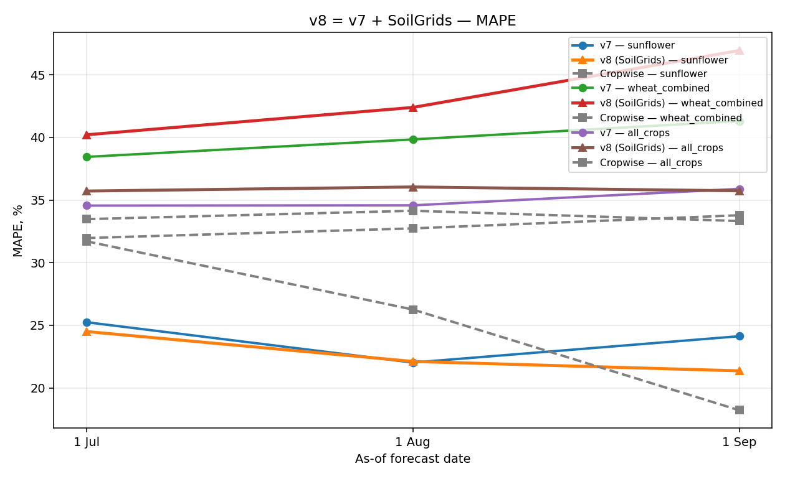

# Sprint 6.1 — v8 = v7 + SoilGrids 250m

Adds 24 SoilGrids features (clay/sand/silt/SOC/N/bdod/CEC/pH × 3 depth layers) to v7.

## Results

| scenario       |   asof_tag | asof_label   |   n |   v7_mape |   v8_mape |   cw_mape |   v7_r2 |   v8_r2 |   cw_r2 |   v7_rmse |   v8_rmse |   cw_rmse |
|:---------------|-----------:|:-------------|----:|----------:|----------:|----------:|--------:|--------:|--------:|----------:|----------:|----------:|
| sunflower      |      07_01 | 1 Jul        |  25 |    25.245 |    24.502 |    31.708 |  -0.383 |  -0.303 |  -1.111 |     0.684 |     0.664 |     0.845 |
| sunflower      |      08_01 | 1 Aug        |  25 |    22.022 |    22.112 |    26.257 |  -0.062 |  -0.12  |  -0.487 |     0.599 |     0.616 |     0.709 |
| sunflower      |      09_01 | 1 Sep        |  25 |    24.127 |    21.362 |    18.215 |  -0.227 |  -0.038 |   0.264 |     0.644 |     0.592 |     0.499 |
| wheat_combined |      07_01 | 1 Jul        |  67 |    38.447 |    40.212 |    31.967 |   0.05  |   0.033 |   0.407 |     1.102 |     1.112 |     0.871 |
| wheat_combined |      08_01 | 1 Aug        |  67 |    39.841 |    42.398 |    32.738 |   0.081 |   0.002 |   0.436 |     1.084 |     1.13  |     0.849 |
| wheat_combined |      09_01 | 1 Sep        |  67 |    41.314 |    46.943 |    33.787 |   0.013 |  -0.242 |   0.419 |     1.123 |     1.26  |     0.862 |
| all_crops      |      07_01 | 1 Jul        | 155 |    34.558 |    35.719 |    33.478 |  -0.246 |  -0.187 |  -0.005 |     1.228 |     1.199 |     1.099 |
| all_crops      |      08_01 | 1 Aug        | 155 |    34.578 |    36.045 |    34.145 |  -0.118 |  -0.221 |  -0.073 |     1.163 |     1.216 |     1.136 |
| all_crops      |      09_01 | 1 Sep        | 155 |    35.894 |    35.737 |    33.325 |  -0.162 |  -0.181 |  -0.061 |     1.186 |     1.196 |     1.13  |

## Top 15 features (all_crops, 1 Aug)

| feature                     |   importance |
|:----------------------------|-------------:|
| crop_id                     |        4.931 |
| ndvi_slope_asof             |        3.836 |
| ndvi_last_value_asof        |        3.593 |
| ndvi_anom_last30d_mean_asof |        3.257 |
| wx_may_srad                 |        3.208 |
| ndvi_anom_mean_asof         |        3.157 |
| ndvi_min_asof               |        2.951 |
| ndvi_peak_doy_asof          |        2.858 |
| ndvi_integral_asof          |        2.848 |
| ndvi_anom_max_asof          |        2.662 |
| ndvi_p25_asof               |        2.494 |
| ndvi_max_asof               |        2.392 |
| ndvi_p75_asof               |        2.319 |
| wx_jun_temp_mean            |        1.967 |
| prev_crop_id                |        1.933 |

