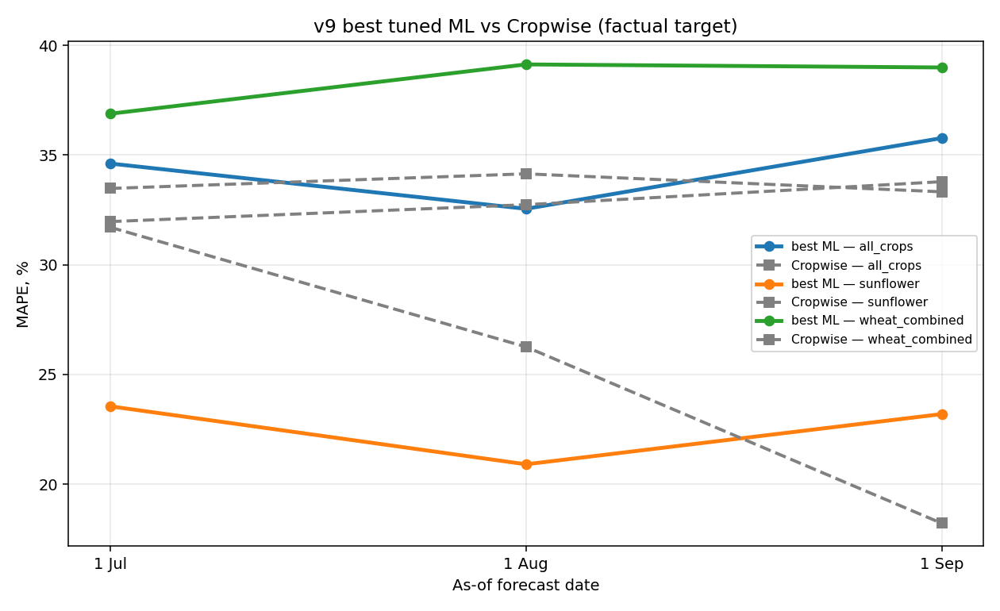

# v9 — Factual Target + Real Sowing-Date Features + Tuning

_Generated by `scripts/asof/train_compare_asof_v9.py`._

## Best model per scenario/date

| scenario       |   asof_tag | asof_label   | model          |   n_ml |   n_cw |   mape |   rmse |     r2 |   cw_mape |   cw_rmse |   cw_r2 |
|:---------------|-----------:|:-------------|:---------------|-------:|-------:|-------:|-------:|-------:|----------:|----------:|--------:|
| all_crops      |      07_01 | 1 Jul        | v9_mae_l30     |    155 |    154 | 34.613 |  1.257 | -0.305 |    33.478 |     1.099 |  -0.005 |
| all_crops      |      08_01 | 1 Aug        | v9_mae_l30     |    155 |    154 | 32.55  |  1.177 | -0.144 |    34.145 |     1.136 |  -0.073 |
| all_crops      |      09_01 | 1 Sep        | v7_default     |    155 |    154 | 35.775 |  1.209 | -0.208 |    33.325 |     1.13  |  -0.061 |
| sunflower      |      07_01 | 1 Jul        | v9_no_field_id |     25 |     25 | 23.548 |  0.64  | -0.213 |    31.708 |     0.845 |  -1.111 |
| sunflower      |      08_01 | 1 Aug        | v7_default     |     25 |     25 | 20.904 |  0.569 |  0.042 |    26.257 |     0.709 |  -0.487 |
| sunflower      |      09_01 | 1 Sep        | v9_shallow_l10 |     25 |     25 | 23.194 |  0.629 | -0.171 |    18.215 |     0.499 |   0.264 |
| wheat_combined |      07_01 | 1 Jul        | v7_default     |     67 |     67 | 36.884 |  1.043 |  0.15  |    31.967 |     0.871 |   0.407 |
| wheat_combined |      08_01 | 1 Aug        | v9_mae_l30     |     67 |     67 | 39.132 |  1.087 |  0.076 |    32.738 |     0.849 |   0.436 |
| wheat_combined |      09_01 | 1 Sep        | v9_mae_l30     |     67 |     67 | 38.993 |  1.061 |  0.119 |    33.787 |     0.862 |   0.419 |

## Full grid

| scenario       |   asof_tag | asof_label   | model          |   n_ml |   n_cw |   mape |   rmse |     r2 |   cw_mape |   cw_rmse |   cw_r2 |
|:---------------|-----------:|:-------------|:---------------|-------:|-------:|-------:|-------:|-------:|----------:|----------:|--------:|
| sunflower      |      07_01 | 1 Jul        | v7_default     |     25 |     25 | 24.994 |  0.678 | -0.358 |    31.708 |     0.845 |  -1.111 |
| sunflower      |      07_01 | 1 Jul        | v9_default     |     25 |     25 | 24.378 |  0.67  | -0.329 |    31.708 |     0.845 |  -1.111 |
| sunflower      |      07_01 | 1 Jul        | v9_shallow_l10 |     25 |     25 | 24.341 |  0.653 | -0.26  |    31.708 |     0.845 |  -1.111 |
| sunflower      |      07_01 | 1 Jul        | v9_shallow_l30 |     25 |     25 | 24.607 |  0.666 | -0.312 |    31.708 |     0.845 |  -1.111 |
| sunflower      |      07_01 | 1 Jul        | v9_mae_l30     |     25 |     25 | 26.287 |  0.746 | -0.647 |    31.708 |     0.845 |  -1.111 |
| sunflower      |      07_01 | 1 Jul        | v9_no_field_id |     25 |     25 | 23.548 |  0.64  | -0.213 |    31.708 |     0.845 |  -1.111 |
| sunflower      |      08_01 | 1 Aug        | v7_default     |     25 |     25 | 20.904 |  0.569 |  0.042 |    26.257 |     0.709 |  -0.487 |
| sunflower      |      08_01 | 1 Aug        | v9_default     |     25 |     25 | 23.198 |  0.619 | -0.134 |    26.257 |     0.709 |  -0.487 |
| sunflower      |      08_01 | 1 Aug        | v9_shallow_l10 |     25 |     25 | 22.71  |  0.614 | -0.115 |    26.257 |     0.709 |  -0.487 |
| sunflower      |      08_01 | 1 Aug        | v9_shallow_l30 |     25 |     25 | 23.448 |  0.629 | -0.171 |    26.257 |     0.709 |  -0.487 |
| sunflower      |      08_01 | 1 Aug        | v9_mae_l30     |     25 |     25 | 25.86  |  0.731 | -0.581 |    26.257 |     0.709 |  -0.487 |
| sunflower      |      08_01 | 1 Aug        | v9_no_field_id |     25 |     25 | 24.012 |  0.658 | -0.278 |    26.257 |     0.709 |  -0.487 |
| sunflower      |      09_01 | 1 Sep        | v7_default     |     25 |     25 | 23.443 |  0.626 | -0.158 |    18.215 |     0.499 |   0.264 |
| sunflower      |      09_01 | 1 Sep        | v9_default     |     25 |     25 | 24.236 |  0.651 | -0.252 |    18.215 |     0.499 |   0.264 |
| sunflower      |      09_01 | 1 Sep        | v9_shallow_l10 |     25 |     25 | 23.194 |  0.629 | -0.171 |    18.215 |     0.499 |   0.264 |
| sunflower      |      09_01 | 1 Sep        | v9_shallow_l30 |     25 |     25 | 23.504 |  0.634 | -0.187 |    18.215 |     0.499 |   0.264 |
| sunflower      |      09_01 | 1 Sep        | v9_mae_l30     |     25 |     25 | 24.9   |  0.67  | -0.328 |    18.215 |     0.499 |   0.264 |
| sunflower      |      09_01 | 1 Sep        | v9_no_field_id |     25 |     25 | 24.003 |  0.648 | -0.241 |    18.215 |     0.499 |   0.264 |
| wheat_combined |      07_01 | 1 Jul        | v7_default     |     67 |     67 | 36.884 |  1.043 |  0.15  |    31.967 |     0.871 |   0.407 |
| wheat_combined |      07_01 | 1 Jul        | v9_default     |     67 |     67 | 39.585 |  1.105 |  0.045 |    31.967 |     0.871 |   0.407 |
| wheat_combined |      07_01 | 1 Jul        | v9_shallow_l10 |     67 |     67 | 38.791 |  1.11  |  0.037 |    31.967 |     0.871 |   0.407 |
| wheat_combined |      07_01 | 1 Jul        | v9_shallow_l30 |     67 |     67 | 38.868 |  1.096 |  0.06  |    31.967 |     0.871 |   0.407 |
| wheat_combined |      07_01 | 1 Jul        | v9_mae_l30     |     67 |     67 | 37.347 |  1.131 | -0.001 |    31.967 |     0.871 |   0.407 |
| wheat_combined |      07_01 | 1 Jul        | v9_no_field_id |     67 |     67 | 39.285 |  1.121 |  0.017 |    31.967 |     0.871 |   0.407 |
| wheat_combined |      08_01 | 1 Aug        | v7_default     |     67 |     67 | 42.325 |  1.16  | -0.052 |    32.738 |     0.849 |   0.436 |
| wheat_combined |      08_01 | 1 Aug        | v9_default     |     67 |     67 | 40.813 |  1.113 |  0.031 |    32.738 |     0.849 |   0.436 |
| wheat_combined |      08_01 | 1 Aug        | v9_shallow_l10 |     67 |     67 | 40.644 |  1.126 |  0.008 |    32.738 |     0.849 |   0.436 |
| wheat_combined |      08_01 | 1 Aug        | v9_shallow_l30 |     67 |     67 | 40.14  |  1.095 |  0.062 |    32.738 |     0.849 |   0.436 |
| wheat_combined |      08_01 | 1 Aug        | v9_mae_l30     |     67 |     67 | 39.132 |  1.087 |  0.076 |    32.738 |     0.849 |   0.436 |
| wheat_combined |      08_01 | 1 Aug        | v9_no_field_id |     67 |     67 | 41.483 |  1.134 | -0.005 |    32.738 |     0.849 |   0.436 |
| wheat_combined |      09_01 | 1 Sep        | v7_default     |     67 |     67 | 40.103 |  1.103 |  0.049 |    33.787 |     0.862 |   0.419 |
| wheat_combined |      09_01 | 1 Sep        | v9_default     |     67 |     67 | 43.326 |  1.147 | -0.029 |    33.787 |     0.862 |   0.419 |
| wheat_combined |      09_01 | 1 Sep        | v9_shallow_l10 |     67 |     67 | 41.361 |  1.137 | -0.01  |    33.787 |     0.862 |   0.419 |
| wheat_combined |      09_01 | 1 Sep        | v9_shallow_l30 |     67 |     67 | 42.858 |  1.166 | -0.064 |    33.787 |     0.862 |   0.419 |
| wheat_combined |      09_01 | 1 Sep        | v9_mae_l30     |     67 |     67 | 38.993 |  1.061 |  0.119 |    33.787 |     0.862 |   0.419 |
| wheat_combined |      09_01 | 1 Sep        | v9_no_field_id |     67 |     67 | 42.402 |  1.163 | -0.057 |    33.787 |     0.862 |   0.419 |
| all_crops      |      07_01 | 1 Jul        | v7_default     |    155 |    154 | 35.352 |  1.211 | -0.211 |    33.478 |     1.099 |  -0.005 |
| all_crops      |      07_01 | 1 Jul        | v9_default     |    155 |    154 | 35.974 |  1.218 | -0.226 |    33.478 |     1.099 |  -0.005 |
| all_crops      |      07_01 | 1 Jul        | v9_shallow_l10 |    155 |    154 | 39.952 |  1.287 | -0.368 |    33.478 |     1.099 |  -0.005 |
| all_crops      |      07_01 | 1 Jul        | v9_shallow_l30 |    155 |    154 | 38.883 |  1.297 | -0.39  |    33.478 |     1.099 |  -0.005 |
| all_crops      |      07_01 | 1 Jul        | v9_mae_l30     |    155 |    154 | 34.613 |  1.257 | -0.305 |    33.478 |     1.099 |  -0.005 |
| all_crops      |      07_01 | 1 Jul        | v9_no_field_id |    155 |    154 | 39.253 |  1.291 | -0.376 |    33.478 |     1.099 |  -0.005 |
| all_crops      |      08_01 | 1 Aug        | v7_default     |    155 |    154 | 35.131 |  1.173 | -0.137 |    34.145 |     1.136 |  -0.073 |
| all_crops      |      08_01 | 1 Aug        | v9_default     |    155 |    154 | 38.206 |  1.227 | -0.244 |    34.145 |     1.136 |  -0.073 |
| all_crops      |      08_01 | 1 Aug        | v9_shallow_l10 |    155 |    154 | 39.461 |  1.249 | -0.288 |    34.145 |     1.136 |  -0.073 |
| all_crops      |      08_01 | 1 Aug        | v9_shallow_l30 |    155 |    154 | 36.143 |  1.208 | -0.206 |    34.145 |     1.136 |  -0.073 |
| all_crops      |      08_01 | 1 Aug        | v9_mae_l30     |    155 |    154 | 32.55  |  1.177 | -0.144 |    34.145 |     1.136 |  -0.073 |
| all_crops      |      08_01 | 1 Aug        | v9_no_field_id |    155 |    154 | 38.443 |  1.232 | -0.253 |    34.145 |     1.136 |  -0.073 |
| all_crops      |      09_01 | 1 Sep        | v7_default     |    155 |    154 | 35.775 |  1.209 | -0.208 |    33.325 |     1.13  |  -0.061 |
| all_crops      |      09_01 | 1 Sep        | v9_default     |    155 |    154 | 39.187 |  1.242 | -0.273 |    33.325 |     1.13  |  -0.061 |
| all_crops      |      09_01 | 1 Sep        | v9_shallow_l10 |    155 |    154 | 39.672 |  1.268 | -0.328 |    33.325 |     1.13  |  -0.061 |
| all_crops      |      09_01 | 1 Sep        | v9_shallow_l30 |    155 |    154 | 35.897 |  1.225 | -0.239 |    33.325 |     1.13  |  -0.061 |
| all_crops      |      09_01 | 1 Sep        | v9_mae_l30     |    155 |    154 | 35.794 |  1.258 | -0.306 |    33.325 |     1.13  |  -0.061 |
| all_crops      |      09_01 | 1 Sep        | v9_no_field_id |    155 |    154 | 39.452 |  1.264 | -0.319 |    33.325 |     1.13  |  -0.061 |

