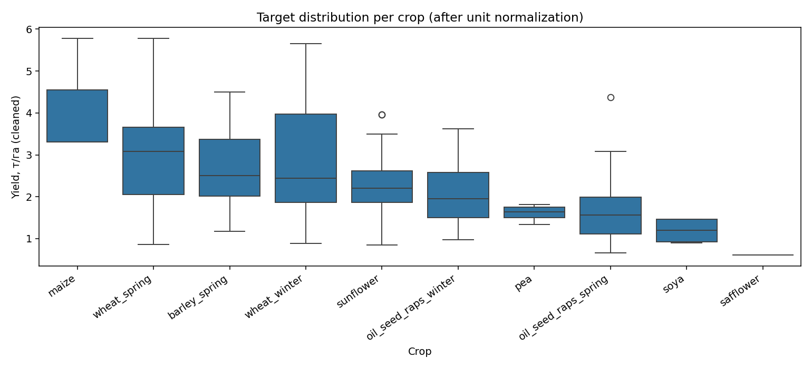
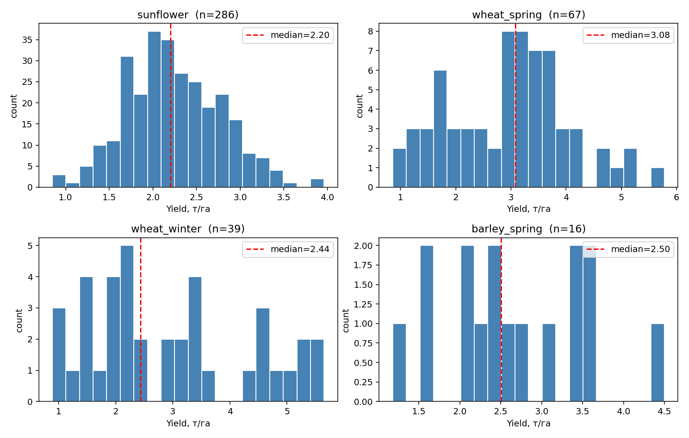
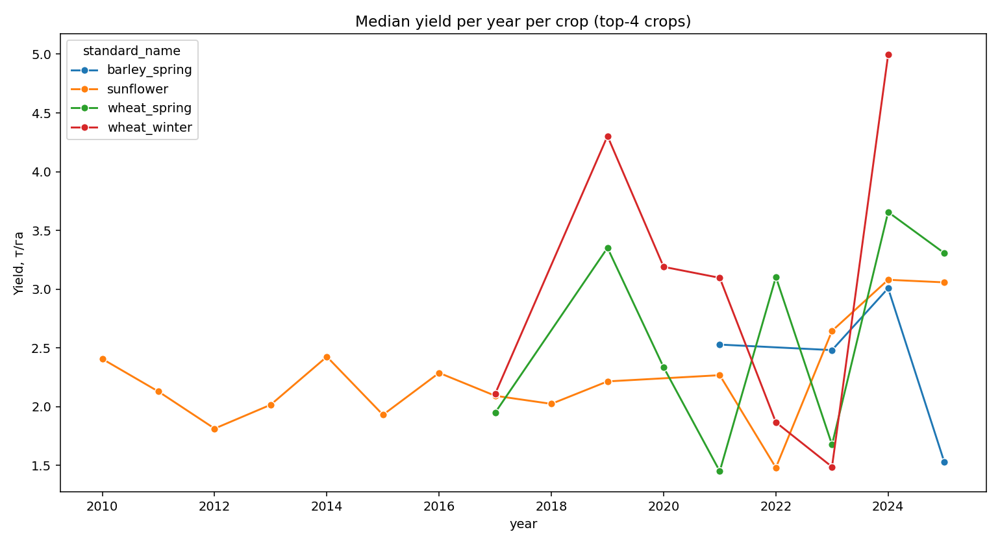
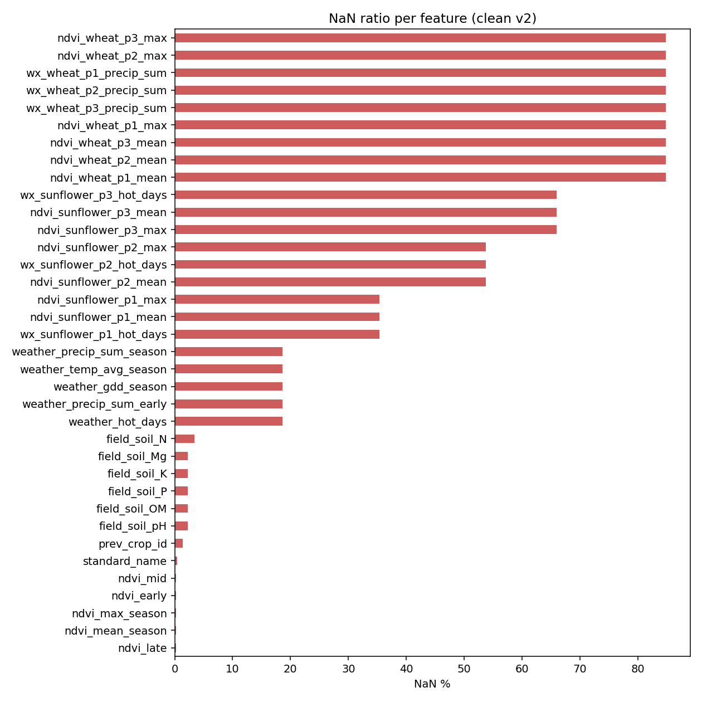
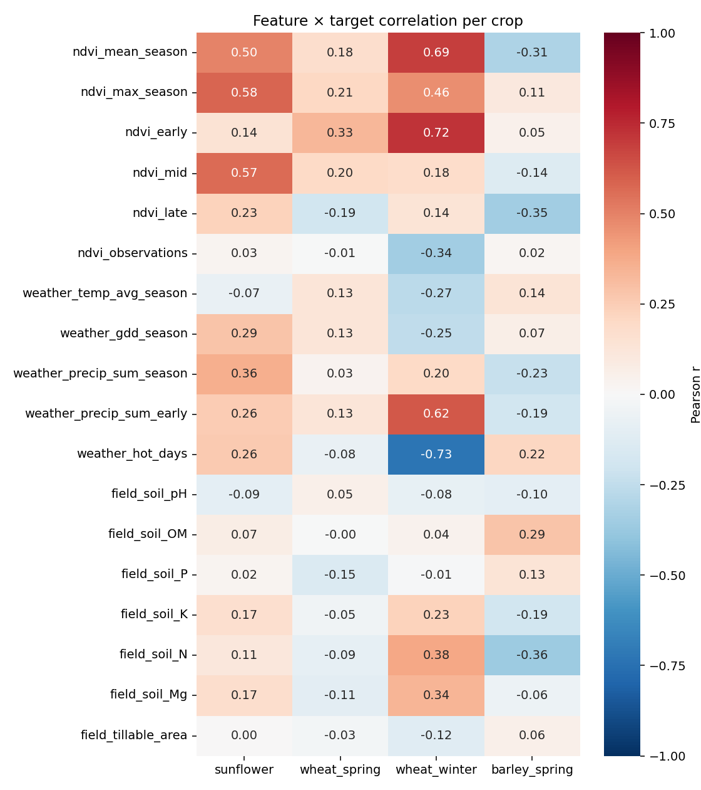

# Clean Dataset v2 — EDA audit

_Generated by `scripts/analysis/audit_clean_dataset.py`_

## Shape

- Rows: **441**
- Columns: **45**

## Target distribution per crop (т/га, cleaned)

| standard_name        |   n |   t_min |   t_med |   t_mean |   t_max |   t_std |
|:---------------------|----:|--------:|--------:|---------:|--------:|--------:|
| sunflower            | 286 |   0.848 |   2.2   |    2.237 |   3.961 |   0.542 |
| wheat_spring         |  67 |   0.857 |   3.079 |    2.964 |   5.78  |   1.093 |
| wheat_winter         |  39 |   0.89  |   2.438 |    2.938 |   5.65  |   1.417 |
| barley_spring        |  16 |   1.179 |   2.505 |    2.62  |   4.5   |   0.889 |
| oil_seed_raps_spring |  15 |   0.664 |   1.565 |    1.744 |   4.38  |   0.973 |
| oil_seed_raps_winter |   4 |   0.978 |   1.955 |    2.127 |   3.62  |   1.119 |
| pea                  |   4 |   1.332 |   1.639 |    1.605 |   1.81  |   0.211 |
| soya                 |   4 |   0.9   |   1.199 |    1.192 |   1.468 |   0.32  |
| maize                |   3 |   3.312 |   3.312 |    4.135 |   5.78  |   1.425 |
| safflower            |   1 |   0.608 |   0.608 |    0.608 |   0.608 | nan     |

## Year × crop coverage

|   year |   barley_spring |   maize |   oil_seed_raps_spring |   oil_seed_raps_winter |   pea |   safflower |   soya |   sunflower |   wheat_spring |   wheat_winter |
|-------:|----------------:|--------:|-----------------------:|-----------------------:|------:|------------:|-------:|------------:|---------------:|---------------:|
|   2010 |               0 |       0 |                      0 |                      0 |     0 |           0 |      0 |          27 |              0 |              0 |
|   2011 |               0 |       0 |                      0 |                      0 |     0 |           0 |      0 |          27 |              0 |              0 |
|   2012 |               0 |       0 |                      0 |                      0 |     0 |           0 |      0 |          27 |              0 |              0 |
|   2013 |               0 |       0 |                      0 |                      0 |     0 |           0 |      0 |          27 |              0 |              0 |
|   2014 |               0 |       0 |                      0 |                      0 |     0 |           0 |      0 |          27 |              0 |              0 |
|   2015 |               0 |       0 |                      0 |                      0 |     0 |           0 |      0 |          27 |              0 |              0 |
|   2016 |               0 |       0 |                      0 |                      0 |     0 |           0 |      0 |          27 |              0 |              0 |
|   2017 |               0 |       0 |                      9 |                      0 |     0 |           0 |      0 |          15 |              2 |              4 |
|   2018 |               0 |       2 |                      0 |                      1 |     0 |           0 |      2 |          22 |              0 |              0 |
|   2019 |               0 |       0 |                      3 |                      0 |     0 |           1 |      2 |          18 |              3 |              3 |
|   2020 |               0 |       1 |                      3 |                      3 |     0 |           0 |      0 |           0 |             17 |              5 |
|   2021 |               3 |       0 |                      0 |                      0 |     0 |           0 |      0 |          17 |              2 |              8 |
|   2022 |               0 |       0 |                      0 |                      0 |     0 |           0 |      0 |           3 |             20 |              6 |
|   2023 |               9 |       0 |                      0 |                      0 |     1 |           0 |      0 |           4 |              5 |              7 |
|   2024 |               1 |       0 |                      0 |                      0 |     0 |           0 |      0 |          10 |              7 |              6 |
|   2025 |               3 |       0 |                      0 |                      0 |     3 |           0 |      0 |           8 |             11 |              0 |

## NaN ratio per feature

|                           |   nan_pct |
|:--------------------------|----------:|
| ndvi_wheat_p2_mean        |      84.8 |
| wx_wheat_p3_precip_sum    |      84.8 |
| wx_wheat_p1_precip_sum    |      84.8 |
| wx_wheat_p2_precip_sum    |      84.8 |
| ndvi_wheat_p3_mean        |      84.8 |
| ndvi_wheat_p1_mean        |      84.8 |
| ndvi_wheat_p3_max         |      84.8 |
| ndvi_wheat_p2_max         |      84.8 |
| ndvi_wheat_p1_max         |      84.8 |
| ndvi_sunflower_p3_mean    |      66   |
| ndvi_sunflower_p3_max     |      66   |
| wx_sunflower_p3_hot_days  |      66   |
| wx_sunflower_p2_hot_days  |      53.7 |
| ndvi_sunflower_p2_mean    |      53.7 |
| ndvi_sunflower_p2_max     |      53.7 |
| wx_sunflower_p1_hot_days  |      35.4 |
| ndvi_sunflower_p1_max     |      35.4 |
| ndvi_sunflower_p1_mean    |      35.4 |
| weather_hot_days          |      18.6 |
| weather_precip_sum_early  |      18.6 |
| weather_precip_sum_season |      18.6 |
| weather_gdd_season        |      18.6 |
| weather_temp_avg_season   |      18.6 |
| field_soil_N              |       3.4 |
| field_soil_Mg             |       2.3 |
| field_soil_K              |       2.3 |
| field_soil_P              |       2.3 |
| field_soil_OM             |       2.3 |
| field_soil_pH             |       2.3 |
| prev_crop_id              |       1.4 |
| standard_name             |       0.5 |
| ndvi_late                 |       0.2 |
| ndvi_mid                  |       0.2 |
| ndvi_early                |       0.2 |
| ndvi_max_season           |       0.2 |
| ndvi_mean_season          |       0.2 |

## Visualizations

### Target boxplot per crop

### Histograms (top-4 crops)

### Year trend (median yield)

### NaN ratio per feature

### Feature × target correlation (per crop)

## Notes for next sprint

- Sunflower (n=286) and wheat_combined (n=106) are the only crops with enough data for proper per-crop modeling.
- Soil features are essentially constants per field (one measurement per field, copied across years), so they encode 'inherent field fertility', not year-specific signal.
- Phase NDVI/weather features are sparse for non-target crops (sunflower-phase columns are NaN for wheat rows). For per-crop models this is fine.
- For Sprint 2: drop crops with n<20 from per-crop training; keep them only in 'all crops' aggregate.
